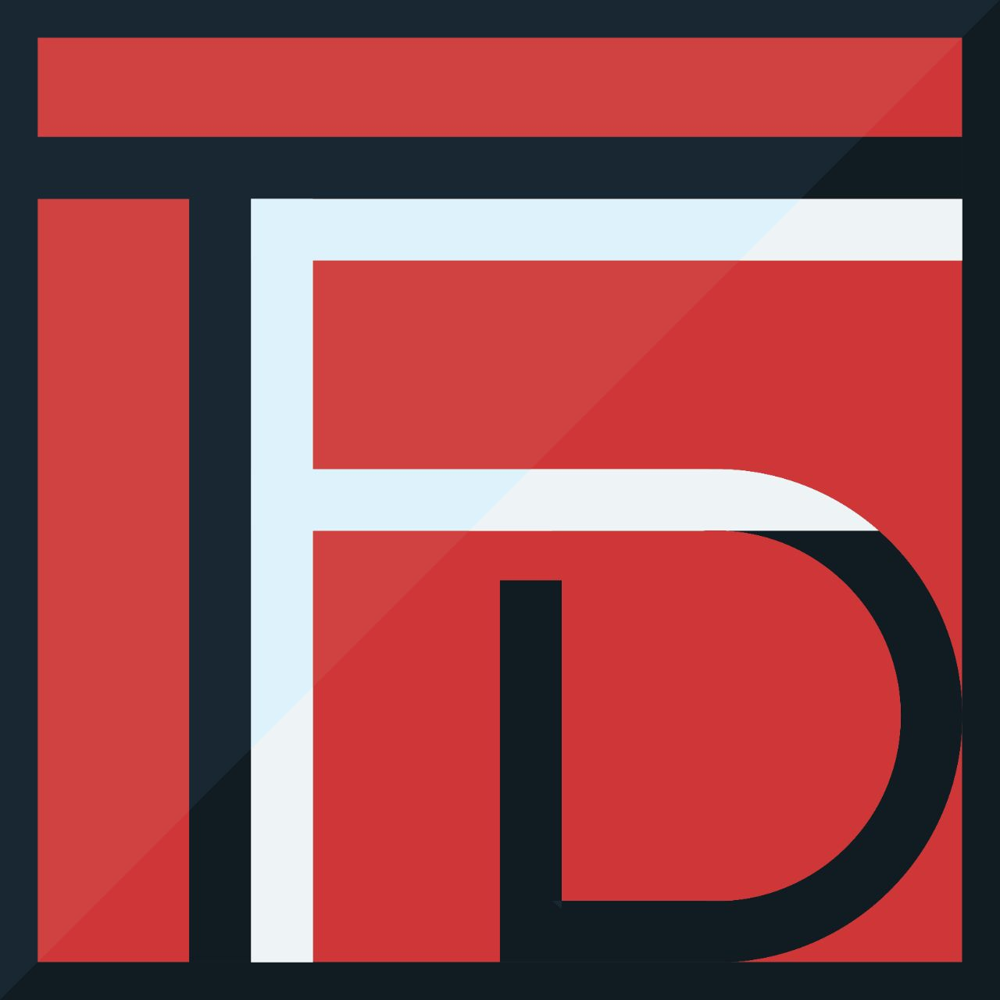

<div align="center">
  
</div>

# TFD Workshop

[](https://github.com/tfdevs/container-security-workshop-series)
[](LICENSE)
[](https://www.docker.com/)
[](https://git-scm.com/)
[](CONTRIBUTING.md)

> **Teaching for Development (TFDvs)** - Empowering developers through hands-on, practical workshops across security, DevOps, and modern development practices.

---

## What is TFD Workshop?

**TFD Workshop** is a comprehensive educational initiative offering multiple workshop series covering essential topics in modern software development. Each series consists of progressive, hands-on sessions designed to build practical skills through real-world scenarios, live demonstrations, and interactive exercises.

### Current & Upcoming Workshop Series

#### **[Web Security Series](./series/web-security/README.md)** - *IN PROGRESS*
Master security in web applications and containerized environments

- **Container Security** (7 workshops) - Currently running
  - Workshop 1: Container Security Basics ✅ Completed (Feb 4, 2026) | [Materials](./series/web-security/w1-container-security-basics/materials/workshop-1-content.md) | [Recording](https://youtu.be/Refr3uDVJpc?si=q7wJFCfo7FBBCYsZ)
  - Workshops 2-7: Coming soon
- **API Security** (5 workshops) - 🚧 Coming soon
- **Authentication & Authorization** (4 workshops) - 🚧 Coming soon
- **Web Application Firewall** (3 workshops) - 🚧 Coming soon

#### **[AI & ML Series](./series/ai-ml/README.md)** - *IN PROGRESS*
Master reinforcement learning and modern AI techniques
- **Reinforcement Learning** (5 workshops) - Currently running
  - Workshop 1: Understanding Proximal Policy Optimization (PPO) | [Materials](./series/ai-ml/w1-understanding-ppo/materials/workshop-1-content.md) | [Recording](https://youtu.be/dfoaHA1_6AI?si=1YOjGN5QtmjDzv_i)
  - Workshops 2-5: Coming soon

#### **[Collaborative Development Series](./series/collab-dev/README.md)** - *NEW!*
Master team collaboration with Git and GitHub
- **Git & GitHub Team Workflow** (5 workshops) - Now available!
  - Workshop 1: Git & GitHub Team Workflow ✅ Available | [Materials](./series/collab-dev/w1-git-github-team-workflow/materials/workshop-1-content.md) | [Lab](./series/collab-dev/w1-git-github-team-workflow/exercises/hands-on-lab.md)
  - Workshop 2: Code Review & PR Best Practices - 🚧 Coming soon
  - Workshop 3: Git Advanced Workflows - 🚧 Coming soon
  - Workshop 4: CI/CD for Teams - 🚧 Coming soon
  - Workshop 5: Team Project Simulation - 🚧 Coming soon

#### **DevOps Series** - 🔜 Coming Soon
CI/CD, Infrastructure as Code, and automation

#### **Software Architecture Series** - 🔜 Coming Soon
Microservices, scalability, and design patterns


---

## 🚀 Quick Start

### For Participants

1. **Clone the repository:**
   ```bash
   git clone https://github.com/KimangKhenng/tfd-workshop.git
   cd container-security-workshop-series
   ```

2. **Choose your workshop:**
   ```bash
   cd series/web-security/w1-container-security-basics
   ```

3. **Read the workshop README:**
   ```bash
   cat README.md
   ```

4. **Follow the setup instructions in each workshop directory**

### Prerequisites

#### For Web Security Series:
- Docker installed and running
- Basic Linux command line knowledge

#### For AI/ML Series:
- Python 3.8+
- Basic understanding of machine learning concepts

#### For Collaborative Development Series:
- Git installed (2.x or higher)
- GiFor University Students & Junior Developers (Start Here!)
1. [Workshop: Git & GitHub Team Workflow](./series/collab-dev/w1-git-github-team-workflow/README.md) - Learn essential collaboration skills
2. [Workshop 1: Container Security Basics](./series/web-security/w1-container-security-basics/README.md) - Understand containerization security
3. [Workshop 1: Understanding PPO](./series/ai-ml/w1-understanding-ppo/README.md) - Dive into reinforcement learning

### Security Track
**Beginner:**
1. [Workshop 1: Container Security Basics](./series/web-security/w1-container-security-basics/README.md)
2. Workshop 2: Image Security (Coming Soon)
3. Workshop 4: Secrets Management (Coming Soon)

**Intermediate:**
1. Workshop 3: Runtime Security (Coming Soon)
2. Workshop 5: Network Security (Coming Soon)

**Advanced:**
1. Workshop 6: Supply Chain Security (Coming Soon)
2. Workshop 7: Final Project (Coming Soon)

### Team Collaboration Track
1. [Workshop 1: Git & GitHub Team Workflow](./series/collab-dev/w1-git-github-team-workflow/README.md)
2. Workshop 2: Code Review & PR Best Practices (Coming Soon)
3. Workshop 3: Git Advanced Workflows (Coming Soon)
4. Workshop 4: CI/CD for Teams (Coming Soon)
5. Workshop 5: Team Project Simulation
### Beginner Track (Start Here)
1. [Workshop 1: Container Security Basics](./series/web-security/w1-container-security-basics/README.md)
2. Workshop 2: Image Security (Coming Soon)
3. Workshop 4: Secrets Management (Coming Soon)

### Intermediate Track
1. Workshop 3: Runtime Security (Coming Soon)
2. Workshop 5: Network Security (Coming Soon)

### Advanced Track
1. Workshop 6: Supply Chain Security (Coming Soon)
2. Workshop 7: Final Project (Coming Soon)

---

## 🎯 TFD Mission

**"Making technology education accessible, practical, and impactful for developers worldwide."**

We believe in:
- 🎓 **Hands-on learning** over pure theory
- 🌍 **Open access** to quality education
- 💡 **Practical skills** for real-world problems
- 🤝 **Community-driven** content and collaboration
- 🚀 **Continuous learning** across all tech domains

---

## 🤝 Contributing

We welcome contributions! Whether it's:

- 🐛 **Bug reports** - Found an issue? Let us know
- 💡 **Feature requests** - Have an idea? Share it
- 📝 **Documentation** - Improve our materials
- 🔧 **Code** - Submit a PR with improvements
- 🎓 **Teaching** - Share your expertise

See [CONTRIBUTING.md](CONTRIBUTING.md) for details.

---

## 📚 Resources

### Essential Reading
- [Docker Security Best Practices](https://docs.docker.com/engine/security/)
- [CIS Docker Benchmark](https://www.cisecurity.org/benchmark/docker)
- [NIST Container Security Guide](https://nvlpubs.nist.gov/nistpubs/SpecialPublications/NIST.SP.800-190.pdf)

### Security Tools
- [Trivy](https://github.com/aquasecurity/trivy) - Vulnerability scanner
- [Docker Bench Security](https://github.com/docker/docker-bench-security) - Security audit
- [Falco](https://falco.org/) - Runtime security

---

## � License

This project is licensed under the MIT License - see the [LICENSE](LICENSE) file for details.

---

## 📞 Contact & Community

**TFDevs - Teaching for Development**

- 🌐 Website: [tfdevs.com](https://tfdevs.com)
- 📧 Email: info@tfdevs.com
- 🐦 Twitter: [@tfdevs](https://twitter.com/tfdevs)
- 💬 Discord: [Join our community](#)

### Stay Updated
- ⭐ **Star** this repo for updates
- 🔔 **Watch** for new workshop announcements
- 🔄 **Fork** to create your own version

---

<div align="center">

**⭐ Star this repo to stay updated on new workshops!**

**🤝 Contribute to help developers worldwide learn and grow**

[⬆ Back to Top](#tfd-workshop)

</div>
