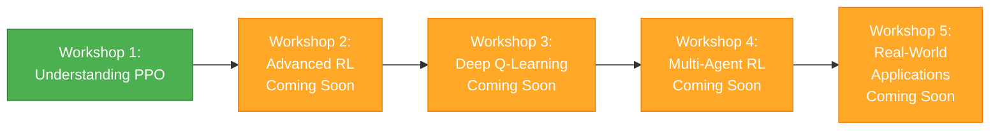

# AI & ML Workshop Series

<div align="center">
  
</div>

## 📚 Series Overview

Welcome to the **AI & ML Workshop Series**! This comprehensive series takes you from foundational reinforcement learning concepts through advanced AI/ML techniques, combining theory with practical implementation.

### 🎯 What You'll Learn

Through hands-on workshops, you'll master:
- Reinforcement Learning fundamentals and algorithms
- Modern policy optimization techniques
- Deep learning for RL applications
- Practical implementation with real environments
- Mathematical foundations with real-world analogies
- Debugging and optimizing RL models

---

## 🗺️ Learning Path



---

## 📋 Workshop Catalog

### ✅ Workshop 1: Understanding Proximal Policy Optimization (PPO)
**Status:** Materials Ready | **Level:** Beginner  
**Duration:** 1.5 hours | **Environment:** Lunar Landing

Build a solid foundation in reinforcement learning through PPO, one of the most effective and widely-used RL algorithms.

**What You'll Learn:**
- Reinforcement Learning fundamentals (agents, environments, rewards)
- Why PPO exists and what problems it solves
- Complete PPO implementation from scratch
- Mapping PPO paper concepts to code
- Gradient observation and interpretation
- Debugging RL training

**Prerequisites:**
- Python programming basics
- Basic understanding of neural networks (helpful but not required)
- Familiarity with NumPy

**[📖 Workshop Materials](./w1-understanding-ppo/README.md)** | **[🎥 Recording](#)** (Coming Soon)

---

### 🚧 Workshop 2: Advanced Policy Gradient Methods
**Status:** Coming Soon | **Level:** Intermediate

Explore variations and improvements to policy gradient methods.

**Topics:**
- Actor-Critic architectures
- Advantage estimation techniques
- Trust region methods (TRPO)
- Comparison: PPO vs TRPO vs A3C

---

### 🚧 Workshop 3: Deep Q-Learning (DQN)
**Status:** Coming Soon | **Level:** Intermediate

Master value-based reinforcement learning methods.

**Topics:**
- Q-Learning fundamentals
- Deep Q-Networks (DQN)
- Experience replay and target networks
- Double DQN, Dueling DQN improvements

---

### 🚧 Workshop 4: Multi-Agent Reinforcement Learning
**Status:** Coming Soon | **Level:** Advanced

Learn how multiple agents interact and learn together.

**Topics:**
- Multi-agent environments
- Cooperative vs competitive settings
- Communication between agents
- Scaling RL to multiple agents

---

### 🚧 Workshop 5: Real-World RL Applications
**Status:** Coming Soon | **Level:** Advanced

Apply RL to practical problems and production systems.

**Topics:**
- Sim-to-real transfer
- RL for robotics
- RL in finance and trading
- Production deployment considerations

---

## 🚀 Getting Started

### Prerequisites

**For All Workshops:**
- Python 3.9 or 3.10 (recommended for OpenAI Gymnasium compatibility)
- Conda or venv for environment management
- Basic linear algebra knowledge
- Jupyter Notebook (optional but recommended)

**System Requirements:**
- 8GB+ RAM recommended
- GPU optional (CPU sufficient for workshop exercises)
- macOS, Linux, or Windows with WSL2

### Quick Start

1. **Clone the repository:**
   ```bash
   git clone https://github.com/KimangKhenng/tfd-workshop.git
   cd container-security-workshop-series/series/ai-ml
   ```

2. **Choose your workshop:**
   ```bash
   cd w1-understanding-ppo
   ```

3. **Read the workshop README:**
   ```bash
   cat README.md
   ```

4. **Follow the setup instructions** in each workshop directory

---

## 🎓 Who Should Attend?

### Ideal Participants

**Workshop 1-2 (Beginner):**
- Software developers interested in AI/ML
- Data scientists new to reinforcement learning
- CS students learning RL
- Anyone curious about how AI agents learn

**Workshop 3-4 (Intermediate):**
- Developers with basic RL knowledge
- ML engineers implementing RL systems
- Researchers exploring RL techniques

**Workshop 5 (Advanced):**
- ML engineers deploying RL models
- Robotics engineers
- Quantitative researchers
- Production ML practitioners

---

## 📚 Learning Philosophy

### Our Approach

**Real-World Analogies:**  
We explain every concept using everyday examples. Neural networks become "brains making decisions," gradients become "learning from mistakes," and policies become "strategies for playing games."

**Theory Meets Practice:**  
Every mathematical concept is immediately connected to working code. You'll see how $\pi_\theta(a|s)$ becomes `policy_network(state)` in Python.

**Visual Learning:**  
Complex algorithms are visualized through:
- Mermaid diagrams for workflows
- Matplotlib plots for training dynamics
- Live demos with recorded GIFs
- Interactive Jupyter notebooks

**Hands-On First:**  
You'll spend more time coding and experimenting than reading slides. Every workshop includes substantial lab time.

---

## 🛠️ Technical Stack

### Core Technologies

- **Python 3.9/3.10** - Primary language
- **PyTorch** - Deep learning framework
- **Gymnasium** - RL environment library (formerly OpenAI Gym)
- **NumPy** - Numerical computing
- **Matplotlib** - Visualization
- **Jupyter** - Interactive development

### Development Tools

- **Conda/Virtualenv** - Environment management
- **VS Code** - Recommended IDE
- **Git** - Version control
- **TensorBoard** - Training visualization (later workshops)

---

## 📊 Workshop Format

### Typical Workshop Structure

| Section | Duration | Format |
|---------|----------|--------|
| **Introduction & Foundations** | 10 min | Lecture + Analogies |
| **Why PPO Exists** | 10 min | Problem motivation |
| **Implementation Walkthrough** | 20 min | Code walkthrough + Explanation |
| **Paper-to-Code Mapping** | 10 min | Research paper analysis |
| **Live Demo** | 10 min | Trained model showcase |
| **Gradient Analysis** | 7 min | Debugging techniques |
| **Hands-On Exercises** | 20 min | Independent coding (Ex 1-3) |
| **Discussion & Q&A** | 5 min | Wrap-up |

**Total:** ~1.5 hours

---

## 💡 Key Concepts Covered

### Reinforcement Learning Fundamentals

- **Agent:** The learner/decision maker
- **Environment:** The world the agent interacts with
- **State ($s$):** Current situation of the agent
- **Action ($a$):** Choices available to the agent
- **Reward ($r$):** Feedback signal for actions
- **Policy ($\pi$):** Strategy for choosing actions
- **Value Function ($V$):** Expected future rewards

### PPO-Specific Concepts

- Policy gradient methods
- Advantage estimation
- Clipped surrogate objective
- KL divergence constraints
- Actor-Critic architecture

---

## 🎯 Learning Outcomes

By completing this series, you will be able to:

✅ **Understand** core RL concepts and algorithms  
✅ **Implement** PPO and other RL methods from scratch  
✅ **Read and interpret** RL research papers  
✅ **Debug** RL training issues  
✅ **Apply** RL to custom problems  
✅ **Evaluate** when to use RL vs other approaches  
✅ **Deploy** RL models in production (Workshop 5)

---

## 🤝 Community & Support

### Get Help

**During Workshops:**
- Raise questions in chat
- Use breakout rooms for debugging
- Direct message instructors

**After Workshops:**
- 💬 [Discord Community](#) - Ask questions, share progress
- 📧 Email: ai-ml@tfdevs.com
- 🐛 [GitHub Issues](https://github.com/KimangKhenng/tfd-workshop/issues) - Report problems

### Share Your Progress

- Tweet with #TFDWorkshop and #ReinforcementLearning
- Share trained models and results
- Contribute improvements to materials

---

## 📖 Recommended Resources

### Before Workshop 1

**Gentle Introductions:**
- [Spinning Up in Deep RL](https://spinningup.openai.com/) by OpenAI
- [Sutton & Barto: Reinforcement Learning](http://incompleteideas.net/book/the-book-2nd.html) - Chapter 1

**Video Courses:**
- [David Silver's RL Course](https://www.youtube.com/watch?v=2pWv7GOvuf0) - First 2 lectures
- [DeepMind x UCL RL Lecture Series](https://www.youtube.com/playlist?list=PLqYmG7hTraZDVH599EItlEWsUOsJbAodm)

### PPO Resources

- [Original PPO Paper](https://arxiv.org/abs/1707.06347) (Schulman et al., 2017)
- [Spinning Up: PPO](https://spinningup.openai.com/en/latest/algorithms/ppo.html)
- [CleanRL PPO Implementation](https://github.com/vwxyzjn/cleanrl)

---

## 🏆 Certificates

Complete all 5 workshops to earn the **TFD AI & ML Series Certificate**.

Requirements:
- Attend all workshops (or watch recordings)
- Complete all hands-on exercises
- Submit final project (Workshop 5)

---

## 🔄 Stay Updated

This series is actively developed. New workshops are added regularly.

**Get Notified:**
- ⭐ Star the [GitHub repository](https://github.com/KimangKhenng/tfd-workshop)
- 🔔 Watch for releases
- 📧 Subscribe to our [mailing list](#)
- 🐦 Follow [@TFDevs on Twitter](https://twitter.com/tfdevs)

---

## 📞 Contact

**TFDevs AI & ML Team**

- 🌐 Website: [tfdevs.com/ai-ml](https://tfdevs.com)
- 📧 Email: ai-ml@tfdevs.com
- 💬 Discord: [TFD Community](#)

**Workshop Instructor:** [Your Name]  
**Questions:** workshops@tfdevs.com

---

<div align="center">

**Ready to start your RL journey?**

**[Begin with Workshop 1: Understanding PPO →](./w1-understanding-ppo/README.md)**

---

*Last Updated: February 11, 2026*

[⬆ Back to Top](#ai--ml-workshop-series)

</div>
