# Workshop 1: Understanding Proximal Policy Optimization (PPO)

**Welcome to the AI & ML Workshop Series!**

In this workshop, you'll build a solid foundation in Reinforcement Learning by understanding and implementing one of the most successful RL algorithms: **Proximal Policy Optimization (PPO)**. We'll use real-world analogies, visualizations, and hands-on coding to demystify how AI agents learn to make decisions.

---

## 🎯 Workshop Overview

**What We'll Build:** A PPO agent that learns to land a spacecraft in the Lunar Landing environment

**Duration:** 1.5 hours

**Format:** Lecture + Code Walkthrough + Hands-On Labs

---

## Part 1: Reinforcement Learning Foundations

### What is Reinforcement Learning?

Imagine teaching a dog a new trick:

1. **The dog** tries different actions (sit, stay, roll over)
2. **You** give treats (rewards) when it does the right thing
3. **Over time**, the dog learns which actions lead to treats
4. **Eventually**, the dog masters the trick!

This is **Reinforcement Learning** in a nutshell. An **agent** (the dog) learns to take **actions** in an **environment** (your home) to maximize **rewards** (treats).

### The RL Framework

```mermaid
graph LR
    A[Agent<br/>🤖] -->|Action a| B[Environment<br/>🌍]
    B -->|State s, Reward r| A
    
    style A fill:#4CAF50,stroke:#2E7D32,color:#fff
    style B fill:#2196F3,stroke:#1565C0,color:#fff
```



**Key Components:**

| Component | Symbol | Description | Real-World Example |
|-----------|--------|-------------|-------------------|
| **Agent** | $\pi$ | The learner making decisions | You playing a video game |
| **Environment** | $\mathcal{E}$ | The world the agent interacts with | The video game itself |
| **State** | $s$ | Current situation | Your character's position, health, items |
| **Action** | $a$ | Choice made by the agent | Move left, jump, attack |
| **Reward** | $r$ | Feedback signal | Points gained, damage taken |
| **Policy** | $\pi(a\|s)$ | Strategy for choosing actions | Your gameplay strategy |

### The Goal of RL

**Maximize cumulative reward over time:**

$$
J(\pi) = \mathbb{E}_{\tau \sim \pi} \left[ \sum_{t=0}^{T} \gamma^t r_t \right]
$$

**Breaking this down:**
- $J(\pi)$: Total expected reward from policy $\pi$
- $\mathbb{E}_{\tau \sim \pi}$: Expected value over trajectories following policy $\pi$
- $\sum_{t=0}^{T}$: Sum rewards from time 0 to T
- $\gamma^t$: Discount factor (future rewards matter less than immediate ones)
- $r_t$: Reward at time $t$

**Real-World Analogy:**  
Like planning your career: immediate rewards (salary) matter, but so do future rewards (promotions, retirement). The discount factor $\gamma$ is like saying "a dollar today is worth more than a dollar next year."

### Key Concepts

#### 1. Policy ($\pi$)

A **policy** is your strategy for choosing actions.

**Deterministic Policy:**
```math
a = \pi(s)
```
"Always do X when you see Y" → Like always braking when you see a red light

**Stochastic Policy:**
```math
a \sim \pi(a|s)
```
"Do X with 70% probability, Y with 30%" → Like a basketball player sometimes shooting, sometimes passing

#### 2. Value Function ($V$)

How good is it to be in a state?

```math
V^\pi(s) = \mathbb{E}_{\tau \sim \pi} \left[ \sum_{t=0}^{\infty} \gamma^t r_t \mid s_0 = s \right]
```

**Real-World Analogy:**  
Being in a good neighborhood (state) means good things are likely to happen in the future (high value), even if nothing special is happening right now.

#### 3. Q-Function (Action-Value)

How good is it to take action $a$ in state $s$?

```math
Q^\pi(s, a) = \mathbb{E}_{\tau \sim \pi} \left[ \sum_{t=0}^{\infty} \gamma^t r_t \mid s_0 = s, a_0 = a \right]
```
$$

**Real-World Analogy:**  
Checking your phone (action) during a meeting (state) has negative value, but checking it during lunch (different state) is fine. Same action, different Q-values!

#### 4. Advantage Function ($A$)

How much better is action $a$ compared to average?

```math
A^\pi(s, a) = Q^\pi(s, a) - V^\pi(s)
```

**Real-World Analogy:**  
If average students score 70% and you score 85%, your **advantage** is +15%. It measures how much better you did than expected.

---

## Part 2: Why PPO Exists

### The Challenge: Training Neural Network Policies

Imagine you're learning to play chess:

**Naive Approach:**
1. Play one game
2. Update your strategy completely based on that game
3. Play another game
4. Update strategy again

**Problem:** One bad game might make you throw away good strategies! One lucky game might make you overconfident!

This is the core problem PPO solves.

### The Evolution of Policy Gradient Methods


### Problems with Vanilla Policy Gradients

#### Problem 1: Unstable Updates

**Vanilla Policy Gradient:**
```math
\nabla_\theta J(\theta) = \mathbb{E} \left[ \nabla_\theta \log \pi_\theta(a|s) \cdot A(s,a) \right]
```

**The Issue:**  
One big gradient update can destroy your policy!

**Real-World Analogy:**  
Like overcorrecting while driving: you drift slightly right, so you yank the wheel hard left, now you're drifting left, repeat → you're swerving all over the road!

#### Problem 2: Sample Inefficiency

You need LOTS of data because each experience is used only once.

**Real-World Analogy:**  
Reading a textbook once and throwing it away vs. studying it multiple times. PPO lets us "study" the same experiences multiple times safely.

### How TRPO Tried to Fix This

**Trust Region Policy Optimization (TRPO)** said: "Don't change your policy too much at once!"

```math
\text{maximize } \mathbb{E} \left[ \frac{\pi_\theta(a|s)}{\pi_{\theta_{\text{old}}}(a|s)} A(s,a) \right] \quad \text{subject to: } \text{KL}(\pi_{\theta_{\text{old}}}, \pi_\theta) \leq \delta
```

**Translation:** Improve the policy, but keep it similar to the old one (measured by KL divergence).

**Problem:** Computing this constraint is mathematically complex and computationally expensive.

### PPO's Clever Solution

**PPO said:** "Instead of a hard constraint, let's just clip the updates!"

$$
L^{\text{CLIP}}(\theta) = \mathbb{E} \left[ \min \left( r_t(\theta) A_t, \text{clip}(r_t(\theta), 1-\epsilon, 1+\epsilon) A_t \right) \right]
$$

Where:
- $r_t(\theta) = \frac{\pi_\theta(a_t|s_t)}{\pi_{\theta_{\text{old}}}(a_t|s_t)}$ is the **probability ratio**
- $\epsilon$ is the clip range (typically 0.2)

**Real-World Analogy:**  
TRPO: "Calculate exact safe driving speed considering road conditions, weather, tire pressure..."  
PPO: "Just don't go more than 10% faster or slower than you were going. Simple!"

### Why PPO Won

| Feature | TRPO | PPO |
|---------|------|-----|
| **Performance** | Excellent | Excellent |
| **Implementation** | Complex (conjugate gradient) | Simple (gradient descent) |
| **Computation** | Expensive | Efficient |
| **Hyperparameters** | Many | Few |
| **Production Use** | Rare | Common |

**PPO's Advantages:**
1. ✅ **Stable training** - Won't destroy your policy
2. ✅ **Sample efficient** - Reuse data multiple times
3. ✅ **Easy to implement** - ~200 lines of PyTorch
4. ✅ **Few hyperparameters** - Works with defaults most of the time
5. ✅ **General purpose** - Works on many different problems

---

## Part 3: PPO Implementation Walkthrough

Now let's build PPO step-by-step! We'll train an agent to land a lunar lander.

### Environment: Lunar Landing


**Why This Environment?**
- Continuous physics simulation
- Clear success/failure criteria
- Visual feedback
- Not too easy, not too hard
- Fast to train (~10-30 minutes)

### Architecture Overview


### Implementation Steps

#### Step 1: Define the Neural Network

```python
import torch
import torch.nn as nn
import torch.nn.functional as F

class ActorCritic(nn.Module):
    """
    Actor-Critic Network for PPO
    
    Actor: Decides what action to take (policy)
    Critic: Evaluates how good the current state is (value function)
    """
    def __init__(self, state_dim, action_dim, hidden_dim=64):
        super(ActorCritic, self).__init__()
        
        # Shared feature extraction layers
        # Real-world analogy: Common knowledge used for both decision-making and evaluation
        self.shared = nn.Sequential(
            nn.Linear(state_dim, hidden_dim),
            nn.ReLU(),
            nn.Linear(hidden_dim, hidden_dim),
            nn.ReLU()
        )
        
        # Actor head: outputs action probabilities
        # Like your brain deciding "70% chance I should brake, 30% chance I should accelerate"
        self.actor = nn.Linear(hidden_dim, action_dim)
        
        # Critic head: outputs state value
        # Like evaluating "being in this situation is worth +5 points on average"
        self.critic = nn.Linear(hidden_dim, 1)
        
    def forward(self, state):
        """Forward pass through the network"""
        features = self.shared(state)
        
        # Actor output: action logits (before softmax)
        action_logits = self.actor(features)
        
        # Critic output: state value
        state_value = self.critic(features)
        
        return action_logits, state_value
    
    def get_action(self, state, deterministic=False):
        """
        Sample an action from the policy
        
        Args:
            state: Current environment state
            deterministic: If True, always pick best action (for evaluation)
        
        Returns:
            action: Chosen action
            log_prob: Log probability of that action
            value: Estimated state value
        """
        action_logits, state_value = self.forward(state)
        
        # Create probability distribution over actions
        action_probs = F.softmax(action_logits, dim=-1)
        dist = torch.distributions.Categorical(action_probs)
        
        if deterministic:
            # For evaluation: always pick most likely action
            action = torch.argmax(action_probs, dim=-1)
        else:
            # For training: sample from distribution
            action = dist.sample()
        
        # Log probability of the action (needed for PPO loss)
        log_prob = dist.log_prob(action)
        
        return action, log_prob, state_value
```

#### Step 2: Collect Rollout Data

```python
def collect_rollouts(env, policy, num_steps=2048):
    """
    Collect experience by running the policy in the environment
    
    Real-world analogy: Like recording yourself playing a game
    to analyze your decisions later
    
    Args:
        env: Gymnasium environment
        policy: Actor-Critic network
        num_steps: Number of environment steps to collect
    
    Returns:
        Dictionary containing states, actions, rewards, values, log_probs
    """
    states = []
    actions = []
    rewards = []
    dones = []
    values = []
    log_probs = []
    
    state, _ = env.reset()
    
    for step in range(num_steps):
        # Convert state to tensor
        state_tensor = torch.FloatTensor(state).unsqueeze(0)
        
        # Get action from policy
        with torch.no_grad():  # No gradients needed during data collection
            action, log_prob, value = policy.get_action(state_tensor)
        
        # Take action in environment
        next_state, reward, terminated, truncated, _ = env.step(action.item())
        done = terminated or truncated
        
        # Store transition
        states.append(state)
        actions.append(action.item())
        rewards.append(reward)
        dones.append(done)
        values.append(value.item())
        log_probs.append(log_prob.item())
        
        state = next_state
        
        if done:
            state, _ = env.reset()
    
    return {
        'states': np.array(states),
        'actions': np.array(actions),
        'rewards': np.array(rewards),
        'dones': np.array(dones),
        'values': np.array(values),
        'log_probs': np.array(log_probs)
    }
```

#### Step 3: Compute Advantages (GAE)

**Generalized Advantage Estimation (GAE)** smoothly balances bias vs variance.

$$
A_t = \delta_t + (\gamma \lambda) \delta_{t+1} + (\gamma \lambda)^2 \delta_{t+2} + \cdots
$$

Where $\delta_t = r_t + \gamma V(s_{t+1}) - V(s_t)$ is the **TD error**.

**Real-World Analogy:**  
When evaluating how well you did on a test:
- **High $\lambda$**: Look at your entire semester performance
- **Low $\lambda$**: Just look at this one test
- **GAE**: Blend both perspectives for better judgment

```python
def compute_gae(rewards, values, dones, gamma=0.99, lambda_=0.95):
    """
    Compute Generalized Advantage Estimation
    
    Args:
        rewards: Array of rewards
        values: Array of state values from critic
        dones: Array of done flags
        gamma: Discount factor
        lambda_: GAE parameter (0 = high bias, 1 = high variance)
    
    Returns:
        advantages: Computed advantages
        returns: Computed returns (targets for value function)
    """
    advantages = np.zeros_like(rewards)
    last_advantage = 0
    last_value = 0
    
    # Compute advantages backwards through time
    for t in reversed(range(len(rewards))):
        if t == len(rewards) - 1:
            next_value = last_value
        else:
            next_value = values[t + 1]
        
        # TD error: δ_t = r_t + γ*V(s_{t+1}) - V(s_t)
        delta = rewards[t] + gamma * next_value * (1 - dones[t]) - values[t]
        
        # GAE: A_t = δ_t + (γλ)*δ_{t+1} + (γλ)²*δ_{t+2} + ...
        advantages[t] = delta + gamma * lambda_ * (1 - dones[t]) * last_advantage
        last_advantage = advantages[t]
        
        if dones[t]:
            last_advantage = 0
            last_value = 0
    
    # Returns = advantages + values (what the critic should predict)
    returns = advantages + values
    
    return advantages, returns
```

#### Step 4: PPO Update Step

The heart of PPO!

```python
def ppo_update(policy, optimizer, batch, clip_epsilon=0.2, value_coef=0.5, entropy_coef=0.01):
    """
    Perform one PPO update step
    
    Args:
        policy: Actor-Critic network
        optimizer: PyTorch optimizer
        batch: Dictionary with states, actions, advantages, returns, old_log_probs
        clip_epsilon: PPO clipping parameter (typically 0.2)
        value_coef: Weight for value loss
        entropy_coef: Weight for entropy bonus (encourages exploration)
    
    Returns:
        Dictionary with loss components
    """
    # Convert batch to tensors
    states = torch.FloatTensor(batch['states'])
    actions = torch.LongTensor(batch['actions'])
    advantages = torch.FloatTensor(batch['advantages'])
    returns = torch.FloatTensor(batch['returns'])
    old_log_probs = torch.FloatTensor(batch['old_log_probs'])
    
    # Normalize advantages (helps training stability)
    advantages = (advantages - advantages.mean()) / (advantages.std() + 1e-8)
    
    # Forward pass with current policy
    action_logits, state_values = policy(states)
    
    # Compute action probabilities and distribution
    action_probs = F.softmax(action_logits, dim=-1)
    dist = torch.distributions.Categorical(action_probs)
    new_log_probs = dist.log_prob(actions)
    
    # Probability ratio: π_new / π_old
    ratio = torch.exp(new_log_probs - old_log_probs)
    
    # PPO clipped objective
    surr1 = ratio * advantages
    surr2 = torch.clamp(ratio, 1 - clip_epsilon, 1 + clip_epsilon) * advantages
    actor_loss = -torch.min(surr1, surr2).mean()
    
    # Value function loss (MSE between predicted and actual returns)
    value_loss = F.mse_loss(state_values.squeeze(), returns)
    
    # Entropy bonus (encourages exploration)
    entropy = dist.entropy().mean()
    
    # Total loss
    loss = actor_loss + value_coef * value_loss - entropy_coef * entropy
    
    # Gradient descent step
    optimizer.zero_grad()
    loss.backward()
    # Clip gradients to prevent exploding gradients
    torch.nn.utils.clip_grad_norm_(policy.parameters(), max_norm=0.5)
    optimizer.step()
    
    return {
        'loss': loss.item(),
        'actor_loss': actor_loss.item(),
        'value_loss': value_loss.item(),
        'entropy': entropy.item(),
        'ratio_mean': ratio.mean().item()
    }
```

#### Step 5: Training Loop

```python
def train_ppo(env_name='LunarLander-v2', 
              total_timesteps=1_000_000,
              batch_size=2048,
              num_epochs=10,
              learning_rate=3e-4):
    """
    Main PPO training loop
    
    Args:
        env_name: Gymnasium environment name
        total_timesteps: Total number of environment steps
        batch_size: Number of steps to collect before each update
        num_epochs: Number of PPO update epochs per batch
        learning_rate: Learning rate for Adam optimizer
    """
    # Initialize environment
    env = gym.make(env_name)
    state_dim = env.observation_space.shape[0]
    action_dim = env.action_space.n
    
    # Initialize policy and optimizer
    policy = ActorCritic(state_dim, action_dim)
    optimizer = torch.optim.Adam(policy.parameters(), lr=learning_rate)
    
    # Training metrics
    episode_rewards = []
    
    num_updates = total_timesteps // batch_size
    
    for update in range(num_updates):
        # Collect rollout data
        batch = collect_rollouts(env, policy, num_steps=batch_size)
        
        # Compute advantages
        advantages, returns = compute_gae(
            batch['rewards'], 
            batch['values'], 
            batch['dones']
        )
        
        batch['advantages'] = advantages
        batch['returns'] = returns
        batch['old_log_probs'] = batch['log_probs']
        
        # Perform multiple epochs of PPO updates on the same batch
        for epoch in range(num_epochs):
            metrics = ppo_update(policy, optimizer, batch)
        
        # Log progress
        if update % 10 == 0:
            avg_reward = np.mean(episode_rewards[-100:]) if episode_rewards else 0
            print(f"Update {update}/{num_updates} | "
                  f"Avg Reward: {avg_reward:.2f} | "
                  f"Loss: {metrics['loss']:.4f}")
    
    return policy
```

---

## Part 4: Mapping PPO Paper to Implementation

Let's connect the original [PPO paper](https://arxiv.org/abs/1707.06347) to our code!

### Paper Section → Code Mapping

#### 1. Clipped Surrogate Objective (Paper Equation 7)

**Paper:**
$$
L^{\text{CLIP}}(\theta) = \hat{\mathbb{E}}_t \left[ \min(r_t(\theta)\hat{A}_t, \text{clip}(r_t(\theta), 1-\epsilon, 1+\epsilon)\hat{A}_t) \right]
$$

**Our Code:**
```python
ratio = torch.exp(new_log_probs - old_log_probs)
surr1 = ratio * advantages
surr2 = torch.clamp(ratio, 1 - clip_epsilon, 1 + clip_epsilon) * advantages
actor_loss = -torch.min(surr1, surr2).mean()
```

**What's Happening:**
- `ratio`: $r_t(\theta) = \frac{\pi_\theta(a|s)}{\pi_{\theta_\text{old}}(a|s)}$
- `surr1`: Unclipped objective
- `surr2`: Clipped objective
- `torch.min`: Take the more conservative (pessimistic) estimate

**Why It Works:**  
If the policy changes too much (ratio > 1.2 or < 0.8), the clipping kicks in and prevents further updates in that direction.

#### 2. Value Function Loss (Paper Section 4.1)

**Paper:**
$$
L^{VF}(\theta) = (V_\theta(s_t) - V_t^{\text{targ}})^2
$$

**Our Code:**
```python
value_loss = F.mse_loss(state_values.squeeze(), returns)
```

**What's Happening:**  
The critic learns to predict returns by minimizing mean squared error between predicted values and actual returns.

#### 3. Entropy Bonus (Paper Section 4)

**Paper:**
$$
S[\pi_\theta](s_t)
$$

**Our Code:**
```python
entropy = dist.entropy().mean()
loss = actor_loss + value_coef * value_loss - entropy_coef * entropy
```

**What's Happening:**  
Entropy measures randomness. High entropy = exploring, low entropy = exploiting. The bonus encourages exploration early in training.

**Real-World Analogy:**  
Like trying different restaurants (high entropy) vs. always going to your favorite (low entropy).

#### 4. Generalized Advantage Estimation (Paper Appendix)

**Paper:**
$$
\hat{A}_t = \sum_{l=0}^{\infty} (\gamma \lambda)^l \delta_{t+l}
$$

**Our Code:**
```python
delta = rewards[t] + gamma * next_value * (1 - dones[t]) - values[t]
advantages[t] = delta + gamma * lambda_ * (1 - dones[t]) * last_advantage
```

**What's Happening:**  
GAE is computed recursively backwards through time, combining immediate TD errors with future advantages.

### Key Hyperparameters from Paper

| Hyperparameter | Paper Value | Our Default | Purpose |
|----------------|-------------|-------------|---------|
| $\epsilon$ | 0.2 | 0.2 | Clip range for PPO |
| $\gamma$ | 0.99 | 0.99 | Discount factor |
| $\lambda$ | 0.95 | 0.95 | GAE parameter |
| Batch size | 2048 | 2048 | Steps per update |
| Epochs | 10 | 10 | Updates per batch |
| Learning rate | 3e-4 | 3e-4 | Adam optimizer |

**Why These Values?**  
These are "best practice" defaults from the paper that work well across many environments. You rarely need to tune them!

---

## Part 5: Live Demo - PPO in Action

### Demo 1: Untrained vs Trained Agent

**[📹 INSTRUCTOR: Record and add GIF here - see INSTRUCTOR_NOTES.md for recording instructions]**

**What to Observe:**
- **Untrained agent:** Random movements, crashes immediately
- **After 100k steps:** Starts hovering, sometimes lands
- **After 500k steps:** Consistently smooth landings

### Demo 2: Training Progress Visualization

**[📹 INSTRUCTOR: Add training curve plot here]**

**Expected Pattern:**
- **Episodes 0-50:** Negative rewards (crashing)
- **Episodes 50-200:** Rapid improvement (learning to hover)
- **Episodes 200-500:** Plateau (mastering landing)
- **Episodes 500+:** Consistent high rewards

### Demo 3: Action Distribution Evolution

**[📹 INSTRUCTOR: Add action distribution heatmap here]**

**What This Shows:**
- Early: Uniform distribution (exploring)
- Middle: Peaky distribution (exploiting)
- Late: Confident, deterministic choices

---

## Part 6: Gradient Observation & Interpretation

Understanding what's happening during training is crucial for debugging!

### What to Monitor

#### 1. Policy Ratio Distribution

```python
ratio = torch.exp(new_log_probs - old_log_probs)
```

**Healthy Training:**
- Most ratios between 0.9 and 1.1
- Very few ratios at clip boundaries (0.8 or 1.2)

**Problem Signs:**
- Many ratios at boundaries → Policy changing too fast
- All ratios near 1.0 → Policy not learning

**Real-World Analogy:**  
Like monitoring your driving: small steering corrections = good, constant hard turns = something's wrong!

#### 2. Advantage Statistics

```python
advantages = (advantages - advantages.mean()) / (advantages.std() + 1e-8)
```

**What to Check:**
- Mean should be near 0 (after normalization)
- Std should be reasonable (0.5-2.0)
- Check for outliers (advantages > 10)

**If Advantages Are:**
- All positive → Critic is too pessimistic
- All negative → Critic is too optimistic
- Huge values → Reward scaling issue

#### 3. Entropy Decay

```python
entropy = dist.entropy().mean()
```

**Expected Pattern:**
- **Early:** High entropy (2.0+) → Exploring
- **Middle:** Decreasing entropy (1.5-1.0) → Learning
- **Late:** Low entropy (0.3-0.8) → Exploiting

**Problem Signs:**
- Entropy drops to 0.01 too quickly → Premature convergence
- Entropy stays high → Not learning

**Real-World Analogy:**  
Like learning a new city: at first you try random routes (high entropy), eventually you know the best route (low entropy).

#### 4. Value Function Accuracy

```python
value_loss = F.mse_loss(state_values.squeeze(), returns)
```

**Healthy Training:**
- Value loss decreases over time
- Stabilizes around 10-100 (depends on reward scale)

**Problem Signs:**
- Value loss increasing → Catastrophic forgetting
- Value loss oscillating wildly → Learning rate too high

### Debugging Checklist

**If training isn't working:**

| Symptom | Likely Cause | Fix |
|---------|-------------|-----|
| Reward not improving | Learning rate too high/low | Try 1e-3, 3e-4, or 1e-4 |
| Policy ratio always clipped | Policy changing too fast | Increase batch size or reduce LR |
| Entropy drops to zero quickly | Not exploring enough | Increase entropy coefficient |
| Value loss exploding | Reward scaling issue | Normalize rewards |
| Training diverges | Gradient explosion | Check gradient clipping |

---

## Part 7: Key Takeaways

### What We Learned

1. **RL Basics:**
   - Agents learn from trial and error
   - Policy = strategy, Value = how good a state is
   - Goal is maximizing cumulative reward

2. **Why PPO:**
   - Stable training through clipped updates
   - Simple to implement
   - Works well out of the box
   - Industry standard for many applications

3. **Implementation:**
   - Actor-Critic architecture
   - Collect rollouts, compute advantages
   - Update policy with clipped objective
   - Monitor training metrics

4. **Debugging:**
   - Watch policy ratios
   - Monitor advantage distributions
   - Track entropy decay
   - Check value function accuracy

### The Big Picture


**When to Use PPO:**
- ✅ Continuous or discrete actions
- ✅ Need stable training
- ✅ Don't want to tune many hyperparameters
- ✅ Have enough compute for neural networks
- ❌ Very simple problems (use Q-learning)
- ❌ Offline learning (use offline RL methods)

### Real-World Applications

PPO is used in production for:
- **OpenAI:** GPT-4 fine-tuning (RLHF)
- **Robotics:** Robot locomotion and manipulation
- **Gaming:** Dota 2 bots, AlphaStar (StarCraft)
- **Autonomous vehicles:** Path planning
- **Finance:** Portfolio optimization
- **Datacenter cooling:** Google's energy efficiency

---

## Next Steps

### Continue Learning

**Workshop 2: Advanced Policy Gradient Methods**
- Actor-Critic variations
- A2C, A3C algorithms
- Distributed training

**Workshop 3: Deep Q-Learning**
- Value-based methods
- DQN, Double DQN, Dueling DQN
- Replay buffers

### Practice Projects

1. **Modify Lunar Lander:**
   - Change reward function
   - Add wind/turbulence
   - Try different network architectures

2. **Different Environments:**
   - CartPole (easier)
   - BipedalWalker (harder)
   - Atari games (much harder)

3. **Algorithm Improvements:**
   - Implement PPO with continuous actions
   - Add recurrent layers (LSTM)
   - Try different advantage estimation methods

### Additional Resources

- [PPO Paper](https://arxiv.org/abs/1707.06347) - Original paper
- [Spinning Up PPO](https://spinningup.openai.com/en/latest/algorithms/ppo.html) - Detailed guide
- [CleanRL PPO](https://github.com/vwxyzjn/cleanrl) - Clean implementations
- [Stable-Baselines3](https://stable-baselines3.readthedocs.io/) - Production-ready library

---

## Exercises

Ready to get hands-on? Head to [exercises/hands-on-lab.md](../exercises/hands-on-lab.md) for structured practice!

---

**Congratulations!** You now understand one of the most important algorithms in modern reinforcement learning. The skills you've learned here are the foundation for more advanced RL topics.

**See you in Workshop 2! 🚀**

---

*Workshop 1: Understanding Proximal Policy Optimization*  
*AI & ML Workshop Series | TFDevs*  
*Last Updated: February 11, 2026*
