# Workshop 1: Understanding Proximal Policy Optimization (PPO)

**Welcome to the AI & ML Workshop Series!**

In this workshop, you'll build a solid foundation in Reinforcement Learning by understanding and implementing one of the most successful RL algorithms: **Proximal Policy Optimization (PPO)**. We'll use real-world analogies, visualizations, and hands-on coding to demystify how AI agents learn to make decisions.

---

## 🎯 Workshop Overview

**What We'll Build:** A PPO agent that learns to land a spacecraft in the Lunar Landing environment

**Duration:** 1.5 hours

**Format:** Lecture + Code Walkthrough + Hands-On Labs

---
If you need mathematics foundations, check out the [Math Foundations Workshop](../materials/math-foundations.md) first!
---

## Part 1: Reinforcement Learning Foundations

### Introduction: What Can RL Do?

Reinforcement learning has achieved remarkable successes across diverse domains:

- **Game Playing**: Mastering complex strategy games like Go (AlphaGo), Dota 2 (OpenAI Five), and playing Atari games from raw pixels
- **Robotics**: Teaching robots to walk, manipulate objects, and perform complex tasks in both simulation and the real world
- **Control Systems**: Optimizing energy usage, traffic management, and industrial control
- **Personalization**: Recommendation systems, dialogue agents, and adaptive interfaces

These achievements stem from a simple but powerful idea: **learning through trial and error**.

### The RL Framework: Agent and Environment

Imagine teaching a dog a new trick. The dog tries different actions, you give treats when it does the right thing, and over time the dog learns which actions lead to treats. This is reinforcement learning in a nutshell.

**Visual Overview:**

<div align="center">

</div>

*Figure 1: The Reinforcement Learning feedback loop - Agent observes state, takes action, receives reward, and environment transitions to new state.* [Source](https://www.kdnuggets.com/2018/03/5-things-reinforcement-learning.html)

**The main characters of RL are:**

1. **The Agent**: The learner and decision maker (e.g., the dog, a robot, an AI playing a game)
2. **The Environment**: The world the agent lives in and interacts with (e.g., your home, a physical space, a video game)

**The interaction loop:**
- At each step, the agent sees an **observation** of the environment's state
- Based on this, the agent decides on an **action** to take
- The environment changes (possibly in response to the agent's action)
- The agent receives a **reward** signal indicating how good or bad the outcome was
- The goal: learn a strategy that **maximizes cumulative reward** over time

### Key Concepts and Terminology

Let's build up the concepts systematically, starting from the basics.

#### States and Observations

A **state** $s$ is a complete description of the world. There is no hidden information. An **observation** $o$ is a partial description that may omit some information.

**Example: Lunar Landing**
- **State**: Exact position, velocity, angle, angular velocity, and leg contact status of the lander
- **Observation**: What the agent actually sees - might be the same as state (fully observed) or limited sensor readings (partially observed)

<div align="center">

</div>

*Figure 2: Lunar Lander environment - The agent must learn to control the spacecraft's engines to achieve a safe landing.* [Source](https://elegantrl.readthedocs.io/en/latest/tutorial/LunarLanderContinuous-v2.html)

In deep RL, we typically represent states and observations as **vectors, matrices, or tensors** of real numbers:
- Visual observations: RGB pixel matrices
- Robot state: Joint angles and velocities
- Game state: Character positions, health, resources

> **Note**: In RL notation, we often use $s$ (state) even when technically referring to observations, especially when describing how the agent makes decisions. The agent can only act on what it observes, not the full state it can't see.

#### Action Spaces

The **action space** is the set of all valid actions available to the agent.

**Discrete Action Spaces**: A finite number of distinct actions
- Example: Lunar Lander has 4 actions (do nothing, fire left engine, fire main engine, fire right engine)
- Example: Chess has a finite (though large) set of legal moves

**Continuous Action Spaces**: Actions are real-valued vectors
- Example: Robot arm control (joint torques or angles)
- Example: Self-driving car (steering angle, acceleration)

**Visual Comparison:**

<table>
<tr>
<td width="50%" valign="top">

**Discrete Actions** 🎮

<div align="center">
<br/>
<b>Lunar Lander</b><br/>
<i>4 discrete actions: {0: Do nothing, 1: Fire left, 2: Fire main, 3: Fire right}</i>
</div>

<div align="center">
<br/>
<b>Breakout (Atari)</b><br/>
<i>4 discrete actions: {Noop, Fire, Right, Left}</i>
</div>

**Characteristics:**
- Finite, countable choices
- Natural for categorical decisions
- Action sampling: Choose from probability distribution
- Example: `action = [0, 1, 2, 3]` → Sample one

**Code Example:**
```python
# Discrete action space
action_space = gym.spaces.Discrete(4)
action = action_space.sample()  # Returns: 0, 1, 2, or 3

# Policy outputs probabilities
probs = [0.1, 0.3, 0.5, 0.1]  # Sum = 1.0
action = np.random.choice([0,1,2,3], p=probs)
```

**References:**
- [Gymnasium Discrete Spaces](https://gymnasium.farama.org/api/spaces/fundamental/#discrete)
- [Lunar Lander Env Docs](https://gymnasium.farama.org/environments/box2d/lunar_lander/)

</td>
<td width="50%" valign="top">

**Continuous Actions** 🤖

<div align="center">
<br/>
<b>BipedalWalker</b><br/>
<i>4 continuous actions: [hip1, knee1, hip2, knee2] ∈ [-1, 1]⁴</i>
</div>

<div align="center">
<br/>
<b>HalfCheetah</b><br/>
<i>6 continuous actions: joint torques ∈ [-1, 1]⁶</i>
</div>

**Characteristics:**
- Infinite, real-valued choices
- Natural for physical control
- Action sampling: Draw from continuous distribution (Gaussian)
- Example: `action = [-0.234, 0.891, 0.156, -0.677]`

**Code Example:**
```python
# Continuous action space (Box = multi-dimensional)
action_space = gym.spaces.Box(low=-1, high=1, shape=(4,))
action = action_space.sample()  # Returns: array([-0.23, 0.89, ...])

# Policy outputs mean and std
mean = [0.5, -0.2, 0.8, -0.3]
std = [0.1, 0.1, 0.1, 0.1]
action = np.random.normal(mean, std)
```

**References:**
- [Gymnasium Box Spaces](https://gymnasium.farama.org/api/spaces/fundamental/#box)
- [BipedalWalker Env Docs](https://gymnasium.farama.org/environments/box2d/bipedal_walker/)

</td>
</tr>
</table>

> **Important**: This distinction has profound consequences for algorithm design. Some RL methods only work with discrete actions (DQN), others only with continuous (DDPG), and some (like **PPO**) can handle both!

#### Policies

A **policy** is the agent's behavior - a rule for selecting actions. It's essentially the agent's brain.

**Deterministic Policy** $\mu$: Always outputs the same action for a given state

```math
a_t = \mu(s_t)
```

**Real-World Analogy**: Always braking when you see a red light

**Stochastic Policy** $\pi$: Outputs a probability distribution over actions

```math
a_t \sim \pi(\cdot | s_t)
```

**Real-World Analogy**: A basketball player sometimes shoots (60%), sometimes passes (30%), sometimes dribbles (10%) depending on the game situation

In deep RL, policies are **parameterized** - their behavior depends on parameters $\theta$ (e.g., neural network weights). We write $\pi_\theta$ or $\mu_\theta$ to highlight this dependency. We can adjust these parameters through optimization to change the agent's behavior.

**Two types of stochastic policies are most common:**

1. **Categorical Policies** (discrete actions): Like a classifier over actions
   - Neural network outputs logits for each action
   - Apply softmax to get probabilities
   - Sample action from this distribution

2. **Diagonal Gaussian Policies** (continuous actions): Output a mean action vector
   - Neural network outputs mean actions $\mu_\theta(s)$
   - Standard deviations $\sigma$ either learned separately or also output by network
   - Sample: $a = \mu_\theta(s) + \sigma \odot z$ where $z \sim \mathcal{N}(0,I)$

#### Trajectories

A **trajectory** $\tau$ (also called an **episode** or **rollout**) is a sequence of states and actions:

```math
\tau = (s_0, a_0, s_1, a_1, s_2, a_2, ...)
```

**How trajectories are generated:**

1. Initial state $s_0$ is sampled from a start-state distribution: $s_0 \sim \rho_0(\cdot)$
2. Actions come from the agent's policy: $a_t \sim \pi(\cdot|s_t)$
3. State transitions follow environment dynamics:
   - Deterministic: $s_{t+1} = f(s_t, a_t)$
   - Stochastic: $s_{t+1} \sim P(\cdot|s_t, a_t)$

The agent influences the world through its actions, but doesn't control how the world responds.

#### Reward and Return

The **reward function** $R$ is the feedback signal. It depends on the current state, action taken, and/or next state:

```math
r_t = R(s_t, a_t, s_{t+1})
```

Often simplified to $r_t = R(s_t)$ or $r_t = R(s_t, a_t)$.

**The goal**: Maximize cumulative reward. But what does "cumulative" mean exactly? There are different formulations:

**Finite-Horizon Undiscounted Return**: Sum of rewards over a fixed window

```math
R(\tau) = \sum_{t=0}^{T} r_t
```

**Infinite-Horizon Discounted Return**: Sum of all future rewards with exponential decay

```math
R(\tau) = \sum_{t=0}^{\infty} \gamma^t r_t
```

Where $\gamma \in (0,1)$ is the **discount factor**.

**Why discount?**
- **Intuitive**: A reward now is worth more than the same reward later (like money and interest rates)
- **Mathematical**: Ensures the infinite sum converges to a finite value
- **Practical**: Models uncertainty about the distant future

> **Note**: Deep RL practice often blurs these distinctions - we might optimize undiscounted return but use discount factors when estimating value functions.

#### The RL Problem: Finding the Optimal Policy

The **central optimization problem** in RL is finding a policy that maximizes expected return:

```math
\pi^* = \arg \max_{\pi} J(\pi)
```

Where $J(\pi)$ is the **expected return** when following policy $\pi$:

```math
J(\pi) = \mathbb{E}_{\tau \sim \pi}[R(\tau)]
```

**Breaking this down**: 
- Trajectories are random (stochastic policy and/or environment)
- Different trajectories have different returns
- We want the policy that gives the highest average return across all possible trajectories

**The probability of a trajectory** under policy $\pi$ is:

```math
P(\tau|\pi) = \rho_0(s_0) \prod_{t=0}^{T-1} P(s_{t+1}|s_t,a_t) \pi(a_t|s_t)
```

This combines:
- Initial state distribution $\rho_0(s_0)$
- Environment dynamics $P(s_{t+1}|s_t,a_t)$ at each step
- Policy action probabilities $\pi(a_t|s_t)$ at each step

#### Value Functions

**Value functions** estimate how good states or state-action pairs are. They're used in nearly every RL algorithm.

**1. State-Value Function** $V^\pi(s)$: Expected return starting from state $s$ and following policy $\pi$

```math
V^\pi(s) = \mathbb{E}_{\tau \sim \pi}[R(\tau) | s_0 = s]
```

**Real-World Analogy**: Being in a good neighborhood (state) means good things are likely to happen in the future, even if nothing special is happening right now.

**2. Action-Value Function** $Q^\pi(s,a)$: Expected return starting from state $s$, taking action $a$, then following $\pi$

```math
Q^\pi(s,a) = \mathbb{E}_{\tau \sim \pi}[R(\tau) | s_0 = s, a_0 = a]
```

**Real-World Analogy**: Checking your phone (action) during a meeting (state) has negative value, but checking it during lunch (different state) might be fine. Same action, different Q-values!

**3. Optimal Value Function** $V^*(s)$: Expected return from state $s$ under the best possible policy

```math
V^*(s) = \max_{\pi} \mathbb{E}_{\tau \sim \pi}[R(\tau) | s_0 = s]
```

**4. Optimal Action-Value Function** $Q^*(s,a)$: Expected return from taking action $a$ in state $s$, then following the best policy

```math
Q^*(s,a) = \max_{\pi} \mathbb{E}_{\tau \sim \pi}[R(\tau) | s_0 = s, a_0 = a]
```

**Key relationships:**

```math
V^\pi(s) = \mathbb{E}_{a \sim \pi}[Q^\pi(s,a)]
```

```math
V^*(s) = \max_a Q^*(s,a)
```

**The Optimal Q-Function and Optimal Action**: If we know $Q^*(s,a)$, we can directly obtain the optimal action:

```math
a^*(s) = \arg\max_a Q^*(s,a)
```

Simply pick the action with the highest Q-value!

#### Advantage Function

The **advantage function** $A^\pi(s,a)$ tells us the relative benefit of taking action $a$ in state $s$ compared to following the policy:

```math
A^\pi(s,a) = Q^\pi(s,a) - V^\pi(s)
```

**Interpretation:**
- $A^\pi(s,a) > 0$: Action $a$ is better than average
- $A^\pi(s,a) < 0$: Action $a$ is worse than average
- $A^\pi(s,a) = 0$: Action $a$ is exactly average

**Real-World Analogy**: If average students score 70% and you score 85%, your advantage is +15%. It measures how much better you did than expected.

> **Important**: The advantage function is crucial for policy gradient methods like PPO. It tells us which actions to reinforce and which to discourage.

#### Bellman Equations

Value functions satisfy special **self-consistency** equations called Bellman equations. The key insight:

> *The value of your starting point is the immediate reward you expect plus the value of where you land next.*

**For on-policy value functions:**

```math
V^\pi(s) = \mathbb{E}_{a \sim \pi, s' \sim P}[r(s,a) + \gamma V^\pi(s')]
```

```math
Q^\pi(s,a) = \mathbb{E}_{s' \sim P}[r(s,a) + \gamma \mathbb{E}_{a' \sim \pi}[Q^\pi(s',a')]]
```

**For optimal value functions:**

```math
V^*(s) = \max_a \mathbb{E}_{s' \sim P}[r(s,a) + \gamma V^*(s')]
```

```math
Q^*(s,a) = \mathbb{E}_{s' \sim P}[r(s,a) + \gamma \max_{a'} Q^*(s',a')]
```

The key difference: optimal Bellman equations include $\max$ over actions, reflecting that the optimal policy always chooses the best action.

> **Note**: A "Bellman backup" refers to the right-hand side of a Bellman equation - computing the reward-plus-next-value.

---

### Summary: The RL Setup

| Component | Symbol | Description |
|-----------|--------|-------------|
| **Agent** | - | The learner making decisions |
| **Environment** | - | The world the agent interacts with |
| **State** | $s$ | Complete description of the world |
| **Observation** | $o$ | What the agent actually sees |
| **Action** | $a$ | Choice made by the agent |
| **Reward** | $r$ | Immediate feedback signal |
| **Policy** | $\pi(a\|s)$ | Agent's behavior (action selection rule) |
| **Trajectory** | $\tau$ | Sequence of states and actions |
| **Return** | $R(\tau)$ | Cumulative reward over a trajectory |
| **Value Function** | $V^\pi(s)$ | Expected return from a state |
| **Action-Value** | $Q^\pi(s,a)$ | Expected return from a state-action pair |
| **Advantage** | $A^\pi(s,a)$ | How much better is action $a$ than average |

**The RL Objective**: Find the policy $\pi^*$ that maximizes expected return $J(\pi) = \mathbb{E}_{\tau \sim \pi}[R(\tau)]$

---

### Two Approaches to RL: Value-Based vs Policy-Based

Now that we understand the fundamentals, there are **two main strategies** for solving RL problems. Understanding this distinction is crucial for knowing why PPO exists.

#### Approach 1: Value-Based Methods (e.g., Q-Learning, DQN)

**Core Idea**: Learn the Q-function $Q^*(s,a)$, then extract policy by picking best action.

**Algorithm:**
1. Learn $Q(s,a)$ that estimates expected return for each action
2. Policy is implicit: $\pi(s) = \arg\max_a Q(s,a)$
3. Always pick action with highest Q-value

**Example - Q-Learning Update:**

```math
Q(s,a) \leftarrow Q(s,a) + \alpha \left[r + \gamma \max_{a'} Q(s',a') - Q(s,a)\right]
```

**Advantages:**
- ✅ **Sample efficient**: Can learn from any experience (off-policy)
- ✅ **Stable updates**: Single Q-value updated at a time
- ✅ **Simple**: Just learn a value function

**Disadvantages:**
- ❌ **Discrete actions only**: Hard to scale to continuous action spaces (millions of actions)
- ❌ **Deterministic policies**: Always picks same action (no stochasticity)
- ❌ **Can overestimate**: Max operator introduces optimistic bias

**Real-World Analogy:**  
Like having a price comparison app: evaluate the value of each option (flight A costs $X, flight B costs $Y), then pick the cheapest. Works great when you have a finite list of options.

#### Approach 2: Policy-Based Methods (e.g., PPO, TRPO)

**Core Idea**: Directly learn policy $\pi_\theta(a|s)$ that outputs actions.

**Algorithm:**
1. Policy network directly outputs action probabilities
2. Update policy parameters to increase expected return
3. Use gradient ascent: $\theta \leftarrow \theta + \alpha \nabla_\theta J(\theta)$

**Policy Gradient:**

```math
\nabla_\theta J(\theta) = \mathbb{E}_{\tau \sim \pi_\theta}\left[\sum_t \nabla_\theta \log \pi_\theta(a_t|s_t) \cdot R(\tau)\right]
```

**Advantages:**
- ✅ **Continuous actions**: Natural for robotics (joint torques, steering angles)
- ✅ **Stochastic policies**: Can learn probabilistic behaviors
- ✅ **Better convergence**: Directly optimize what you care about (policy)
- ✅ **Effective in high dimensions**: No max over all actions needed

**Disadvantages:**
- ❌ **High variance**: Gradients can be noisy
- ❌ **Sample inefficient**: Typically on-policy (use data once)
- ❌ **Unstable**: Small parameter changes → big policy changes

**Real-World Analogy:**  
Like developing instinct: practice driving until you naturally know when to brake (70% sure) vs accelerate (30% sure). You develop intuition for the right action distribution.

#### Actor-Critic: Best of Both Worlds

**PPO uses Actor-Critic architecture** which combines both approaches:

```mermaid
graph TB
    A[State s] --> B[Actor: Policy π<sub>θ</sub>]
    A --> C[Critic: Value V<sub>θ</sub>]
    B --> D[Action a]
    C --> E[Value estimate]
    E --> F[Advantage = Q - V]
    F --> G[Update Actor]
    
    style A fill:#2196F3,stroke:#1565C0,color:#fff
    style B fill:#4CAF50,stroke:#2E7D32,color:#fff
    style C fill:#FF9800,stroke:#F57C00,color:#fff
    style G fill:#9C27B0,stroke:#6A1B9A,color:#fff
```



- **Actor** (policy): Decides which action to take
- **Critic** (value function): Evaluates how good the action was
- **Advantage**: Critic helps reduce Actor's gradient variance

**Benefits:**
- ✅ Lower variance than pure policy gradients (critic provides baseline)
- ✅ Works with continuous actions (policy-based)
- ✅ More stable than vanilla policy gradient

### When to Use What?

| Scenario | Recommendation | Example |
|----------|---------------|---------|
| **Discrete actions** (< 100 options) | Q-Learning / DQN | Atari games, board games |
| **Continuous actions** | PPO / SAC | Robot control, autonomous driving |
| **Need stochastic policy** | PPO / TRPO | Games with exploration, rock-paper-scissors |
| **Off-policy learning** (learn from old data) | DQN / SAC | Batch RL, limited data collection |
| **On-policy learning** (fresh data each update) | PPO / TRPO | Simulated environments where data is cheap |
| **High-dimensional actions** | Policy gradient | Humanoid robot (30+ joints) |
| **Sample efficiency critical** | DQN / SAC | Real robot (expensive data) |
| **Stability critical** | PPO | Production systems |

### Why This Workshop Uses PPO

1. **General Purpose**: Works for both discrete and continuous actions
2. **State of the Art**: Competitive performance across many tasks
3. **Production Ready**: Used in real systems (OpenAI Five, ChatGPT RLHF)
4. **Relatively Simple**: Easier to understand than more complex algorithms
5. **Stable**: Won't catastrophically fail during training

---

## Part 2: Why PPO Exists - The Policy Gradient Challenge

### The Challenge: Training Neural Network Policies

Imagine you're learning to play chess:

**Naive Approach:**
1. Play one game
2. Update your strategy completely based on that game
3. Play another game
4. Update strategy again

**Problem:** One bad game might make you throw away good strategies! One lucky game might make you overconfident!

This is the core problem PPO solves.

### The Evolution of Policy Gradient Methods


### Problems with Vanilla Policy Gradients

#### Problem 1: Unstable Updates

**Vanilla Policy Gradient:**
```math
\nabla_\theta J(\theta) = \mathbb{E} \left[ \nabla_\theta \log \pi_\theta(a|s) \cdot A(s,a) \right]
```

**The Issue:**  
One big gradient update can destroy your policy!

**Real-World Analogy:**  
Like overcorrecting while driving: you drift slightly right, so you yank the wheel hard left, now you're drifting left, repeat → you're swerving all over the road!

#### Problem 2: Sample Inefficiency

You need LOTS of data because each experience is used only once.

**Real-World Analogy:**  
Reading a textbook once and throwing it away vs. studying it multiple times. PPO lets us "study" the same experiences multiple times safely.

### How TRPO Tried to Fix This

**Trust Region Policy Optimization (TRPO)** said: "Don't change your policy too much at once!"

```math
\text{maximize } \mathbb{E} \left[ \frac{\pi_\theta(a|s)}{\pi_{\theta_{\text{old}}}(a|s)} A(s,a) \right] \quad \text{subject to: } \text{KL}(\pi_{\theta_{\text{old}}}, \pi_\theta) \leq \delta
```

**Translation:** Improve the policy, but keep it similar to the old one (measured by KL divergence).

**Problem:** Computing this constraint is mathematically complex and computationally expensive.

### PPO's Clever Solution

**PPO said:** "Instead of a hard constraint, let's just clip the updates!"

```math
L^{\text{CLIP}}(\theta) = \mathbb{E} \left[ \min \left( r_t(\theta) A_t, \text{clip}(r_t(\theta), 1-\epsilon, 1+\epsilon) A_t \right) \right]
```

Where:
- $r_t(\theta) = \frac{\pi_\theta(a_t|s_t)}{\pi_{\theta_{\text{old}}}(a_t|s_t)}$ is the **probability ratio**
- $\epsilon$ is the clip range (typically 0.2)

**Real-World Analogy:**  
TRPO: "Calculate exact safe driving speed considering road conditions, weather, tire pressure..."  
PPO: "Just don't go more than 10% faster or slower than you were going. Simple!"

### Why PPO Won

| Feature | TRPO | PPO |
|---------|------|-----|
| **Performance** | Excellent | Excellent |
| **Implementation** | Complex (conjugate gradient) | Simple (gradient descent) |
| **Computation** | Expensive | Efficient |
| **Hyperparameters** | Many | Few |
| **Production Use** | Rare | Common |

**PPO's Advantages:**
1. ✅ **Stable training** - Won't destroy your policy
2. ✅ **Sample efficient** - Reuse data multiple times
3. ✅ **Easy to implement** - ~200 lines of PyTorch
4. ✅ **Few hyperparameters** - Works with defaults most of the time
5. ✅ **General purpose** - Works on many different problems

---

## Part 3: PPO Implementation Walkthrough

Now let's build PPO piece by piece, understanding each component before adding complexity.

### PPO Algorithm Pseudocode

Before diving into implementation details, let's see the complete PPO algorithm:

<div align="center">

</div>

*Figure: PPO algorithm pseudocode from [OpenAI Spinning Up](https://spinningup.openai.com/en/latest/algorithms/ppo.html). This shows the complete training loop including experience collection, advantage computation, and policy updates.*

**Key Steps Explained:**

1. **Initialize** policy network $\pi_\theta$ and value network $V_\phi$
2. **For each iteration:**
   - Collect trajectories by running policy in environment
   - Compute advantages using GAE
   - **For K epochs:**
     - Update policy using clipped objective (multiple gradient steps on same data)
     - Update value function to fit returns
3. **Repeat** until convergence

The pseudocode shows PPO's key innovation: **reusing the same batch of data for multiple epochs** (K=10 typically), making it much more sample-efficient than standard policy gradients while maintaining stability through clipping.

**Now let's build each piece step by step!**

---

### Our Target Environment: Lunar Landing


**Why This Environment?** Clear success/failure, visual feedback, fast training (~10-30 minutes), not too easy or hard.

---

### Building Block 1: The Policy Network (Actor)

**Mathematical Foundation:**  
Recall the stochastic policy: $a_t \sim \pi_\theta(\cdot|s_t)$

For discrete actions, we use a **categorical policy**:

```math
\pi_\theta(a|s) = \text{softmax}(\text{logits}_\theta(s))_a
```

**Implementation - Just the Actor:**

```python
import torch.nn as nn

class PolicyNetwork(nn.Module):
    def __init__(self, state_dim, action_dim, hidden_dim=64):
        super().__init__()
        self.network = nn.Sequential(
            nn.Linear(state_dim, hidden_dim),
            nn.ReLU(),
            nn.Linear(hidden_dim, action_dim)  # Outputs logits
        )
```

**What This Does:**  
State (8 numbers) → Hidden Layer (64 neurons) → Action Logits (4 numbers)

**Real-World Analogy:**  
Your brain seeing a situation (state) and generating preferences (logits) for different actions: "I feel 3.2 units toward braking, 1.5 toward accelerating..."

---

### Building Block 2: Sampling Actions

**Mathematical Foundation:**  
Need to sample $a \sim \pi_\theta(\cdot|s)$ and compute $\log \pi_\theta(a|s)$ for training.

**Why Log Probability?**  
Gradient of log probability has nice mathematical properties:

```math
\nabla_\theta \log \pi_\theta(a|s) = \frac{\nabla_\theta \pi_\theta(a|s)}{\pi_\theta(a|s)}
```

**Adding to Our Policy:**

```python
import torch.nn.functional as F

class PolicyNetwork(nn.Module):
    # ... (previous __init__ code)
    
    def get_action(self, state):
        logits = self.network(state)
        probs = F.softmax(logits, dim=-1)  # Convert to probabilities
        dist = torch.distributions.Categorical(probs)
        action = dist.sample()  # Sample from distribution
        log_prob = dist.log_prob(action)  # For training
        return action, log_prob
```

**Step by Step:**
1. Network outputs raw scores (logits): `[2.1, 0.5, -1.2, 0.8]`
2. Softmax converts to probabilities: `[0.52, 0.11, 0.02, 0.15]`
3. Sample action: might get action 0 with 52% probability
4. Compute log prob: $\log(0.52) = -0.65$

---

### Building Block 3: The Value Network (Critic)

**Mathematical Foundation:**  
The critic estimates: $V^\pi(s) = \mathbb{E}[R(\tau)|s_0=s]$

**Why We Need This:**  
To compute advantages $A(s,a) = Q(s,a) - V(s)$ without storing Q-values for all actions.

**Separate Network (for now):**

```python
class ValueNetwork(nn.Module):
    def __init__(self, state_dim, hidden_dim=64):
        super().__init__()
        self.network = nn.Sequential(
            nn.Linear(state_dim, hidden_dim),
            nn.ReLU(),
            nn.Linear(hidden_dim, 1)  # Single value output
        )
    
    def forward(self, state):
        return self.network(state).squeeze()
```

**What This Predicts:**  
"From this state, I expect to get +42.7 total reward in the future"

---

### Building Block 4: Combining Actor and Critic

**Design Choice:**  
Share early layers (common feature extraction) but separate heads.


**Implementation:**

```python
class ActorCritic(nn.Module):
    def __init__(self, state_dim, action_dim, hidden_dim=64):
        super().__init__()
        # Shared feature extraction
        self.shared = nn.Sequential(
            nn.Linear(state_dim, hidden_dim),
            nn.ReLU()
        )
        # Separate heads
        self.actor = nn.Linear(hidden_dim, action_dim)
        self.critic = nn.Linear(hidden_dim, 1)
    
    def forward(self, state):
        features = self.shared(state)
        return self.actor(features), self.critic(features)
```

**Why Share?**  
Both actor and critic need to understand the state. Sharing parameters is more efficient and can improve learning.

---

### Building Block 5: Collecting Experience

**What We Need:**  
Tuples of $(s_t, a_t, r_t, s_{t+1}, \text{done}_t)$ to learn from.

**Algorithm:**
1. Start in state $s_0$
2. Get action from policy: $a_t \sim \pi_\theta(\cdot|s_t)$
3. Execute action, observe $r_t, s_{t+1}$
4. Store transition
5. Repeat

**Key Code Snippet:**

```python
def collect_rollouts(env, policy, num_steps):
    data = []
    state, _ = env.reset()
    
    for _ in range(num_steps):
        state_tensor = torch.FloatTensor(state)
        action, log_prob = policy.get_action(state_tensor)
        
        next_state, reward, done, _, _ = env.step(action.item())
        
        data.append({
            'state': state,
            'action': action.item(),
            'reward': reward,
            'log_prob': log_prob.item(),
            'done': done
        })
        
        state = next_state if not done else env.reset()[0]
    
    return data
```

---

### Building Block 6: Computing Returns and Advantages

**Mathematical Foundation:**  
We need advantages: $A_t = Q(s_t, a_t) - V(s_t)$

But we don't have Q! **Solution**: Use the Bellman equation:

```math
Q(s_t,a_t) \approx r_t + \gamma V(s_{t+1})
```

So:
```math
A_t \approx r_t + \gamma V(s_{t+1}) - V(s_t) = \delta_t \text{ (TD error)}
```

**Generalized Advantage Estimation (GAE - Paper Appendix):**  
Instead of just one-step TD error, blend multiple steps:

```math
\hat{A}_t = \sum_{l=0}^{\infty}(\gamma\lambda)^l \delta_{t+l}^V \quad \text{where } \delta_t^V = r_t + \gamma V(s_{t+1}) - V(s_t)
```

**Parameters:**
- $\lambda = 0$: Only one-step TD (high bias, low variance)
- $\lambda = 1$: Full Monte Carlo (low bias, high variance)
- $\lambda = 0.95$: Sweet spot (GAE's default)

**Recursive Form** (computationally efficient):

```math
A_t = \delta_t + \gamma\lambda A_{t+1}
```

**Implementation:**

```python
def compute_advantages(rewards, values, dones, gamma=0.99, lambda_=0.95):
    advantages = []
    last_advantage = 0
    
    # Work backwards through time
    for t in reversed(range(len(rewards))):
        # Next value (0 if episode ended)
        next_value = values[t+1] if t+1 < len(values) else 0
        next_value = next_value * (1 - dones[t])
        
        # TD error: δ_t = r_t + γV(s') - V(s)
        delta = rewards[t] + gamma * next_value - values[t]
        
        # GAE recursive: A_t = δ_t + γλA_{t+1}
        advantage = delta + gamma * lambda_ * (1 - dones[t]) * last_advantage
        
        advantages.insert(0, advantage)
        last_advantage = advantage
    
    return advantages
```

**What This Does:**  
Each advantage is a weighted sum of TD errors: immediate corrections plus future corrections (decayed).

---

### Building Block 7: The PPO Objective

**Core Idea:**  
Update policy to increase probability of good actions (positive advantage), decrease bad actions (negative advantage).

**Vanilla Policy Gradient:**

```math
L^{PG}(\theta) = \mathbb{E}[\log \pi_\theta(a|s) \cdot A(s,a)]
```

**Problem:** Can make huge policy changes!

**PPO Solution - Clipped Objective ([Paper Eq. 7](https://arxiv.org/abs/1707.06347)):**

```math
L^{\text{CLIP}}(\theta) = \hat{\mathbb{E}}_t\left[\min(r_t(\theta)\hat{A}_t, \text{clip}(r_t(\theta), 1-\epsilon, 1+\epsilon)\hat{A}_t)\right]
```

Where the **probability ratio** is:

```math
r_t(\theta) = \frac{\pi_\theta(a_t|s_t)}{\pi_{\theta_{\text{old}}}(a_t|s_t)}
```

**Interpretation:**
- $r_t = 1$: Policy unchanged
- $r_t = 1.5$: Action 50% more likely now
- $r_t = 0.5$: Action 50% less likely now
- Clipping to $[0.8, 1.2]$ (when $\epsilon=0.2$): "Don't change more than 20%!"

**Implementation - Actor Loss:**

```python
def compute_actor_loss(new_log_probs, old_log_probs, advantages, clip_eps=0.2):
    # Probability ratio: r_t(θ) = π_θ(a|s) / π_θ_old(a|s)
    ratio = torch.exp(new_log_probs - old_log_probs)
    
    # Unclipped objective: r_t * A_t
    surr1 = ratio * advantages
    
    # Clipped objective: clip(r_t, 1-ε, 1+ε) * A_t
    ratio_clipped = torch.clamp(ratio, 1-clip_eps, 1+clip_eps)
    surr2 = ratio_clipped * advantages
    
    # Take minimum (pessimistic bound): -E[min(...)]
    loss = -torch.min(surr1, surr2).mean()
    
    return loss
```

**Paper → Code Mapping:**
- $r_t(\theta)$ → `ratio` 
- $\hat{A}_t$ → `advantages`
- $\text{clip}$ → `torch.clamp`
- $\hat{\mathbb{E}}_t[\cdot]$ → `.mean()`
- Negative: maximize objective = minimize negative

**Why Minimum?**  
Be conservative: only improve when we're sure the policy change is safe.

---

### Building Block 8: The Critic Loss

**Loss Function:**  
Simple mean squared error:

```math
L^{VF}(\theta) = \mathbb{E}[(V_\theta(s) - R)^2]
```

**Implementation:**

```python
def compute_critic_loss(predicted_values, returns):
    return F.mse_loss(predicted_values, returns)
```

Simple! Train the critic to predict the actual observed returns.

---

### Building Block 9: Entropy Bonus

**Problem:**  
Policy might converge too early to suboptimal behavior (premature exploitation).

**Solution:**  
Encourage exploration by rewarding uncertainty (entropy).

**Entropy of Categorical Distribution:**

```math
H(\pi) = -\sum_a \pi(a|s) \log \pi(a|s)
```

**Intuition:**
- Uniform distribution (completely random): High entropy
- Deterministic (always same action): Zero entropy

**Add to Total Loss:**

```math
L^{\text{TOTAL}} = L^{\text{CLIP}} + c_1 L^{VF} - c_2 H(\pi)
```

(Note the negative: we want to maximize entropy)

**Implementation:**

```python
def compute_entropy_bonus(action_probs):
    dist = torch.distributions.Categorical(action_probs)
    entropy = dist.entropy().mean()
    return entropy
```

---

### Building Block 10: Putting It All Together

**Complete Loss Function ([Paper Eq. 9](https://arxiv.org/abs/1707.06347)):**

```math
L_t^{\text{CLIP+VF+S}}(\theta) = \hat{\mathbb{E}}_t\left[L_t^{\text{CLIP}}(\theta) - c_1 L_t^{VF}(\theta) + c_2 S[\pi_\theta](s_t)\right]
```

Where:
- $L_t^{\text{CLIP}}$: PPO clipped objective (actor)
- $L_t^{VF}$: Value function loss (critic)
- $S[\pi_\theta]$: Entropy bonus (exploration)
- $c_1 = 0.5$: Value loss coefficient
- $c_2 = 0.01$: Entropy coefficient

**Complete PPO Update Function:**

```python
def ppo_update(policy, optimizer, states, actions, advantages, returns, 
               old_log_probs, clip_eps=0.2, vf_coef=0.5, ent_coef=0.01):
    """One PPO update step - implements complete loss from paper"""
    
    # Forward pass with current policy
    action_logits, values = policy(states)
    action_probs = F.softmax(action_logits, dim=-1)
    
    # Get log probs for actions we took
    dist = torch.distributions.Categorical(action_probs)
    new_log_probs = dist.log_prob(actions)
    
    # Actor loss: L^CLIP (Paper Eq. 7)
    ratio = torch.exp(new_log_probs - old_log_probs)  # r_t(θ)
    surr1 = ratio * advantages
    surr2 = torch.clamp(ratio, 1-clip_eps, 1+clip_eps) * advantages
    actor_loss = -torch.min(surr1, surr2).mean()
    
    # Critic loss: L^VF (Paper Eq. 9)
    critic_loss = F.mse_loss(values.squeeze(), returns)
    
    # Entropy bonus: S[π_θ] (Paper Eq. 9)
    entropy = dist.entropy().mean()
    
    # Combined loss (Paper Eq. 9)
    loss = actor_loss + vf_coef * critic_loss - ent_coef * entropy
    
    # Gradient update
    optimizer.zero_grad()
    loss.backward()
    torch.nn.utils.clip_grad_norm_(policy.parameters(), 0.5)
    optimizer.step()
    
    return {
        'total_loss': loss.item(),
        'actor_loss': actor_loss.item(),
        'critic_loss': critic_loss.item(),
        'entropy': entropy.item()
    }
```

**Paper → Code Mapping:**
- $L_t^{\text{CLIP}}$ → `actor_loss`
- $L_t^{VF}$ → `critic_loss`
- $S[\pi_\theta]$ → `entropy`
- $c_1$ → `vf_coef` (0.5)
- $c_2$ → `ent_coef` (0.01)

**What Each Line Does:**

1. **Forward pass**: Get current policy's predictions
2. **Compute ratio**: How much has policy changed?
3. **Actor loss**: Clipped PPO objective (Eq. 7)
4. **Critic loss**: MSE between predicted and actual values (Eq. 9)
5. **Entropy**: Measure of exploration
6. **Combine**: Weighted sum per paper Eq. 9
7. **Backprop**: Update network parameters

---

### Building Block 11: The Training Loop

**High-Level Algorithm:**

```
for update in 1 to N:
    1. Collect batch of experience (rollouts)
    2. Compute advantages using GAE
    3. Update policy multiple times on same batch (epochs)
    4. Repeat
```

**Key Insight:**  
PPO reuses the same data for multiple gradient updates (sample efficient!)

**Implementation Skeleton:**

```python
def train_ppo(env_name='LunarLander-v2', total_steps=1_000_000):
    # Setup
    env = gym.make(env_name)
    policy = ActorCritic(state_dim=8, action_dim=4)
    optimizer = torch.optim.Adam(policy.parameters(), lr=3e-4)
    
    steps = 0
    while steps < total_steps:
        # 1. Collect experience
        rollouts = collect_rollouts(env, policy, num_steps=2048)
        steps += 2048
        
        # 2. Compute advantages
        advantages, returns = compute_advantages(
            rollouts['rewards'],
            rollouts['values'],
            rollouts['dones']
        )
        
        # 3. Multiple update epochs on same data
        for epoch in range(10):
            metrics = ppo_update(
                policy, optimizer,
                rollouts['states'],
                rollouts['actions'],
                advantages,
                returns,
                rollouts['log_probs']
            )
        
        # 4. Log progress
        if steps % 10000 == 0:
            print(f"Steps: {steps}, Loss: {metrics['total_loss']:.3f}")
```

**Why 10 epochs?**  
Balance between sample efficiency (reuse data) and stability (don't overfit to old data).

**Hyperparameters ([Paper](https://arxiv.org/abs/1707.06347) Defaults):**

| Symbol | Paper Name | Code Name | Value | Purpose |
|--------|-----------|-----------|-------|---------|
| $\epsilon$ | clip range | `clip_eps` | 0.2 | PPO clipping |
| $\gamma$ | discount | `gamma` | 0.99 | Future reward weight |
| $\lambda$ | GAE param | `lambda_` | 0.95 | Bias-variance trade-off |
| $c_1$ | value coef | `vf_coef` | 0.5 | Critic loss weight |
| $c_2$ | entropy coef | `ent_coef` | 0.01 | Exploration bonus |
| - | batch size | - | 2048 | Steps per update |
| - | epochs | - | 10 | Updates per batch |
| $\alpha$ | learning rate | `lr` | 3e-4 | Adam step size |

**These defaults work for most environments!** Rarely need tuning.

---

## Part 4: Understanding Through Visualization

### What Clipping Actually Does

**Scenario: Positive Advantage** (good action, should increase probability)

```
If advantage = +1:
- ratio = 0.5 → clipped to 0.8 → loss = min(0.5, 0.8) = 0.5 ✓
- ratio = 1.0 → no clip       → loss = min(1.0, 1.0) = 1.0 ✓
- ratio = 1.5 → clipped to 1.2 → loss = min(1.5, 1.2) = 1.2 ✓ (prevents too much change!)
- ratio = 2.0 → clipped to 1.2 → loss = min(2.0, 1.2) = 1.2 ✓ (still capped)
```

**Scenario: Negative Advantage** (bad action, should decrease probability)

```
If advantage = -1:
- ratio = 0.5 → clipped to 0.8 → loss = min(-0.5, -0.8) = -0.8 ✓ (prevents too much change!)
- ratio = 1.0 → no clip       → loss = min(-1.0, -1.0) = -1.0 ✓
- ratio = 1.5 → clipped to 1.2 → loss = min(-1.5, -1.2) = -1.5 ✓
```

**Key Insight:**  
Clipping only matters when the policy changes significantly AND the advantage suggests changing more. It creates a "trust region" without expensive constraints.

### Evolution During Training

**Early Training** (random policy):
- High entropy (~1.4 for 4 actions)
- Ratio varies widely (0.3 to 3.0)
- Clipping happens frequently
- Large policy updates

**Mid Training** (learning):
- Decreasing entropy (~0.8)
- Ratio more stable (0.7 to 1.4)
- Some clipping
- Moderate updates

**Late Training** (converged):
- Low entropy (~0.2)
- Ratio near 1.0 (0.9 to 1.1)
- Rare clipping
- Small fine-tuning updates

---

## Part 5: Practical Tips and Common Issues

### Debugging Checklist

**Problem: Agent not learning**
- ✅ Check if entropy is decreasing (should go from ~1.4 to ~0.3)
- ✅ Check if advantages are normalized (mean ≈ 0, std ≈ 1)
- ✅ Check if ratio stays near 1 (should be 0.8-1.2 most of the time)

**Problem: Training unstable**
- ✅ Lower learning rate (try 1e-4 instead of 3e-4)
- ✅ Increase batch size (try 4096 instead of 2048)
- ✅ Reduce clip range (try 0.1 instead of 0.2)

**Problem: Learns then forgets**
- ✅ Reduce number of epochs (try 5 instead of 10)
- ✅ Increase clip range to 0.3
- ✅ Add gradient clipping (already in our code at 0.5)

### Key Metrics to Monitor

```python
# During training, log these:
print(f"Reward: {episode_reward:.1f}")          # Should increase
print(f"Actor Loss: {actor_loss:.3f}")          # Should stabilize
print(f"Critic Loss: {critic_loss:.3f}")        # Should decrease
print(f"Entropy: {entropy:.3f}")                # Should decrease
print(f"Ratio Mean: {ratio.mean():.3f}")        # Should stay near 1.0
print(f"Clip Fraction: {clip_frac:.2f}")        # Should decrease over time
    advantages = torch.FloatTensor(batch['advantages'])
    returns = torch.FloatTensor(batch['returns'])
    old_log_probs = torch.FloatTensor(batch['old_log_probs'])
    
    # Normalize advantages (helps training stability)
    advantages = (advantages - advantages.mean()) / (advantages.std() + 1e-8)
    
    # Forward pass with current policy
    action_logits, state_values = policy(states)
    
    # Compute action probabilities and distribution
    action_probs = F.softmax(action_logits, dim=-1)
    dist = torch.distributions.Categorical(action_probs)
    new_log_probs = dist.log_prob(actions)
    
    # Probability ratio: π_new / π_old
    ratio = torch.exp(new_log_probs - old_log_probs)
    
    # PPO clipped objective
    surr1 = ratio * advantages
    surr2 = torch.clamp(ratio, 1 - clip_epsilon, 1 + clip_epsilon) * advantages
    actor_loss = -torch.min(surr1, surr2).mean()
    
    # Value function loss (MSE between predicted and actual returns)
    value_loss = F.mse_loss(state_values.squeeze(), returns)
    
    # Entropy bonus (encourages exploration)
    entropy = dist.entropy().mean()
    
    # Total loss
    loss = actor_loss + value_coef * value_loss - entropy_coef * entropy
    
    # Gradient descent step
    optimizer.zero_grad()
    loss.backward()
    # Clip gradients to prevent exploding gradients
    torch.nn.utils.clip_grad_norm_(policy.parameters(), max_norm=0.5)
    optimizer.step()
    
    return {
        'loss': loss.item(),
        'actor_loss': actor_loss.item(),
        'value_loss': value_loss.item(),
        'entropy': entropy.item(),
        'ratio_mean': ratio.mean().item()
    }
```

#### Step 5: Training Loop

```python
def train_ppo(env_name='LunarLander-v2', 
              total_timesteps=1_000_000,
              batch_size=2048,
              num_epochs=10,
              learning_rate=3e-4):
    """
    Main PPO training loop
    
    Args:
        env_name: Gymnasium environment name
        total_timesteps: Total number of environment steps
        batch_size: Number of steps to collect before each update
        num_epochs: Number of PPO update epochs per batch
        learning_rate: Learning rate for Adam optimizer
    """
    # Initialize environment
    env = gym.make(env_name)
    state_dim = env.observation_space.shape[0]
    action_dim = env.action_space.n
    
    # Initialize policy and optimizer
    policy = ActorCritic(state_dim, action_dim)
    optimizer = torch.optim.Adam(policy.parameters(), lr=learning_rate)
    
    # Training metrics
    episode_rewards = []
    
    num_updates = total_timesteps // batch_size
    
    for update in range(num_updates):
        # Collect rollout data
        batch = collect_rollouts(env, policy, num_steps=batch_size)
        
        # Compute advantages
        advantages, returns = compute_gae(
            batch['rewards'], 
            batch['values'], 
            batch['dones']
        )
        
        batch['advantages'] = advantages
        batch['returns'] = returns
        batch['old_log_probs'] = batch['log_probs']
        
        # Perform multiple epochs of PPO updates on the same batch
        for epoch in range(num_epochs):
            metrics = ppo_update(policy, optimizer, batch)
        
        # Log progress
        if update % 10 == 0:
            avg_reward = np.mean(episode_rewards[-100:]) if episode_rewards else 0
            print(f"Update {update}/{num_updates} | "
                  f"Avg Reward: {avg_reward:.2f} | "
                  f"Loss: {metrics['loss']:.4f}")
    
    return policy
```

---

## Part 6: Live Demo - PPO in Action

Check out demo materials [here](../scripts/demo/)

### Training Configuration

Our demo training used these hyperparameters:

```python
# PPO Configuration
lr = 3e-4              # Learning rate
gamma = 0.99           # Discount factor
gae_lambda = 0.95      # GAE parameter
clip_epsilon = 0.2     # PPO clipping parameter
value_coef = 0.5       # Value loss coefficient
entropy_coef = 0.01    # Entropy bonus coefficient
max_grad_norm = 0.5    # Gradient clipping threshold

# Training Configuration
batch_size = 2048      # Steps per update
n_epochs = 10          # PPO epochs per batch
hidden_dim = 128       # Neural network hidden size
total_episodes = 1000  # Total training episodes
```

### Demo 1: Learning Progression

Watch how the agent improves from random crashes to smooth landings!

<table>
<tr>
<td width="50%" align="center">

**Episode 50: Early Training** ❌


**Reward: -156**
- Random, erratic movements
- No understanding of physics
- Crashes immediately
- High entropy (exploring everything)

</td>
<td width="50%" align="center">

**Episode 500: Mid Training** ⚠️


**Reward: -50**
- Starting to hover
- Learning to use engines
- Still unstable landings
- Reduced entropy (exploiting knowledge)

</td>
</tr>
<tr>
<td width="50%" align="center">

**Episode 800: Late Training** ✅


**Reward: +262**
- Controlled descent
- Efficient fuel usage
- Smooth landing
- Low entropy (confident policy)

</td>
<td width="50%" align="center">

**Final Evaluation** 🎯


**Reward: +274**
- Mastered the task
- Optimal trajectory
- Perfect landing between flags
- Deterministic, reliable behavior

</td>
</tr>
</table>

### Demo 2: Training Metrics Visualization

<div align="center">

</div>

**Key Observations:**

**Episode Rewards (Top Left):**
- **Episodes 0-200:** Negative rewards, agent is crashing (-400 to -100)
- **Episodes 200-400:** Rapid improvement, learning to hover (-100 to +50)
- **Episodes 400-600:** Breakthrough moment, successful landings (+50 to +200)
- **Episodes 600-1000:** Mastery and consistency (+150 to +280)

**Policy Loss (Top Right):**
- Initially high and volatile (0.3-0.5)
- Gradually stabilizes around 0.05-0.15
- Small fluctuations indicate stable learning

**Value Loss (Bottom Left):**
- Starts high (~3000) as critic learns value estimates
- Decreases exponentially to ~500
- Stabilizes as value function converges

**Entropy (Bottom Right):**
- Starts high (~1.3) - pure exploration
- Steadily decreases to ~0.3 - policy becoming deterministic
- Healthy decay pattern indicates good exploration-exploitation balance

### Demo 3: Gradient Analysis

<div align="center">

</div>

**What This Shows:**

**Gradient Norm Distribution (Top Left):**
- Most gradients cluster around 0.15-0.25
- Healthy bell-curve distribution
- No extreme outliers (good stability)

**Recent Gradient Norms (Top Right):**
- Gradients stay well below clip threshold (0.5)
- Consistent magnitude throughout training
- Clipping rarely needed (stable updates)

**Actor vs Critic Gradients (Bottom Left):**
- Actor gradients slightly larger than critic
- Points cluster near diagonal (balanced learning)
- No gradient explosion in either network

**Gradient Smoothness (Bottom Right):**
- Smooth gradient changes over time
- No sudden spikes or oscillations
- Indicates stable optimization landscape

### Key Takeaways from Demo

1. **Learning is Non-Linear:** Agent makes breakthrough around episode 400-600
2. **Entropy Decay:** Exploration gradually gives way to exploitation
3. **Stable Gradients:** PPO's clipping mechanism prevents instability
4. **Value Function Crucial:** Critic learns faster initially, enables actor improvement
5. **Reward Variance:** Even trained agents have episode-to-episode variance

---

## Part 7: Gradient Observation & Interpretation

Understanding what's happening during training is crucial for debugging!

### What to Monitor

#### 1. Policy Ratio Distribution

```python
ratio = torch.exp(new_log_probs - old_log_probs)
```

**Healthy Training:**
- Most ratios between 0.9 and 1.1
- Very few ratios at clip boundaries (0.8 or 1.2)

**Problem Signs:**
- Many ratios at boundaries → Policy changing too fast
- All ratios near 1.0 → Policy not learning

**Real-World Analogy:**  
Like monitoring your driving: small steering corrections = good, constant hard turns = something's wrong!

#### 2. Advantage Statistics

```python
advantages = (advantages - advantages.mean()) / (advantages.std() + 1e-8)
```

**What to Check:**
- Mean should be near 0 (after normalization)
- Std should be reasonable (0.5-2.0)
- Check for outliers (advantages > 10)

**If Advantages Are:**
- All positive → Critic is too pessimistic
- All negative → Critic is too optimistic
- Huge values → Reward scaling issue

#### 3. Entropy Decay

```python
entropy = dist.entropy().mean()
```

**Expected Pattern:**
- **Early:** High entropy (2.0+) → Exploring
- **Middle:** Decreasing entropy (1.5-1.0) → Learning
- **Late:** Low entropy (0.3-0.8) → Exploiting

**Problem Signs:**
- Entropy drops to 0.01 too quickly → Premature convergence
- Entropy stays high → Not learning

**Real-World Analogy:**  
Like learning a new city: at first you try random routes (high entropy), eventually you know the best route (low entropy).

#### 4. Value Function Accuracy

```python
value_loss = F.mse_loss(state_values.squeeze(), returns)
```

**Healthy Training:**
- Value loss decreases over time
- Stabilizes around 10-100 (depends on reward scale)

**Problem Signs:**
- Value loss increasing → Catastrophic forgetting
- Value loss oscillating wildly → Learning rate too high

### Debugging Checklist

**If training isn't working:**

| Symptom | Likely Cause | Fix |
|---------|-------------|-----|
| Reward not improving | Learning rate too high/low | Try 1e-3, 3e-4, or 1e-4 |
| Policy ratio always clipped | Policy changing too fast | Increase batch size or reduce LR |
| Entropy drops to zero quickly | Not exploring enough | Increase entropy coefficient |
| Value loss exploding | Reward scaling issue | Normalize rewards |
| Training diverges | Gradient explosion | Check gradient clipping |

---

## Part 7: Key Takeaways

### What We Learned

1. **RL Basics:**
   - Agents learn from trial and error
   - Policy = strategy, Value = how good a state is
   - Goal is maximizing cumulative reward

2. **Why PPO:**
   - Stable training through clipped updates
   - Simple to implement
   - Works well out of the box
   - Industry standard for many applications

3. **Implementation:**
   - Actor-Critic architecture
   - Collect rollouts, compute advantages
   - Update policy with clipped objective
   - Monitor training metrics

4. **Debugging:**
   - Watch policy ratios
   - Monitor advantage distributions
   - Track entropy decay
   - Check value function accuracy

### The Big Picture


**When to Use PPO:**
- ✅ Continuous or discrete actions
- ✅ Need stable training
- ✅ Don't want to tune many hyperparameters
- ✅ Have enough compute for neural networks
- ❌ Very simple problems (use Q-learning)
- ❌ Offline learning (use offline RL methods)

### Real-World Applications

PPO is used in production for:
- **OpenAI:** GPT-4 fine-tuning (RLHF)
- **Robotics:** Robot locomotion and manipulation
- **Gaming:** Dota 2 bots, AlphaStar (StarCraft)
- **Autonomous vehicles:** Path planning
- **Finance:** Portfolio optimization
- **Datacenter cooling:** Google's energy efficiency

---

## Gallery: RL Environments You Can Explore

PPO works across a wide variety of environments! Here's a visual tour of popular RL environments where you can apply what you've learned:

### 🎮 Classic Control & Atari

<table>
<tr>
<td align="center" width="33%">
<br/>
<b>CartPole</b><br/>
<i>Balance a pole on a moving cart</i><br/>
Discrete actions, simple physics
</td>
<td align="center" width="33%">
<br/>
<b>Acrobot</b><br/>
<i>Swing up and balance a double pendulum</i><br/>
Underactuated control problem
</td>
<td align="center" width="33%">
<br/>
<b>MountainCar</b><br/>
<i>Build momentum to reach the goal</i><br/>
Sparse rewards, delayed gratification
</td>
</tr>
<tr>
<td align="center" width="33%">
<br/>
<b>Breakout (Atari)</b><br/>
<i>Learn from pixels</i><br/>
Vision-based RL
</td>
<td align="center" width="33%">
<br/>
<b>Pong (Atari)</b><br/>
<i>Classic game AI</i><br/>
Two-player competitive
</td>
<td align="center" width="33%">
<br/>
<b>Space Invaders</b><br/>
<i>Shoot and dodge</i><br/>
High-dimensional observation
</td>
</tr>
</table>

### 🤖 Continuous Control (MuJoCo)

<table>
<tr>
<td align="center" width="33%"><br/><b>Humanoid</b><br/><i>Bipedal locomotion</i><br/>21 DOF, complex physics</td>
<td align="center" width="33%"><br/><b>Ant</b><br/><i>Quadruped walking</i><br/>8 DOF, stable gaits</td>
<td align="center" width="33%"><br/><b>HalfCheetah</b><br/><i>Fast running</i><br/>6 DOF, speed optimization</td>
</tr>
<tr>
<td align="center" width="33%"><br/><b>Hopper</b><br/><i>One-legged hopping</i><br/>3 DOF, balance challenge</td>
<td align="center" width="33%"><br/><b>Walker2D</b><br/><i>Bipedal walking</i><br/>6 DOF, efficient gait</td>
<td align="center" width="33%"><br/><b>Swimmer</b><br/><i>Aquatic locomotion</i><br/>2 DOF, fluid dynamics</td>
</tr>
</table>

### 🚀 Robotics & Manipulation

<table>
<tr>
<td align="center" width="33%">
<br/>
<b>FetchReach</b><br/>
<i>Reach target position</i><br/>
Robot arm control
</td>
<td align="center" width="33%">
<br/>
<b>FetchPush</b><br/>
<i>Push object to target</i><br/>
Object manipulation
</td>
<td align="center" width="33%">
<br/>
<b>HandReach</b><br/>
<i>Dexterous manipulation</i><br/>
24 DOF shadow hand
</td>
</tr>
</table>

### 🏃 Bipedal & Box2D

<table>
<tr>
<td align="center" width="50%">
<br/>
<b>BipedalWalker</b><br/>
<i>Walk across rough terrain</i><br/>
Continuous control, 4 joints
</td>
<td align="center" width="50%">
<br/>
<b>BipedalWalker Hardcore</b><br/>
<i>Navigate obstacles</i><br/>
Challenging terrain variations
</td>
</tr>
<tr>
<td align="center" width="50%">
<br/>
<b>CarRacing</b><br/>
<i>Drive on a track</i><br/>
Vision-based, continuous steering
</td>
<td align="center" width="50%">
<br/>
<b>LunarLander</b><br/>
<i>Safe spacecraft landing</i><br/>
<strong>★ Workshop Environment ★</strong>
</td>
</tr>
</table>

### 🌍 More Complex Environments

Want to go deeper? Check out these advanced environments:

- **[Meta-World](https://github.com/Farama-Foundation/Metaworld)**: 50 robot manipulation tasks
- **[MuJoCo Menagerie](https://github.com/deepmind/mujoco_menagerie)**: Collection of robot models
- **[IsaacGym](https://developer.nvidia.com/isaac-gym)**: Massively parallel physics simulation
- **[Procgen](https://github.com/openai/procgen)**: Procedurally generated environments for generalization
- **[DeepMind Control Suite](https://github.com/deepmind/dm_control)**: Continuous control benchmarks
- **[Habitat](https://aihabitat.org/)**: 3D navigation in photorealistic scenes
- **[CARLA](https://carla.org/)**: Autonomous driving simulator

### 📚 Comprehensive Environment Collection

For a complete list of categorized RL environments with descriptions:

**🔗 [Awesome RL Environments](https://github.com/clvrai/awesome-rl-envs)**

This curated list includes environments for:
- 🤖 Robotics (manipulation, locomotion)
- 🎮 Games (Atari, board games, video games)
- 🏠 Navigation (indoor/outdoor, 3D scenes)
- 🚗 Autonomous Driving (CARLA, Highway-Env)
- 👥 Multi-Agent (competition, cooperation)
- 🛡️ Safety (constrained RL)
- 🎯 Multi-Task Learning
- 🔄 Generalization benchmarks

---

## Next Steps

### Continue Learning

**Workshop 2: Advanced Policy Gradient Methods**
- Actor-Critic variations
- A2C, A3C algorithms
- Distributed training

**Workshop 3: Deep Q-Learning**
- Value-based methods
- DQN, Double DQN, Dueling DQN
- Replay buffers

### Practice Projects

1. **Modify Lunar Lander:**
   - Change reward function
   - Add wind/turbulence
   - Try different network architectures

2. **Different Environments:**
   - CartPole (easier)
   - BipedalWalker (harder)
   - Atari games (much harder)

3. **Algorithm Improvements:**
   - Implement PPO with continuous actions
   - Add recurrent layers (LSTM)
   - Try different advantage estimation methods

### Additional Resources

- [Mathematics Foundation](../materials/math-foundations.md)
- [PPO Paper](https://arxiv.org/abs/1707.06347) - Original paper
- [Spinning Up PPO](https://spinningup.openai.com/en/latest/algorithms/ppo.html) - Detailed guide
- [CleanRL PPO](https://github.com/vwxyzjn/cleanrl) - Clean implementations
- [Stable-Baselines3](https://stable-baselines3.readthedocs.io/) - Production-ready library

---

## Exercises

Ready to get hands-on? Head to [exercises/hands-on-lab.md](../exercises/hands-on-lab.md) for structured practice!

---

**Congratulations!** You now understand one of the most important algorithms in modern reinforcement learning. The skills you've learned here are the foundation for more advanced RL topics.

**See you in Workshop 2! 🚀**

---

*Workshop 1: Understanding Proximal Policy Optimization*  
*AI & ML Workshop Series | TFDevs*  
*Last Updated: February 11, 2026*
