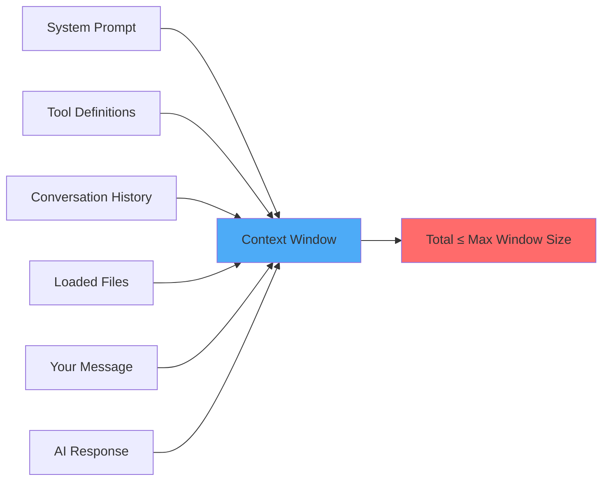

# Understanding Context Windows - Visual Guide

## 🎯 What You'll Learn

This guide explains **context windows** — one of the most important concepts for efficient AI usage — using visual aids and practical examples.

---

## 📊 What Is a Context Window?

The **context window** is the maximum amount of text (measured in tokens) that an LLM can process in a single request.

Think of it as the LLM's "working memory" or "attention span."

### Visual Analogy

```
Context Window = A Whiteboard
═══════════════════════════════════════════════════════════════
┌─────────────────────────────────────────────────────────────┐
│  Context Window: 128,000 tokens (GPT-4 Turbo)              │
├─────────────────────────────────────────────────────────────┤
│                                                              │
│  [Everything you write on this whiteboard counts]           │
│                                                              │
│  • System instructions                                       │
│  • Previous conversation                                     │
│  • Files you've opened                                       │
│  • Your current question                                     │
│  • The AI's response                                         │
│                                                              │
│  When the whiteboard is full, old stuff gets erased!       │
│                                                              │
└─────────────────────────────────────────────────────────────┘
```

---

## 🔍 What Counts Toward the Context Window?

**Everything!** That's the crucial insight.



### Breaking It Down

| Component | Typical Size | Your Control |
|-----------|--------------|--------------|
| **System Prompt** | 2,000 - 5,000 tokens | ❌ Set by tool/API |
| **Tool Definitions** | 1,000 - 10,000 tokens | ❌ Set by agent framework |
| **Conversation History** | Grows with each turn | ✅ Start fresh conversations |
| **Loaded Files** | 500 - 50,000+ tokens per file | ✅ Be selective! |
| **Your Prompt** | 10 - 1,000 tokens | ✅ Be concise |
| **AI Response** | 100 - 5,000+ tokens | ✅ Set constraints |

**The Problem**: Most users only think about "Your Prompt" but ignore the other 95% of token usage!

---

## 📈 How Context Accumulates (The Hidden Cost)

### LLMs Have No Memory


**Key Insight**: LLMs don't remember previous conversations. Each request is independent.

To create the illusion of memory, **the entire conversation history is resent with every request**.

### Example: Token Accumulation Over a Conversation

```
Turn 1:  You: "Create a User class"                     = 100 tokens sent
         AI:  "Here's a User class..."                   = 200 tokens response
         ─────────────────────────────────────────────────────────────────
         Total billed: 300 tokens

Turn 2:  Previous: [Turn 1 = 300 tokens]                = 300 tokens
         You: "Add email validation"                     = 50 tokens
         AI: "Here's the validation method..."           = 150 tokens
         ─────────────────────────────────────────────────────────────────
         Total billed: 500 tokens

Turn 3:  Previous: [Turn 1 + 2 = 500 tokens]            = 500 tokens
         You: "Add password hashing"                     = 50 tokens
         AI: "Here's the hashing method..."              = 200 tokens
         ─────────────────────────────────────────────────────────────────
         Total billed: 750 tokens

Turn 10: Previous: [All 9 turns = 3,000 tokens]         = 3,000 tokens
         You: "Fix the bug"                              = 50 tokens
         AI: "Fixed..."                                  = 100 tokens
         ─────────────────────────────────────────────────────────────────
         Total billed: 3,150 tokens
```

**Notice**: By Turn 10, you're paying for 3,000+ tokens just for history!

### Visualizing Growth

```
Without Context Management:
Turn 1:  ▓                               (0.3k tokens)
Turn 5:  ▓▓▓▓▓▓▓▓                        (2k tokens)
Turn 10: ▓▓▓▓▓▓▓▓▓▓▓▓▓▓▓▓                (6k tokens)
Turn 20: ▓▓▓▓▓▓▓▓▓▓▓▓▓▓▓▓▓▓▓▓▓▓▓▓▓▓▓▓▓▓  (20k tokens)

With Smart Management:
Turn 1:  ▓                               (0.3k tokens)
Turn 5:  ▓▓                              (0.8k tokens)
Turn 10: ▓▓▓                             (1.5k tokens)
Turn 20: ▓▓▓▓                            (2k tokens)
```

---

## ⚠️ What Happens When the Window Fills Up?


### Problem 1: Oldest Messages Get Dropped

```
Context Window: 128,000 tokens (100% full)
┌──────────────────────────────────────────────────┐
│ Turn 1-5:   DROPPED ❌                          │
│ Turn 6-10:  DROPPED ❌                          │
│ Turn 11-15: Still in memory ✓                   │
│ Turn 16-20: Still in memory ✓                   │
│ Turn 21:    New message ✓                       │
└──────────────────────────────────────────────────┘

The AI literally "forgets" your earlier conversation!
```

### Consequences

1. **AI Contradicts Itself**: Can't see what it said earlier
2. **Lost Context**: Forgets requirements you mentioned at the start
3. **Repeated Work**: Re-does things it already completed
4. **Confusion**: Asks questions you already answered
5. **Degraded Performance**: Works with incomplete information

### Real Example

```
Turn 5:  You: "Make the API use JWT authentication"
         AI:  "Done! Using JWT tokens..."

[... 20 more turns about other features ...]

Turn 25: You: "Add a new endpoint"
         AI:  "Should we add authentication? What kind?"
              ↑ Forgot you wanted JWT! (Turn 5 was dropped)
```

---

## 💰 How Context Windows Affect Your Costs

### Model Comparison

| Model | Context Window | Equivalent To | Input Cost (1M tokens) |
|-------|---------------|---------------|------------------------|
| GPT-4 Turbo | 128,000 tokens | ~300 pages | $10 |
| GPT-4o | 128,000 tokens | ~300 pages | $5 |
| Claude 3.5 Sonnet | 200,000 tokens | ~500 pages | $3 |
| Claude 3 Opus | 200,000 tokens | ~500 pages | $15 |
| GPT-3.5 Turbo | 16,000 tokens | ~40 pages | $0.50 |

**Note**: 1 page ≈ 400-500 tokens of typical text

### Cost Example: Long Conversation

```
Scenario: 20-turn conversation about a coding project

Without Management:
Turn 1:  300 tokens   = $0.003
Turn 5:  2,000 tokens = $0.020
Turn 10: 6,000 tokens = $0.060
Turn 15: 12,000 tokens = $0.120
Turn 20: 20,000 tokens = $0.200
─────────────────────────────────
Total: ~60,000 tokens = $0.60 (using GPT-4 Turbo)

With Smart Management (fresh starts every 5 turns):
Turn 1-5:   5,000 tokens  = $0.050
Turn 6-10:  5,000 tokens  = $0.050  
Turn 11-15: 5,000 tokens  = $0.050
Turn 16-20: 5,000 tokens  = $0.050
─────────────────────────────────
Total: ~20,000 tokens = $0.20 (using GPT-4 Turbo)

Savings: $0.40 (66% reduction!)
```

### Scale It Up

For a developer making **50 requests per day**:

```
Without Management:  $30/month → $360/year
With Management:     $10/month → $120/year
─────────────────────────────────────────
Savings:             $20/month → $240/year
```

For a **team of 10 developers**:

```
Potential savings: $2,400/year
```

---

## ✅ Token-Efficient Strategies for Context Windows

### Strategy 1: Start Fresh When Switching Topics

```
❌ Don't Do This:
[20 turns about Feature A = 15k tokens in context]
Turn 21: "Now let's work on Feature B"
→ Still carrying 15k tokens of irrelevant history!

✅ Do This:
[Complete work on Feature A]
[Start NEW conversation]
Turn 1: "Working on Feature B. Context: ..."
→ Only 500 tokens!
```

### Strategy 2: Summarize and Reset

```
✅ Smart Approach:
[After 15 turns of complex discussion]
Turn 16: "Summarize what we've accomplished and what's left"
AI: "We've built X, Y, Z. Remaining: A, B." (500 tokens)

[Start NEW conversation with summary]
Turn 1: "Based on this summary: [paste 500 tokens], let's do A..."
→ 500 tokens instead of 15,000 tokens!
```

### Strategy 3: Be Selective About Loaded Files

```
❌ Inefficient:
"Look at my project and add logging"
→ Loads 50 files, 100,000 tokens

✅ Efficient:
"Add logging to these 3 files: app.py, auth.py, utils.py"
→ Loads 3 files, 6,000 tokens
→ 94% token reduction!
```

### Strategy 4: Use Stateless Requests

```
❌ Long Conversation:
Turn 1: Load codebase (30k tokens)
Turn 2: Ask question (+30k = 60k total)
Turn 3: Ask another (+30k = 90k total)

✅ Separate Requests:
Request 1: "In app.py line 45, fix bug where..." (1k tokens)
Request 2: "In auth.py, add rate limiting..." (1k tokens)
Request 3: "In utils.py, optimize cache..." (1k tokens)
→ 3k total vs. 90k total!
```

### Strategy 5: Set Explicit Constraints

```
✅ Add Constraints to Prevent Token Waste:

"Add logging to app.py. Requirements:
- Only modify lines 100-150
- Add 1 log statement per function
- Don't show the entire file, just the changes
- Max 30 lines of output"

This prevents AI from:
- Loading/showing full file (saves tokens)
- Over-explaining (saves tokens)
- Generating unnecessary code (saves tokens)
```

---

## 🎯 Quick Reference: Context Window Red Flags

**🚨 Warning Signs You're Wasting Context**:

- [ ] Conversations lasting >15-20 turns
- [ ] AI asking questions you already answered
- [ ] Loading entire codebases for small changes
- [ ] Keeping old conversation history when switching topics
- [ ] Not setting constraints on output size
- [ ] Letting AI load files automatically without limits

**✅ Good Practices**:

- [x] Start fresh conversations for new topics
- [x] Summarize progress periodically
- [x] Specify exactly which files to load
- [x] Set output constraints ("max 20 lines")
- [x] Use separate requests for independent tasks
- [x] Monitor token usage in your AI tool

---

## 📚 Further Learning

### Tools to Monitor Token Usage

1. **OpenAI Tokenizer**: https://platform.openai.com/tokenizer
   - Paste text to see exact token count
   - Test different phrasings

2. **tiktoken Library**: https://github.com/openai/tiktoken
   - Python library to count tokens programmatically
   - Same tokenizer used by OpenAI models

3. **Built-in Monitoring**: 
   - GitHub Copilot: Shows token usage in IDE
   - Cursor: Displays context size
   - ChatGPT Plus: Shows message limits

### Hands-On Practice

Try the workshop exercises in `exercises/hands-on-lab.md`:
- Exercise 1: Token awareness and counting
- Exercise 4: Token-efficient prompt patterns
- Exercise 7: Token budget challenge

### Run the Demo

Execute the demo script to see visualizations:

```bash
python scripts/demo-script.py
# Select "Demo 8: Context Window Visualization"
```

---

## 💡 Key Takeaways

1. **Context windows are limited** — typically 16k-200k tokens per request
2. **Everything counts** — system prompts, history, files, your input, AI output
3. **History accumulates** — each turn adds to the context (compounding cost)
4. **Overflow causes confusion** — AI "forgets" when limit is reached
5. **Efficiency saves money** — Smart context management can save 60-90% of costs
6. **Bigger ≠ Better** — Don't maximize context; optimize it
7. **Think stateless** — Independent requests often cheaper than long conversations

---

## 🎓 Remember

> Context windows are like RAM — just because you have 32GB doesn't mean every app should use 32GB!

> The most expensive prompt isn't the longest one you write — it's the one that loads 100k tokens of context you don't need.

> Tokens = Money. Managing your context window = Managing your budget.

---

**Need help?** Refer to:
- Main workshop content: `materials/workshop-2-content.md`
- Quick reference: `materials/QUICK_REFERENCE.md`
- Instructor Q&A: `INSTRUCTOR_NOTES.md`
