# Workshop 2: AI Is Getting Expensive — Stop Wasting Tokens!

**Webinar Rescheduled: AI Token-Efficient Usage Workshop**

**Duration**: 1 hour  
**Level**: Intermediate  
**Instructor**: TFD Workshop Series

---

## 🎯 Learning Objectives

By the end of this workshop, participants will be able to:

1. Explain how Large Language Models work and understand token fundamentals
2. Recognize why agentic AI leads to higher token consumption
3. Apply software engineering principles to AI-assisted development
4. Design token-efficient prompts and workflows
5. Use divide-and-conquer strategies effectively
6. Leverage agentic skills for framework-specific tasks
7. Implement senior-junior delegation patterns with AI

---

## 📚 Table of Contents

- [Part 1: Understanding the Foundation](#part-1-understanding-the-foundation)
  - [How LLMs Work: A Quick Overview](#how-llms-work-a-quick-overview)
  - [What Are Tokens?](#what-are-tokens)
  - [The Evolution: From Prompts to Agents](#the-evolution-from-prompts-to-agents)
  - [Why Token Usage Is Exploding](#why-token-usage-is-exploding)
- [Part 2: The Myth of the "Magic Prompt"](#part-2-the-myth-of-the-magic-prompt)
- [Part 3: Software Engineering Principles for AI](#part-3-software-engineering-principles-for-ai)
- [Part 4: Token-Efficient Prompt & Workflow Design](#part-4-token-efficient-prompt--workflow-design)
- [Part 5: Agentic AI: Instructions, Tools, and Planning](#part-5-agentic-ai-instructions-tools-and-planning)
- [Part 6: Real-World Techniques](#part-6-real-world-techniques)
- [Summary and Key Takeaways](#summary-and-key-takeaways)

---

## Part 1: Understanding the Foundation

### How LLMs Work: A Quick Overview

**Duration**: 5 minutes

Large Language Models (LLMs) are neural networks trained on massive amounts of text data to predict the next word (or token) in a sequence.

#### The Basic Process

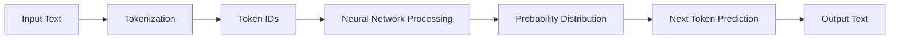

**Key Points:**

1. **Prediction, Not Understanding**: LLMs don't "understand" — they predict statistically likely continuations
2. **Context Window**: Limited memory (e.g., GPT-4: 128k tokens, Claude 3: 200k tokens)
3. **Stateless**: Each request is independent unless context is explicitly provided
4. **Token-Based Billing**: You pay for both input (prompt) and output (response) tokens

#### Why LLMs Have No Memory

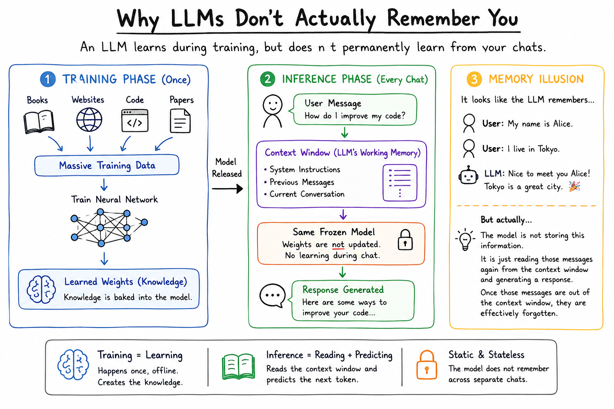

**Critical Insight**: LLMs don't remember previous conversations. Each request is completely independent.

To create the illusion of memory:
- The entire conversation history is **re-sent with every request**
- Turn 1: 100 tokens sent
- Turn 2: 100 new + 100 old = 200 tokens sent
- Turn 10: 100 new + 900 old = 1,000 tokens sent

This is why long conversations become expensive — you're paying to "remind" the AI of your entire conversation each time!

#### Real-World Analogy

Think of an LLM like autocomplete on steroids:
- Your phone's autocomplete predicts the next word
- LLMs predict entire responses based on patterns learned from training data
- Both work on probability, not true comprehension

---

### What Are Tokens?

**Duration**: 5 minutes

Tokens are the fundamental units that LLMs process — not quite words, not quite characters.

#### Tokenization Examples

```python
# Example using tiktoken (OpenAI's tokenizer)
import tiktoken

encoder = tiktoken.encoding_for_model("gpt-4")

# Different text, different token counts
examples = [
    "Hello, world!",           # 4 tokens: ["Hello", ",", " world", "!"]
    "Hello,world!",            # 3 tokens: ["Hello", ",", "world", "!"]
    "AI",                      # 1 token
    "artificial intelligence", # 2 tokens: ["artificial", " intelligence"]
    "café",                    # 2 tokens: ["caf", "é"]
    "console.log('test')",     # 6 tokens
]

for text in examples:
    tokens = encoder.encode(text)
    print(f"{text:30s} → {len(tokens)} tokens: {tokens}")
```

**Output:**
```
Hello, world!                  → 4 tokens: [9906, 11, 1917, 0]
Hello,world!                   → 3 tokens: [9906, 11, 14957, 0]
AI                             → 1 token: [15836]
artificial intelligence        → 2 tokens: [472, 21150, 11478]
café                           → 2 tokens: [66, 2642, 978]
console.log('test')            → 6 tokens: [5467, 13, 848, 2640, 1985, 11588]
```

#### Key Insights

1. **Spacing matters**: `"Hello, world!"` vs `"Hello,world!"` = different token counts
2. **Code is expensive**: Code typically uses more tokens than natural language
3. **Common words = fewer tokens**: Frequent words often get their own token
4. **Non-English costs more**: Languages with non-Latin scripts use more tokens
5. **Special characters**: Each punctuation mark might be a separate token

#### Token Cost Comparison

| Model | Input (1M tokens) | Output (1M tokens) | Context Window |
|-------|-------------------|---------------------|----------------|
| GPT-4 Turbo | $10 | $30 | 128k tokens |
| GPT-4o | $5 | $15 | 128k tokens |
| Claude 3.5 Sonnet | $3 | $15 | 200k tokens |
| Claude 3 Opus | $15 | $75 | 200k tokens |

💡 **Tip**: Output tokens are typically 2-3x more expensive than input tokens!

---

### Understanding Context Windows

**Duration**: 5 minutes

The **context window** is one of the most important concepts in working with LLMs, yet it's often misunderstood. Let's break it down.

#### What Is a Context Window?

The context window is the **maximum amount of text** (measured in tokens) that an LLM can process in a single request. Think of it as the LLM's "working memory."

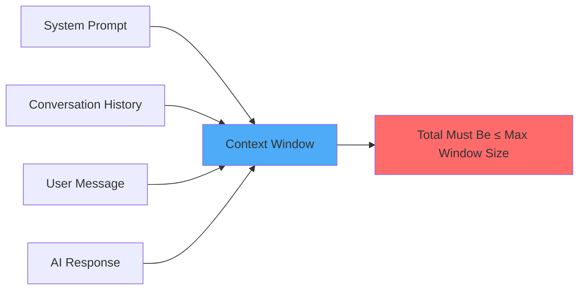

**Everything counts toward the limit:**
- System instructions (agent capabilities, tool definitions)
- Previous messages (conversation history)
- Your current prompt
- Files you've loaded or referenced
- The AI's response (as it generates)

#### Visual Example: Context Window Filling Up

```
┌─────────────────────────────────────────────────────────────┐
│  Context Window: 128,000 tokens (GPT-4 Turbo)              │
├─────────────────────────────────────────────────────────────┤
│ System Prompt (2,000 tokens)           ▓▓                  │
│ Tool Definitions (4,000 tokens)        ▓▓▓▓                │
│ Conversation History (20,000 tokens)   ▓▓▓▓▓▓▓▓▓▓▓▓▓▓      │
│ Loaded Files (30,000 tokens)           ▓▓▓▓▓▓▓▓▓▓▓▓▓▓▓▓▓▓▓▓│
│ Your Prompt (500 tokens)               ▓                    │
│ AI Response (3,500 tokens)             ▓▓▓                  │
├─────────────────────────────────────────────────────────────┤
│ Total Used: 60,000 tokens                                   │
│ Remaining: 68,000 tokens                                    │
└─────────────────────────────────────────────────────────────┘

Usage: 47% ████████████░░░░░░░░░░░░░░
```

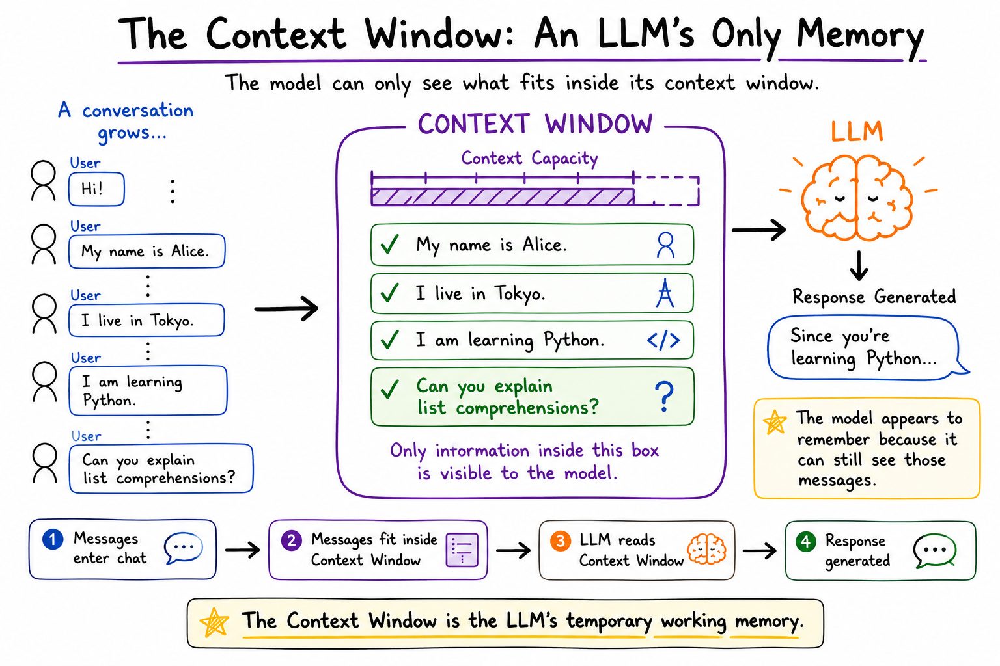

*The diagram above shows how different components fill up your context window. Notice how everything — system prompts, history, files, your input, and AI responses — all count toward the limit!*

#### Why Context Windows Matter for Token Efficiency

**Problem 1: Hidden Token Usage**

When you ask an AI agent to help with a project, it might load:

```
System prompt:           2,000 tokens
Tool definitions:        4,000 tokens
Your codebase (10 files): 30,000 tokens
Search results:          10,000 tokens
Conversation history:    15,000 tokens
Your actual prompt:      100 tokens
─────────────────────────────────────
Total INPUT tokens:      61,100 tokens

AI Response:             2,000 tokens
─────────────────────────────────────
Total BILLED tokens:     63,100 tokens
```

**You paid for 63,100 tokens even though your prompt was only 100 tokens!**

**Problem 2: Context Window Overflow**

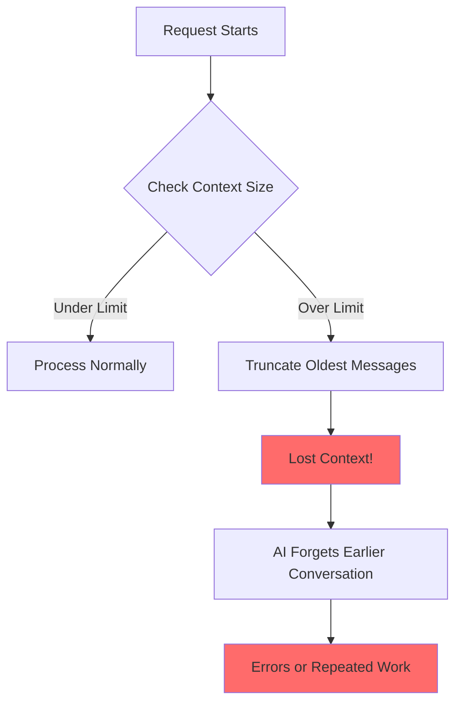

When the context window fills up:
1. **Older messages get dropped** - AI "forgets" earlier parts of the conversation
2. **You lose important context** - Previously discussed requirements disappear
3. **AI may contradict itself** - Can't see what it said earlier
4. **Repeated work** - AI re-does things it already completed

#### Real-World Example: Context Window in Action

**Scenario**: You're working on a project with an AI agent over 30 minutes.

```
Turn 1:  [System: 2k] + [Prompt: 0.1k] + [Response: 1k]     = 3.1k tokens
Turn 2:  [System: 2k] + [History: 3.1k] + [Prompt: 0.1k] + [Response: 1k] = 6.2k tokens
Turn 3:  [System: 2k] + [History: 6.2k] + [Prompt: 0.5k] + [Response: 2k] = 10.7k tokens
Turn 4:  [System: 2k] + [History: 10.7k] + [Files: 20k] + [Prompt: 0.1k] + [Response: 3k] = 35.8k tokens
Turn 5:  [System: 2k] + [History: 35.8k] + [Files: 20k] + [Prompt: 0.1k] + [Response: 2k] = 59.9k tokens

... after 15 turns, you've hit 120k tokens
Turn 16: Context window nearly full! Oldest turns start dropping!
```

**The token bill compounds with each turn** because history accumulates!

#### Context Window Sizes Comparison

| Model | Context Window | Equivalent To | Use Case |
|-------|---------------|---------------|----------|
| GPT-4 Turbo | 128,000 tokens | ~300 pages | Large codebases, long conversations |
| GPT-4o | 128,000 tokens | ~300 pages | Efficient large context processing |
| Claude 3.5 Sonnet | 200,000 tokens | ~500 pages | Entire repositories, books |
| Claude 3 Opus | 200,000 tokens | ~500 pages | Maximum context needs |
| GPT-3.5 Turbo | 16,000 tokens | ~40 pages | Short conversations, small files |

**1 page ≈ 400-500 tokens** (typical text document)

#### How Context Windows Relate to Token Costs

Larger context windows enable **two behaviors** that increase costs:

**1. Lazy Loading** - AI agents load more than needed

```
❌ With Large Context Window (200k tokens):
"I'll load all 50 files to be safe" → 100k tokens loaded

✅ With Smaller Context Window (16k tokens):
"I can only fit 3 files, so I'll be selective" → 6k tokens loaded
```

**2. Context Accumulation** - History grows with each turn

```
Conversation over 20 turns:

Turn 1:  Input: 2k tokens
Turn 10: Input: 35k tokens (history accumulated)
Turn 20: Input: 80k tokens (history keeps growing)

Total tokens used: 500k+ tokens
Total cost: $5+
```

#### Visualizing the Problem

```
Without Managing Context:
┌──────────────────────────────────────────┐
│ Turn 1:  ▓                               │ 2k tokens
│ Turn 5:  ▓▓▓▓                            │ 8k tokens
│ Turn 10: ▓▓▓▓▓▓▓▓▓▓▓▓                    │ 25k tokens
│ Turn 15: ▓▓▓▓▓▓▓▓▓▓▓▓▓▓▓▓▓▓▓▓▓▓          │ 55k tokens
│ Turn 20: ▓▓▓▓▓▓▓▓▓▓▓▓▓▓▓▓▓▓▓▓▓▓▓▓▓▓▓▓▓▓  │ 95k tokens
└──────────────────────────────────────────┘
                 ↓ Approaching limit!

With Smart Context Management:
┌──────────────────────────────────────────┐
│ Turn 1:  ▓                               │ 2k tokens
│ Turn 5:  ▓▓                              │ 4k tokens
│ Turn 10: ▓▓▓                             │ 6k tokens
│ Turn 15: ▓▓▓▓                            │ 8k tokens
│ Turn 20: ▓▓▓▓▓                           │ 10k tokens
└──────────────────────────────────────────┘
         ↓ Staying efficient by limiting context
```

#### Token Efficiency Strategies for Context Windows

**Strategy 1: Start Fresh When Needed**

Instead of:
```
[20 turns of conversation = 80k tokens in context]
Turn 21: "Now let's work on a different feature"
→ Still carrying all 80k tokens!
```

Do this:
```
[20 turns = 80k tokens]
[Start new conversation]
Turn 1: "Working on feature X. Here's the context: ..."
→ Only 2k tokens!
```

**Strategy 2: Summarize and Reset**

```
Turn 15: "Summarize what we've accomplished so far"
→ AI provides 500-token summary
[Start new conversation with summary]
Turn 16: "Based on this summary, let's continue with..."
→ 500 tokens instead of 50k tokens of history
```

**Strategy 3: Be Selective About Loaded Files**

```
❌ "Look at my project and add logging"
→ Loads 50 files, 100k tokens

✅ "Add logging to these 3 files: app.py, auth.py, utils.py"
→ Loads 3 files, 6k tokens
```

**Strategy 4: Use Stateless Requests**

```
Instead of long conversation:
Turn 1: Load codebase (30k tokens)
Turn 2: Ask question (+ 30k tokens = 60k total)
Turn 3: Ask another (+30k tokens = 90k total)

Use separate requests:
Request 1: "In app.py line 45, fix the bug where..."  (1k tokens)
Request 2: "In auth.py, add rate limiting to..."      (1k tokens)
Request 3: "In utils.py, optimize the cache function" (1k tokens)
```

#### The Bottom Line

**Context windows are:**
- ✅ Powerful for complex tasks requiring lots of information
- ⚠️ Expensive if not managed carefully
- 📊 Measured in tokens (everything counts!)
- 🎯 Best used strategically, not maximized by default

**Key Takeaway**: Bigger context windows don't mean you should use them fully. Think of them like RAM — just because you have 32GB doesn't mean every app should use 32GB!

---

### The Evolution: From Prompts to Agents

**Duration**: 3 minutes

Understanding how we arrived at the current state of AI assistants:

#### Phase 1: Simple Prompts (2020-2021)
```
User: "Write a Python function to sort a list"
AI: [Generates a single function]
Cost: ~100-200 tokens total
```

**Characteristics:**
- Single turn, single response
- No context retention
- Manual copy-paste workflow
- Low token usage

#### Phase 2: Chat Interfaces (2022-2023)
```
User: "Write a Python function to sort a list"
AI: [Generates function]
User: "Add error handling"
AI: [Updates function with try-except]
User: "Add type hints"
AI: [Updates with type annotations]
Cost: ~1,000-2,000 tokens (cumulative context)
```

**Characteristics:**
- Multi-turn conversations
- Context accumulates
- Still manual integration
- Moderate token usage (growing with conversation length)

#### Phase 3: Agentic AI (2024-Present)
```
User: "Build a web scraper with error handling, retries, and logging"
AI Agent:
  1. Reads your existing codebase (10k tokens)
  2. Searches for similar patterns (5k tokens)
  3. Generates scraper.py (2k tokens)
  4. Generates tests (1k tokens)
  5. Generates documentation (1k tokens)
  6. Runs tests, sees failures (3k tokens)
  7. Debugs and fixes (2k tokens)
  8. Updates related files (2k tokens)
  
Cost: ~26,000+ tokens in a single request!
```

**Characteristics:**
- Autonomous multi-step execution
- Tool usage (file read/write, search, execution)
- Self-planning and correction
- Context includes: codebase, tools, history, planning
- **Extremely high token usage**

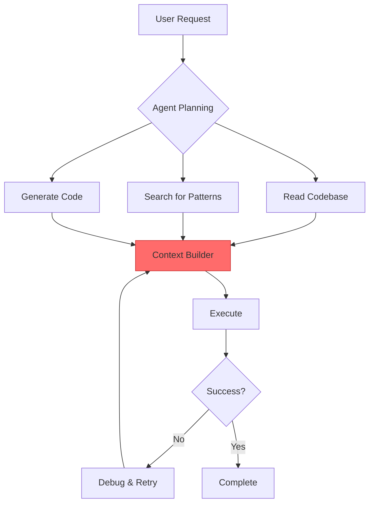

**The red "Context Builder" is where tokens accumulate rapidly.**

---

### Why Token Usage Is Exploding

**Duration**: 2 minutes

#### 1. **Agentic Autonomy**
Agents read entire files "just in case" they're relevant:
```
❌ Bad: Agent reads 10 files (50k tokens) to modify 1 function
✅ Good: Precise instructions to read only necessary context
```

#### 2. **Tool Call Overhead**
Every tool usage includes:
- Tool descriptions (in system prompt)
- Tool call formatting
- Tool output
- Agent reasoning about results

```json
{
  "tool_calls": [
    {
      "name": "read_file",
      "description": "Read the contents of a file...",
      "parameters": {...},
      "result": "[entire file contents]"
    }
  ],
  "reasoning": "I need to understand the current implementation..."
}
```

#### 3. **Iterative Refinement**
Agents often:
- Generate code
- Run tests
- See failures
- Regenerate
- Repeat

Each iteration multiplies token usage!

#### 4. **Large Context Windows Enable Laziness**
With 128k-200k token windows, agents can be wasteful:
- Loading entire codebases when only one file is needed
- Including excessive examples
- Verbose reasoning

#### Real Example: Token Explosion

**Simple Request**: "Add logging to my function"

**What happens behind the scenes:**

```
System Prompt: 2,000 tokens (agent instructions, tool definitions)
User Message: 50 tokens
Agent reads file: 500 tokens
Agent searches codebase: 3,000 tokens (multiple files)
Agent generates response: 800 tokens
Agent writes file: 500 tokens
Agent reasoning/planning: 1,200 tokens
---
Total: ~8,000 tokens for a simple change!
```

**At $5/1M input tokens**: That's $0.04 per request  
**100 requests per day**: $4/day = $120/month = $1,440/year

Multiply that across a team! 💸

---

## Part 2: The Myth of the "Magic Prompt"

**Duration**: 10 minutes

### The Promise of Perfect Prompts

You've probably seen advice like:

> "Use these 10 magic words to make AI 10x better!"  
> "Act as a senior software engineer with 20 years of experience..."  
> "Think step by step and explain your reasoning..."

**The Hard Truth**: There is no magic prompt that works for everything.

---

### Why "Magic Prompts" Fail

#### 1. **Token Waste**

```markdown
❌ Overly Elaborate Prompt (150 tokens):
"Act as an expert senior software engineer with 20+ years of experience 
in Python, JavaScript, and distributed systems. You are meticulous, 
detail-oriented, and always follow best practices. Think carefully 
about each decision step by step. Explain your reasoning clearly. 
Consider edge cases. Write production-ready code with comprehensive 
error handling..."

✅ Clear, Direct Prompt (10 tokens):
"Write a Python function to validate email addresses"
```

**Token Savings**: 140 tokens per request  
**Over 100 requests**: 14,000 tokens saved = $0.07 (input) + more in output

#### 2. **Context Pollution**

Long, elaborate prompts:
- Take up valuable context window space
- Can confuse the model with contradictory instructions
- Slow down processing
- Cost more

#### 3. **False Sense of Control**

```python
# Prompt: "Act as a perfect programmer who never makes mistakes"
# Reality: AI still makes mistakes because:
# - It's probabilistic, not deterministic
# - It can hallucinate
# - It doesn't understand, it predicts
```

---

### What Actually Works

#### ✅ Clarity Over Cleverness

```markdown
Instead of:
"Leverage your extensive expertise to architect a robust, scalable solution..."

Use:
"Create a Flask API with these endpoints: /users (GET, POST), /login (POST)"
```

#### ✅ Specific Examples Over Generic Instructions

```markdown
Instead of:
"Follow PEP 8 and write Pythonic code"

Use:
"Format like this example:
def calculate_total(items: list[float]) -> float:
    return sum(items)
"
```

#### ✅ Constraints Over Aspirations

```markdown
Instead of:
"Write the best possible code"

Use:
"Write code that:
- Uses type hints
- Has max 20 lines per function
- Includes docstrings
"
```

---

### The Real "Magic": Iteration

Good prompting is like good coding — it's iterative:

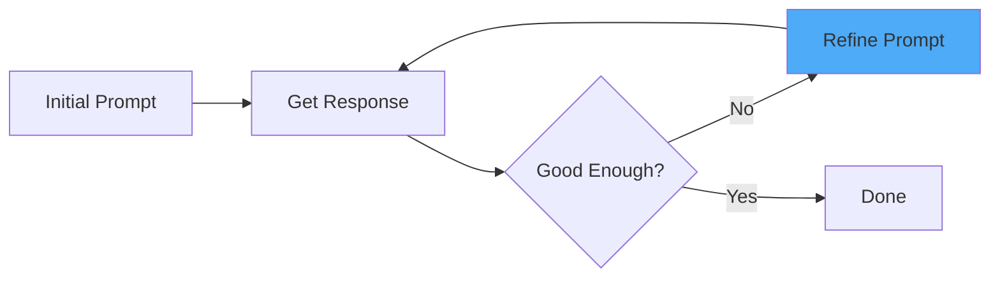

**Example Progression:**

```markdown
Attempt 1: "Create a user class"
Response: Basic class with no methods

Attempt 2: "Create a user class with name, email, and validate_email method"
Response: Better, but no error handling

Attempt 3: "Add ValueError if email is invalid"
Response: ✅ Exactly what you need!
```

**Total tokens**: Less than one "perfect" prompt that tries to specify everything upfront!

---

### Common Prompt Anti-Patterns

#### ❌ Anti-Pattern 1: The Novel

```markdown
"I need you to create a comprehensive, enterprise-grade, production-ready,
highly scalable, fault-tolerant, secure web application following SOLID
principles, clean architecture, domain-driven design, with comprehensive
unit tests, integration tests, end-to-end tests, CI/CD pipeline,
containerization, orchestration, monitoring, logging, distributed tracing,
API documentation, and security auditing..."

(200+ tokens before even describing what the app does!)
```

#### ❌ Anti-Pattern 2: The Roleplay

```markdown
"You are a 10x engineer working at FAANG with a PhD in Computer Science.
You've built systems that handle billions of requests. You think in
distributed systems, microservices, and event-driven architectures..."
```

**Reality**: These roles don't significantly improve output but waste tokens.

#### ❌ Anti-Pattern 3: The Step-by-Step Demand

```markdown
"Think step by step. Explain your reasoning. Show your work. Consider
alternatives. Evaluate trade-offs. Then and only then, provide code."
```

**Problem**: You get a verbose response with lots of explanations you might not need.

---

### ✅ What Actually Works: The Patterns

#### Pattern 1: The Specification

```markdown
Create a Python function that:
- Takes a list of dictionaries with 'name' and 'score' keys
- Returns the top 3 items sorted by score (descending)
- Handles empty lists by returning []
```

**Why it works**: Concrete requirements, testable outcomes, no fluff.

#### Pattern 2: The Example-Driven

```markdown
Transform this code:

def process(data):
    result = []
    for item in data:
        if item > 0:
            result.append(item * 2)
    return result

Into a list comprehension.
```

**Why it works**: Shows exact input and desired output format.

#### Pattern 3: The Constraint-Based

```markdown
Refactor this function to:
- Use max 15 lines
- No nested loops
- Type hints required
```

**Why it works**: Clear boundaries, measurable constraints.

---

## Part 3: Software Engineering Principles for AI

**Duration**: 15 minutes

### Applying Classic Principles to AI Interactions

The same principles that make code maintainable make AI interactions efficient:

1. **Single Responsibility Principle**
2. **Divide and Conquer**
3. **Iterative Development**
4. **Code Review Mindset**

---

### 1. Single Responsibility Principle

**Each prompt should do ONE thing well.**

#### ❌ Violating SRP

```markdown
"Create a FastAPI app with user authentication, database models using SQLAlchemy,
email verification, password reset, rate limiting, CORS configuration, logging,
testing, Docker configuration, and deployment documentation."
```

**Problems:**
- AI tries to do everything at once
- Higher chance of errors
- Difficult to debug
- Massive token usage
- No incremental validation

#### ✅ Following SRP

```markdown
Step 1: "Create basic FastAPI app structure with one /health endpoint"
[Verify it works]

Step 2: "Add SQLAlchemy User model with id, email, hashed_password fields"
[Verify it works]

Step 3: "Add POST /register endpoint that creates a user"
[Verify it works]

Step 4: "Add password hashing using passlib"
[Verify it works]

... and so on
```

**Benefits:**
- Each step is testable
- Errors are isolated and easy to fix
- Token usage is controlled
- You can stop when you have "enough"

---

### 2. Divide and Conquer for Complex Tasks

Break down complex tasks into a hierarchy of simpler subtasks.

#### Example: Building a Web Scraper

**❌ Monolithic Approach**

```markdown
"Build a web scraper that:
- Scrapes product data from multiple e-commerce sites
- Handles rate limiting
- Stores data in PostgreSQL
- Has retry logic
- Sends email notifications
- Has a dashboard
- Includes tests
- Has deployment config"
```

**Token Cost**: Potentially 50k+ tokens as AI loads tons of context, generates massive code, likely with errors.

#### ✅ Divide and Conquer Approach

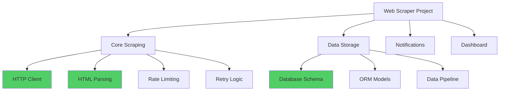

**Phase 1: Core Scraping (Start Here)**

```markdown
Prompt 1: "Create a function that fetches HTML from a URL using requests"
Prompt 2: "Add a simple rate limiter (1 request per second)"
Prompt 3: "Add retry logic for failed requests (max 3 retries)"
Prompt 4: "Parse product name and price from HTML using BeautifulSoup"
```

**Test each step before moving on!**

**Phase 2: Data Storage**

```markdown
Prompt 5: "Create SQLAlchemy model for Product (name, price, url, timestamp)"
Prompt 6: "Add function to save scraped products to database"
```

**Phase 3: Polish**

```markdown
Prompt 7: "Add logging"
Prompt 8: "Add email notification on completion"
```

**Token Savings**: 

- Monolithic: ~50k tokens (lots of context, big generation, debugging iterations)
- Divide & Conquer: ~15k tokens (targeted prompts, less context, easier debugging)
- **Savings: 70%**

---

### 3. The Senior-Junior Delegation Model

**Think of AI as a junior developer — capable but needs guidance and supervision.**

#### How Senior Developers Delegate

```python
# ❌ Bad Delegation (to junior developer)
"Go build the user authentication system. Figure it out."

# ✅ Good Delegation
"Create a User model with email and password_hash fields. 
Use SQLAlchemy. Follow this pattern from our existing Post model.
Let me review before you continue."
```

#### Applying to AI

```markdown
❌ Vague: "Fix the bugs in my app"

✅ Specific: "The login function raises KeyError on line 45. 
The user dict doesn't have an 'email' key. Add validation to check 
if 'email' exists before accessing it."
```

#### Key Principles

1. **Be Specific**: Like explaining to a junior what needs to be done
2. **Provide Examples**: Show, don't just tell
3. **Review Output**: Always check the AI's work
4. **Iterate**: Give feedback and refine
5. **Keep Tasks Small**: One focused task at a time

---

### 4. Iterative Development Over Big Bang

Software is built incrementally. AI-assisted development should be too.

#### The Waterfall Trap

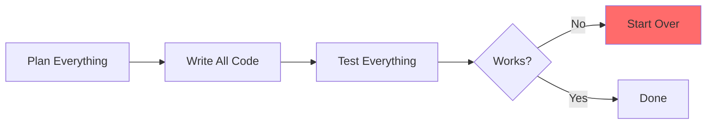

**Problem**: If it doesn't work, you have a mess to debug.

#### The Iterative Way

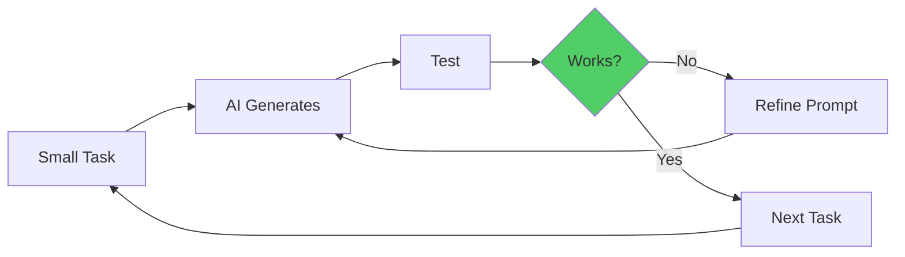

**Benefits**:
- Quick feedback loops
- Easier debugging
- Less token waste on wrong directions
- Building on validated foundations

---

### 5. Code Review Mindset

**Never blindly accept AI-generated code.**

#### The AI Code Review Checklist

```markdown
✅ Does it actually solve the problem?
✅ Is it secure? (No hardcoded secrets, SQL injection, etc.)
✅ Is it efficient? (No O(n²) where O(n) works)
✅ Is it readable and maintainable?
✅ Does it follow project conventions?
✅ Are there tests?
✅ Does it handle edge cases?
✅ Are there better alternatives?
```

#### Example: Spotting Issues

**AI Generated:**

```python
def get_user(user_id):
    query = f"SELECT * FROM users WHERE id = {user_id}"
    return db.execute(query)
```

**Issues:**
- ❌ SQL injection vulnerability
- ❌ No error handling
- ❌ Returns raw DB results (no model)
- ❌ No type hints

**After Review & Refinement:**

```python
from typing import Optional
from sqlalchemy.orm import Session
from .models import User

def get_user(db: Session, user_id: int) -> Optional[User]:
    """Fetch user by ID.
    
    Args:
        db: Database session
        user_id: User ID to fetch
        
    Returns:
        User object if found, None otherwise
    """
    return db.query(User).filter(User.id == user_id).first()
```

**Refinement Prompt:**

```markdown
"Rewrite using SQLAlchemy ORM to prevent SQL injection. 
Add type hints and docstring. Return None if user not found."
```

---

## Part 4: Token-Efficient Prompt & Workflow Design

**Duration**: 15 minutes

### Understanding Token Economics

Before optimizing, understand where tokens are spent:

```
Total Tokens = System Prompt + Context + User Prompt + AI Response + Tool Calls
```

#### Token Breakdown Example

```
System Prompt: 2,000 tokens (agent instructions, tool definitions)
Context: 10,000 tokens (files, search results, conversation history)
User Prompt: 100 tokens (your request)
AI Response: 1,500 tokens (code + explanation)
Tool Calls: 5,000 tokens (reading files, running commands)
---
Total: 18,600 tokens
```

**You control**: Context, User Prompt, and indirectly Tool Calls  
**You don't control**: System Prompt, AI Response length

---

### Strategy 1: Minimize Context Loading

#### ❌ Context Overload

```markdown
"Look at my entire codebase and fix any bugs"
```

**What happens:**
- AI loads 50+ files
- 100k+ tokens of context
- Expensive and slow
- Often misses the actual bug

#### ✅ Targeted Context

```markdown
"In auth.py, the login function fails when email is None. 
Fix the validation on line 45."
```

**What happens:**
- AI loads 1 file
- ~500 tokens of context
- Fast and focused
- Actually fixes the issue

---

### Strategy 2: Use File Paths Instead of Content

#### ❌ Wasteful

```markdown
"Here's my entire config.py file: [paste 200 lines]
Update the DATABASE_URL"
```

**Cost**: 1,000+ tokens just for the file content

#### ✅ Efficient

```markdown
"In config.py, update DATABASE_URL to use environment variable"
```

**Cost**: ~20 tokens  
**AI loads the file only if needed**

---

### Strategy 3: Precise Instructions Reduce Iteration

#### ❌ Vague (Multiple Rounds)

```markdown
Round 1: "Make it better"
→ AI guesses, probably wrong
Round 2: "No, I meant add error handling"
→ AI adds try-except
Round 3: "Actually, use custom exceptions"
→ AI rewrites
Total: 3 rounds × 5k tokens = 15k tokens
```

#### ✅ Precise (One Round)

```markdown
"Add error handling using custom exceptions:
- Raise InvalidEmailError if email is malformed
- Raise UserNotFoundError if user doesn't exist"

Total: 1 round × 5k tokens = 5k tokens
```

**Savings: 67%**

---

### Strategy 4: Limit Output Scope

AI will write as much code as it thinks you need. Control this!

#### ❌ Unbounded

```markdown
"Create a REST API for users"
```

**AI might generate:**
- Full CRUD operations
- Authentication
- Validation
- Tests
- Documentation
- 500+ lines of code
- 3,000+ tokens

#### ✅ Bounded

```markdown
"Create a single GET /users/:id endpoint. 
Return JSON with id, name, email. 
Max 20 lines of code."
```

**AI generates:**
- One endpoint
- ~30 lines of code
- ~200 tokens

**Use when appropriate**: "Show just the function signature first"

---

### Strategy 5: Reuse Patterns, Don't Regenerate

#### ❌ Regenerating

```markdown
Prompt 1: "Create a POST /users endpoint"
[AI generates 50 lines]

Prompt 2: "Create a POST /products endpoint" 
[AI generates 50 lines again, similar pattern]

Prompt 3: "Create a POST /orders endpoint"
[AI generates 50 lines again]
```

**Total**: 3 × 50 lines = 150 lines, lots of token duplication

#### ✅ Pattern Reuse

```markdown
Prompt 1: "Create a generic create_resource(model) function 
that handles POST endpoints. Use it to create POST /users"

Prompt 2: "Use create_resource for POST /products"

Prompt 3: "Use create_resource for POST /orders"
```

**Total**: 1 base function + 3 short usages = Less code, fewer tokens, more maintainable

---

### Strategy 6: Batch Related Changes

#### ❌ Sequential Single Changes

```markdown
Change 1: "Add type hint to function foo"
Change 2: "Add type hint to function bar"
Change 3: "Add type hint to function baz"
```

Each request reloads context!

#### ✅ Batched Changes

```markdown
"Add type hints to these functions in utils.py: foo, bar, baz"
```

**Token savings from context loading: 50-70%**

---

### Strategy 7: Ask for Diffs, Not Full Files

#### ❌ Full File Regeneration

```markdown
"Update the function in config.py"
```

**AI response:**

```python
# Here's the entire config.py file with the change:
import os
from pathlib import Path

# ... 200 lines of code including unchanged parts
```

**Token cost**: 1,000+ tokens for the entire file

#### ✅ Diff/Partial Response

```markdown
"Show only the updated function from config.py"
```

**AI response:**

```python
# Updated function:
def get_database_url():
    return os.getenv('DATABASE_URL', 'sqlite:///app.db')
```

**Token cost**: ~50 tokens

**Even better if your AI supports it:**
```markdown
"Show as a diff"
```

---

### Strategy 8: Stop Generation When You Have Enough

If AI starts generating more than you need:

- **In ChatGPT/Claude**: Use the stop button
- **In Copilot**: Press Escape to stop
- **In API**: Use `max_tokens` parameter

```python
# Using OpenAI API with token limits
response = openai.ChatCompletion.create(
    model="gpt-4",
    messages=[{"role": "user", "content": prompt}],
    max_tokens=200  # Limit response length
)
```

---

### Strategy 9: Use Caching (Where Available)

Some AI providers cache prompts:

- **Anthropic Claude**: Prompt caching (90% cost reduction for cached content)
- **OpenAI**: Context caching (in development)

#### How to Leverage Caching

```python
# Structure prompts so repeated content comes first
system_prompt = """
You are a code assistant.
Use this codebase structure: [large project description]
Follow these conventions: [large style guide]
"""  # This gets cached

user_prompt = "Add logging to auth.py"  # This changes
```

**First call**: Full token cost  
**Subsequent calls**: Only user_prompt tokens charged (system cached)

---

### Real-World Workflow Example

**Task**: Add rate limiting to an API

#### ❌ Inefficient Workflow

```markdown
1. "Look at my entire API code and add rate limiting"
   → AI loads 50 files, 100k tokens
   → Generates rate limiter for every endpoint
   → 3,000 lines of changes
   → Breaks half your tests

Total: ~120k tokens
Cost: ~$0.60
Time: 10 minutes + debugging
```

#### ✅ Efficient Workflow

```markdown
1. "Create a simple rate_limiter decorator that allows 100 requests/minute"
   → 50 tokens prompt
   → AI generates ~20 line decorator
   → Test it

2. "Apply @rate_limiter to POST /users endpoint in api/users.py"
   → 30 tokens prompt
   → AI adds one line
   → Test it

3. "Apply same decorator to all POST endpoints in api/users.py"
   → 30 tokens prompt
   → AI adds decorators
   → Test it

Total: ~5k tokens
Cost: ~$0.025
Time: 5 minutes, incremental testing
```

**Savings: 96% tokens, 95% cost, cleaner result**

---

## Part 5: Agentic AI: Instructions, Tools, and Planning

**Duration**: 10 minutes

### What Makes AI "Agentic"?

Traditional AI: You prompt → It responds  
Agentic AI: You prompt → It plans → It uses tools → It accomplishes goal

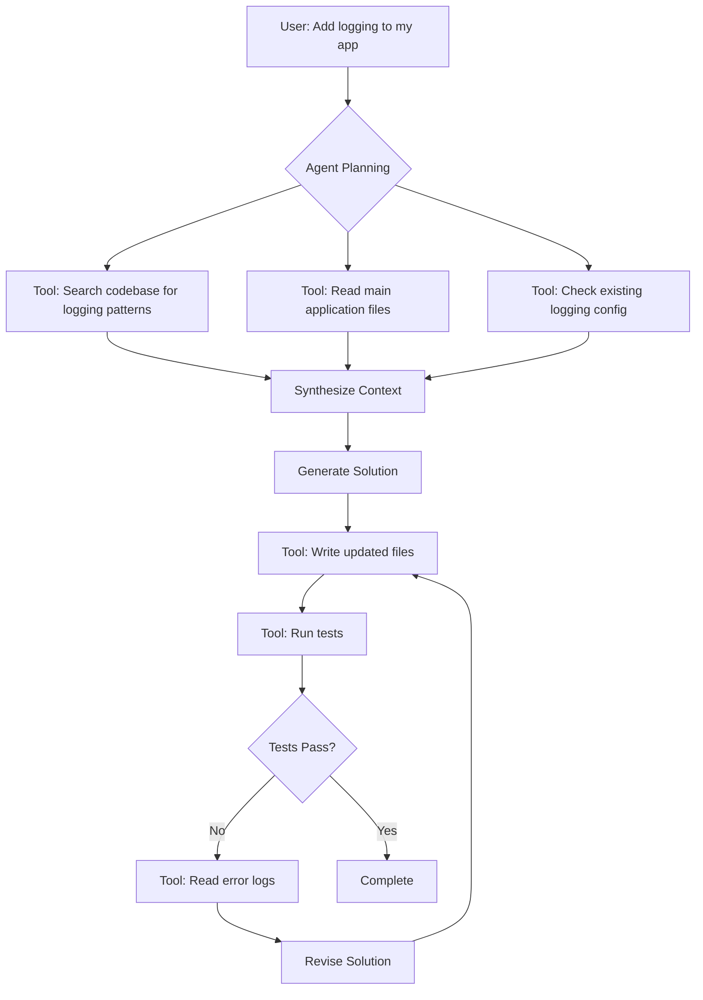

**Key Components:**

1. **Planning**: Breaking down your request into steps
2. **Tools**: File operations, search, execution, web access, etc.
3. **Execution Loop**: Plan → Execute → Verify → Adjust
4. **Context Management**: Tracking what's been done

---

### The Token Cost of Autonomy

Every autonomous action has token costs:

#### Tool Definitions (in system prompt)

```json
{
  "name": "read_file",
  "description": "Read the contents of a file from the workspace...",
  "parameters": {
    "file_path": {
      "type": "string",
      "description": "The absolute or relative path to the file..."
    },
    "line_start": {...},
    "line_end": {...}
  }
}
```

**~200 tokens per tool × 20 tools = 4,000 tokens just for tool definitions!**

#### Tool Calls

```json
{
  "reasoning": "I need to read the main app file to understand the structure",
  "tool": "read_file",
  "parameters": {
    "file_path": "src/app.py"
  },
  "result": "[entire file contents - 2,000 tokens]"
}
```

**Each tool call**: ~2,500+ tokens

#### Planning

```
Agent internal monologue:
"The user wants to add logging. First, I should search for existing 
logging configurations. Then I'll read the main files to understand 
the structure. Then I'll create a logging configuration. Then I'll 
update each file that needs logging..."
```

**Planning overhead**: 500-1,000 tokens

---

### Agentic Skills: Framework-Specific Expertise

Modern AI assistants can use **skills** — specialized knowledge for specific frameworks/libraries.

#### What Are Skills?

Skills are pre-packaged instructions that teach the AI about:
- Framework-specific patterns
- Best practices
- Common operations
- Project structure

**Example Skills:**
- `python-django-skill`: Django patterns, ORM usage
- `react-nextjs-skill`: Next.js conventions, SSR patterns
- `docker-compose-skill`: Multi-container setups

#### How Skills Save Tokens

#### ❌ Without Skills

```markdown
User: "Create a Django model for blog posts"

AI: [Loads general Python knowledge, guesses at Django syntax, 
     might use outdated patterns, generates verbose code]

Token cost: ~2,000 tokens (lots of general context)
```

#### ✅ With Django Skill

```markdown
User: "Create a Django model for blog posts"

AI: [Uses Django skill knowledge: knows model syntax, 
     field types, Meta options, best practices]

Token cost: ~500 tokens (focused, accurate)
```

**Savings**: 75% reduction + more accurate code

---

### Leveraging Skills Effectively

#### 1. Identify Framework-Specific Tasks

```markdown
✅ Good for skills:
- "Create a Next.js API route"
- "Set up Django authentication"
- "Configure Docker multi-stage build"

❌ Not framework-specific:
- "Write a sort function" (general programming)
- "Fix this typo" (too simple)
```

#### 2. Be Explicit About Framework Version

```markdown
Better: "Create a React component using hooks (React 18)"
vs.
Vague: "Create a React component"
```

#### 3. Reference Documentation

```markdown
"Create a FastAPI endpoint following the pattern in their docs:
https://fastapi.tiangolo.com/tutorial/path-params/"
```

---

### Controlling Agentic Behavior

Agents can be over-eager. Control them:

#### ✅ Set Boundaries

```markdown
"Update auth.py to add rate limiting.
DO NOT modify other files.
DO NOT run tests automatically."
```

#### ✅ Request Approval Steps

```markdown
"Plan out the changes needed for adding rate limiting.
List the files you'll modify.
Wait for my approval before making changes."
```

#### ✅ Limit Scope

```markdown
"Read only these files: auth.py, config.py
Generate the changes but don't write them yet."
```

---

### When to Use Agentic vs. Direct Prompting

| Scenario | Use Agentic | Use Direct Prompting |
|----------|-------------|----------------------|
| Multi-file refactoring | ✅ | ❌ |
| Complex debugging | ✅ | ❌ |
| Exploring unfamiliar codebase | ✅ | ❌ |
| Simple function generation | ❌ | ✅ |
| Code formatting | ❌ | ✅ |
| One-file changes | ❌ | ✅ |
| Need to control every step | ❌ | ✅ |

---

### Example: Agentic Task Breakdown

**Task**: "Migrate from SQLite to PostgreSQL"

#### Autonomous Agent Approach

```markdown
User: "Migrate my app from SQLite to PostgreSQL"

Agent Planning:
1. Search for database configuration files
2. Read current database setup
3. Identify all model definitions
4. Generate PostgreSQL migration
5. Update config files
6. Generate migration scripts
7. Update documentation
8. Create backup instructions

Token cost: ~40k tokens (lots of searching and reading)
```

#### Supervised Agent Approach

```markdown
User: "Plan migration from SQLite to PostgreSQL. 
List all files that need changes. Don't make changes yet."

Agent:
"Files to update:
- config/database.py (connection string)
- requirements.txt (add psycopg2)
- docker-compose.yml (add postgres service)
- .env.example (postgres credentials)"

User: "Update config/database.py and requirements.txt only"

[Agent makes only those changes]

User: "Now generate the docker-compose postgres service"

[Agent adds that]

Token cost: ~15k tokens (controlled, incremental)
```

**Savings: 62%**

---

## Part 6: Real-World Techniques from Experienced Developers

**Duration**: 10 minutes

### Technique 1: The "Explain Then Generate" Pattern

Instead of jumping straight to code:

```markdown
Round 1: "How would you approach adding caching to this API?"
→ AI explains strategy (500 tokens)
→ You review, adjust

Round 2: "Good. Implement Redis caching for the /users endpoint only"
→ AI generates code (1,000 tokens)
→ Correct code on first try

Total: 1,500 tokens
```

vs.

```markdown
Direct: "Add caching to my API"
→ AI guesses wrong approach (2,000 tokens)
→ You correct it
→ AI regenerates (2,000 tokens)
→ Still not quite right
→ Third attempt (2,000 tokens)

Total: 6,000 tokens + frustration
```

---

### Technique 2: The "Reference Implementation" Pattern

Show AI a working example:

```markdown
"I have this working endpoint:

@app.get('/users')
def get_users(db: Session = Depends(get_db)):
    return db.query(User).all()

Create a similar POST /products endpoint following the exact same pattern.
Use the Product model."
```

**Why it works:**
- Less ambiguity
- Consistent style
- Faster generation
- Fewer tokens (AI doesn't need to infer patterns)

---

### Technique 3: The "Incremental Refinement" Pattern

Start minimal, add features incrementally:

```markdown
Step 1: "Create a basic Product model with name and price"
[Test]

Step 2: "Add description and image_url fields"
[Test]

Step 3: "Add validation: price > 0, name max 100 chars"
[Test]

Step 4: "Add created_at and updated_at timestamps"
[Test]
```

Each step is small, testable, and cheap in tokens.

---

### Technique 4: The "Constraints First" Pattern

Specify constraints before asking for implementation:

```markdown
"I need a function to process uploaded images with these constraints:
- Max file size: 5MB
- Allowed formats: jpg, png, webp
- Resize to max 1920×1080
- Save to S3
- Return the S3 URL

Now implement it using Pillow and boto3."
```

**Why it works:** AI has clear boundaries, less likely to over-engineer.

---

### Technique 5: The "Error-Driven Refinement" Pattern

Use actual errors to guide AI:

```markdown
Attempt 1: "Create a function to parse JSON from a file"
→ AI generates code
→ You run it
→ Error: JSONDecodeError

Attempt 2: "The function raises JSONDecodeError when file is empty. 
Handle this by returning an empty dict."
→ AI adds specific error handling
→ Actually fixes the issue!
```

**vs. trying to predict all edge cases upfront**

---

### Technique 6: The "Diff Review" Pattern

For large changes, review diffs before applying:

```markdown
User: "Refactor auth.py to use JWT tokens instead of sessions.
Show me a diff of the changes first."

AI: [Shows detailed diff]

User: "The expiry time should be 24 hours, not 1 hour. 
Update the diff and apply."
```

**Benefits:**
- Catch issues before they're written
- Understand what's changing
- More control

---

### Technique 7: The "Test-Driven" Pattern

Ask for tests first:

```markdown
Step 1: "Write pytest test cases for a user registration function that:
- Validates email format
- Checks password strength
- Prevents duplicate emails"

Step 2: "Now implement the registration function to make these tests pass"
```

**Why it works:**
- Tests clarify requirements
- Implementation is focused
- Built-in verification

---

### Technique 8: The "Rubber Duck" Pattern

Use AI to explain code, not just generate it:

```markdown
"Explain what this function does line by line:
[paste complex code]"

→ AI explains
→ You understand
→ You realize the actual issue
→ You can now ask for a precise fix
```

**Cheaper than asking AI to blindly debug!**

---

### Technique 9: The "Progressive Context" Pattern

Build context progressively instead of all at once:

```markdown
Round 1: "I'm building a task management API. 
Just acknowledge and ask me about the first feature."

AI: "What's the first feature to implement?"

Round 2: "Create a Task model with title, description, status, due_date"

[AI generates, you test]

Round 3: "Now add a GET /tasks endpoint to list all tasks"

[Context builds incrementally]
```

**vs. dumping entire requirements in one massive prompt**

---

### Technique 10: The "Anti-Pattern Review" Pattern

Ask AI to critique its own code:

```markdown
Step 1: "Create a function to fetch user data from an API"
[AI generates]

Step 2: "Review the code above for:
- Security issues
- Performance problems
- Error handling gaps"

[AI identifies issues]

Step 3: "Fix the issues you identified"
[AI refactors]
```

**Gets better results than asking for perfect code upfront!**

---

## Summary and Key Takeaways

### 🎯 Core Principles

1. **Tokens = Money**: Every token counts. 200k tokens/month at GPT-4 rates = $80/month.

2. **Clarity > Cleverness**: Simple, direct prompts beat elaborate "magic" prompts.

3. **Small Tasks > Big Tasks**: Break complex work into incremental steps.

4. **Iteration > Perfection**: Refine through feedback instead of trying for perfect first attempt.

5. **Supervision > Autonomy**: Guide AI like a junior developer — precise delegation, active review.

---

### 💡 Practical Strategies

#### For Immediate Impact

1. **Be specific in prompts**: "Add rate limiting to POST /users" not "improve the API"
2. **Limit context**: Point to specific files, don't let AI load the whole codebase
3. **Request diffs or partial output**: "Show only the changed function"
4. **Batch related changes**: One prompt for multiple similar edits
5. **Stop unnecessary generation**: Use stop button if AI over-generates

#### For Workflow Optimization

1. **Use the SRP**: One prompt, one responsibility
2. **Divide and conquer**: Break projects into phases
3. **Provide examples**: Show patterns instead of describing them
4. **Incremental refinement**: Build features step by step
5. **Review before applying**: Check diffs, understand changes

#### For Agentic AI

1. **Set boundaries**: Tell AI what NOT to do
2. **Request plans first**: Review before execution
3. **Use framework skills**: Leverage specialized knowledge
4. **Control tool usage**: Limit file access when possible
5. **Supervise iterations**: Don't let AI loop autonomously

---

### 📊 Token Savings Recap

| Technique | Potential Savings |
|-----------|-------------------|
| Targeted vs. whole codebase context | 70-90% |
| Specific vs. vague prompts | 50-70% |
| Batched vs. sequential changes | 50-70% |
| Diffs vs. full file regeneration | 80-95% |
| Incremental vs. monolithic tasks | 60-80% |
| Using framework skills | 50-75% |
| Supervised vs. fully autonomous agents | 40-60% |

**Real Example**: 
- Bad approach: 100k tokens/month = $3-5/month
- Good approach: 20k tokens/month = $0.60-1/month
- **Savings: ~80% = $36-48/year per developer**

For a team of 10: **$360-480/year savings**

---

### 🚀 Action Items

**After this workshop:**

1. ✅ **Audit your AI usage**:
   - Check your token consumption (GitHub Copilot dashboard, API usage)
   - Identify high-cost interactions
   - Find patterns of waste

2. ✅ **Adopt one technique this week**:
   - Start with "specific prompts"
   - Try "incremental refinement" on next feature
   - Use "explain then generate" for complex tasks

3. ✅ **Set up token tracking**:
   - Monitor monthly usage
   - Set budget alerts
   - Track improvements

4. ✅ **Share with your team**:
   - Document your prompting patterns
   - Create team guidelines
   - Review each other's AI interactions

5. ✅ **Keep learning**:
   - Follow AI tool updates (new features, caching)
   - Experiment with different approaches
   - Measure what works for your workflow

---

### 🔗 Additional Resources

**Tools:**
- [OpenAI Tokenizer](https://platform.openai.com/tokenizer) - Visualize tokens
- [tiktoken](https://github.com/openai/tiktoken) - Count tokens programmatically
- [AI Token Counter](https://www.tokencounter.com/) - Multi-model counting

**Reading:**
- [Anthropic Prompt Engineering](https://docs.anthropic.com/claude/docs/prompt-engineering)
- [OpenAI Best Practices](https://platform.openai.com/docs/guides/prompt-engineering)
- [Prompt Engineering Guide](https://www.promptingguide.ai/)

**Community:**
- [r/PromptEngineering](https://reddit.com/r/PromptEngineering)
- [Prompt Engineering Discord](https://discord.gg/promptengineering)

---

### ❓ Q&A Topics

Common questions:

1. **"Isn't this premature optimization?"**
   - No. Token costs add up fast across teams. Building good habits early prevents waste.

2. **"Won't better models fix this?"**
   - Models improve, but prices often stay proportional. Efficiency always matters.

3. **"This seems like more work upfront"**
   - Short-term: slightly more thought required
   - Long-term: fewer errors, less debugging, lower costs, better results

4. **"What if I need comprehensive AI assistance?"**
   - Use it! But be intentional. For complex features, incremental agent-driven development is fine.
   - For simple changes, direct prompting is better.

5. **"How do I convince my team?"**
   - Show the math: token costs over time
   - Demonstrate quality improvement from focused prompts
   - Start with your own workflow, lead by example

---

### 🎓 Final Thoughts

AI coding assistants are powerful tools, but like any tool, they require skill to use effectively. The principles we've covered today aren't just about saving tokens — they're about **working smarter with AI to build better software faster**.

Remember:
- **AI is a tool, not a magic wand**
- **Good engineering principles apply to AI interactions**
- **Small, supervised tasks beat large, autonomous ones**
- **Iteration and refinement beat perfect-first-time attempts**
- **Your expertise guides the AI, not the other way around**

Thank you for attending! Questions?

---

**Next Workshop**: TBD - Check [AI/ML Series](../README.md) for updates.

**Feedback**: We'd love to hear your thoughts! [Post-workshop survey link]
