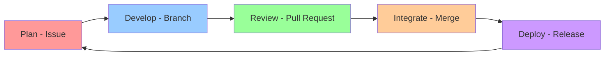
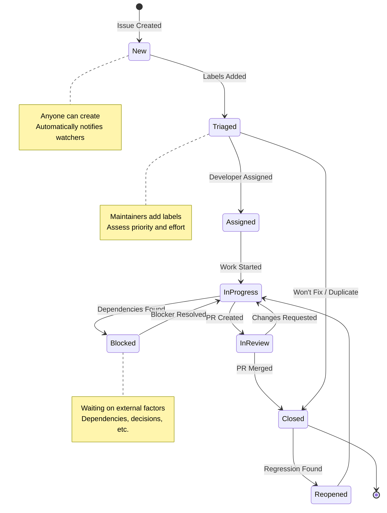
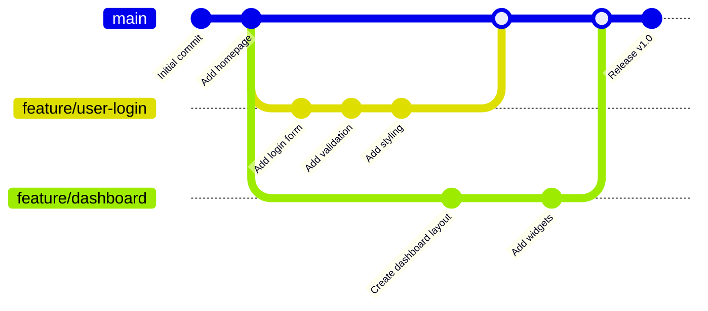
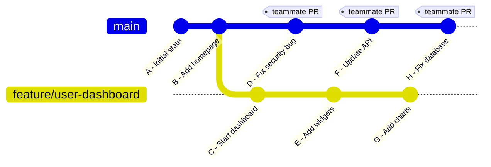
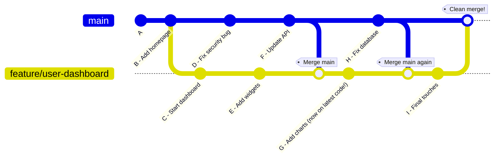

# Workshop 1: Git & GitHub Team Workflow

## 🎯 Learning Objectives

By the end of this workshop, you will:
- Understand how professional teams use Git and GitHub for collaboration
- Create and manage GitHub Issues for effective task tracking
- Use branch-based workflow to develop features safely
- Create meaningful pull requests and conduct code reviews
- Resolve merge conflicts with confidence
- Apply best practices for team communication and collaboration

---

Video recording of the workshop: *[Link will be added after live session]*

---

## 📚 Part 1: Introduction to Collaborative Development

### Why Team Workflows Matter

Imagine you're building a house with 10 other people. If everyone just starts hammering nails wherever they want, chaos ensues. You need:
- A **plan** (what to build)
- **Coordination** (who builds what)
- **Quality checks** (is it safe and well-built?)
- **Communication** (keeping everyone informed)

Software development is the same! Git and GitHub provide the tools for this coordination.

### Real-World Scenarios

**Scenario 1: The University Group Project**
Four students building a web application:
- Sarah works on the login page
- Mike builds the database
- Chen creates the navigation
- Anna designs the homepage

Without proper workflow: Everyone edits the same files, changes get overwritten, the project breaks constantly.

With proper workflow: Each person works independently, changes are reviewed, integration happens smoothly.

**Scenario 2: The Startup Team**
A team of 6 developers building a mobile app with weekly releases. They use Git workflows to:
- Track bugs and features
- Review each other's code
- Deploy confidently
- Onboard new team members

### The Git Collaboration Lifecycle



---

## 📋 Part 2: GitHub Issues - Your Team's Task Manager

### What Are GitHub Issues?

Think of issues as **smart to-do cards** that can:
- Describe a task, bug, or feature request
- Track progress and discussions
- Link to code changes
- Notify relevant team members
- Organize work with labels and milestones

### Anatomy of a Good Issue

#### Bad Issue Example ❌
```
Title: Fix bug
Body: There's a problem with the login
```

**Problems:**
- Too vague
- No context
- Can't assign priority
- Doesn't explain impact

#### Good Issue Example ✅
```markdown
Title: Login button does not respond on mobile Safari

**Description:**
When users tap the login button on mobile Safari (iOS 15+), nothing happens.
The button works fine on desktop browsers.

**Steps to Reproduce:**
1. Open app on iPhone with Safari
2. Navigate to login page
3. Enter valid credentials
4. Tap "Login" button
5. Nothing happens - no error, no navigation

**Expected Behavior:**
User should be redirected to dashboard after successful login

**Actual Behavior:**
Button appears to be tapped (visual feedback) but no action occurs

**Environment:**
- Device: iPhone 12
- OS: iOS 15.6
- Browser: Safari (latest)

**Screenshots:**
[Attach screenshot showing the issue]

**Priority:** High (affects 30% of users)
**Labels:** bug, mobile, urgent
```

**Why this is good:**
- Clear, specific title
- Detailed reproduction steps
- Expected vs actual behavior
- Environment details
- Visual evidence
- Priority indicated

### Creating Your First Issue

**Step 1: Navigate to Issues Tab**

```bash
# On GitHub repository page
https://github.com/your-username/your-repo
Click "Issues" tab → "New Issue"
```

**Step 2: Write a Descriptive Title**

Good titles follow patterns:
- `Add [feature name]` - for new features
- `Fix [specific problem]` - for bugs
- `Update [component]` - for improvements
- `Refactor [area]` - for code cleanup

Examples:
- ✅ `Add user profile page with avatar upload`
- ✅ `Fix memory leak in data processing module`
- ❌ `Update stuff`
- ❌ `Things are broken`

**Step 3: Fill Out the Body**

Use this template:

```markdown
## Description
[What needs to be done and why]

## Acceptance Criteria
- [ ] Criterion 1
- [ ] Criterion 2
- [ ] Criterion 3

## Additional Context
[Any relevant information, links, or screenshots]
```

**Step 4: Add Labels**

Common label categories:
- **Type:** `bug`, `feature`, `documentation`, `enhancement`
- **Priority:** `urgent`, `high`, `medium`, `low`
- **Status:** `in-progress`, `blocked`, `needs-review`
- **Area:** `frontend`, `backend`, `database`, `api`

**Step 5: Assign and Milestone**

- **Assign to:** Person responsible for the work
- **Milestone:** Which release or sprint this belongs to
- **Projects:** If using GitHub Projects board

### Practical Example: Planning a Feature

Let's create issues for building a "User Comments" feature:

**Issue #1: Backend API**
```markdown
Title: Create API endpoint for user comments

## Description
Build RESTful API endpoint to handle comment operations for blog posts

## Tasks
- [ ] Design comment data model (author, content, timestamp, post_id)
- [ ] Create POST /api/comments endpoint
- [ ] Create GET /api/comments/:postId endpoint  
- [ ] Create DELETE /api/comments/:commentId endpoint
- [ ] Add authentication middleware
- [ ] Write unit tests

## Dependencies
- Requires database migration (#45)

## Estimated Time: 4 hours
Labels: feature, backend, api
```

**Issue #2: Frontend Component**
```markdown
Title: Build comment section UI component

## Description
Create React component to display and submit comments

## Tasks
- [ ] Design comment card layout
- [ ] Create CommentList component
- [ ] Create CommentForm component  
- [ ] Add loading and error states
- [ ] Implement pagination
- [ ] Add accessibility features

## Dependencies
- Requires API endpoint (#46)

## Design Mockup
[Link to Figma design]

## Estimated Time: 5 hours
Labels: feature, frontend, react
```

### Issue Management Best Practices

✅ **Do:**
- Create issues early - capture ideas when you have them
- Keep issues focused - one issue = one topic
- Update issues as work progresses
- Close issues when complete
- Reference issues in commits: `git commit -m "Implement user login, fixes #23"`
- Use templates for consistency

❌ **Don't:**
- Leave issues open indefinitely
- Create duplicate issues
- Use issues for conversations (use Discussions instead)
- Forget to link related issues
- Let issues grow too large

### Issue Referencing in Git

GitHub automatically links issues when you use these keywords in commit messages or PRs:

```bash
# These keywords automatically close the issue when merged to main:
git commit -m "Fix login validation, fixes #42"
git commit -m "Add dark mode, closes #38"
git commit -m "Resolve #55 by updating dependencies"

# These keywords just reference without closing:
git commit -m "Work on #42 - add input validation"
git commit -m "See #38 for context"
```

---

## 🔍 Part 2.5: Analyzing Effective GitHub Issues

Let's examine different types of issues to understand what makes them effective. These examples demonstrate best practices you can apply to your own projects.

### Example 1: Feature Request - Study Group Finder App

**Project:** University Study Group Platform

**Issue Title:** "Add filtering by study time preferences"

**What Made This Issue Excellent:**

```markdown
## Problem Statement
Currently, students can only search for study groups by course name.
Many students have specific time constraints (morning person vs night owl,
weekday vs weekend) and want to find groups that match their schedule.

## Proposed Solution
Add filter options for:
- Preferred study times (Morning/Afternoon/Evening/Night)
- Preferred days (Weekdays/Weekends/Flexible)
- Session duration preference (30min/1hr/2hr/3hr+)

## Example Use Case
javascript
// User selects filters
const filters = {
  preferredTime: ['Morning', 'Afternoon'],
  preferredDays: ['Weekdays'],
  sessionDuration: '1-2hr'
};

// System shows matching study groups
const matchingGroups = filterStudyGroups(filters);


## Benefits
- Helps students find compatible study partners
- Reduces schedule conflicts
- Increases engagement with platform
- Better user experience

## Considerations
- Need to update database schema (add preference fields)
- UI space constraints on mobile
- Should preferences be required or optional?
- What if no groups match all filters?

## Related Issues
- #23 (Study group creation flow)
- #45 (Search functionality improvements)
- #67 (User profile enhancements)

## Mockup
[Attach wireframe of filter UI]

Labels: enhancement, frontend, backend, user-experience
Priority: Medium
Estimated Effort: 8-12 hours
```

**Key Lessons:**
1. ✅ **Clear problem statement** - Explains current limitation
2. ✅ **Concrete use case** - Shows code example and user scenario
3. ✅ **Benefits outlined** - Explains value to users
4. ✅ **Considerations listed** - Shows thoughtful analysis
5. ✅ **Linked to related issues** - Provides context
6. ✅ **Proper labels and estimates** - Helps with planning

### Example 2: Bug Report - Campus Food Ordering App

**Project:** University Cafeteria Order System

**Issue Title:** "Order confirmation email not sent when using guest checkout"

**Why This Bug Report Worked:**

```markdown
## Bug Description
Users who checkout as guests (without creating an account) complete
their order successfully but never receive a confirmation email.
Logged-in users receive emails correctly.

## Steps to Reproduce
1. Visit cafeteria.university.edu
2. Add items to cart: 1x Burger ($8), 1x Fries ($3)
3. Click "Checkout"
4. Select "Continue as Guest"
5. Enter email: test@student.edu
6. Complete payment (test mode)
7. See "Order Confirmed" page
8. Check email inbox → No confirmation email received

## Expected Behavior
Guest users should receive order confirmation email with:
- Order number
- Items ordered
- Total cost
- Pickup time and location

## Actual Behavior
- Order is created in database (verified)
- Payment is processed
- No email is sent
- User has no record of order details

## Environment
- Browser: Chrome 108.0
- OS: macOS 13.2
- Device: MacBook Pro
- Order ID: #ORD-20260304-1234 (for reference)

## Error Logs
javascript
// From browser console:
Warning: Email service skipped - user not authenticated
EmailService.send() returned null


## Impact
- Affects ~40% of users (guest checkout rate)
- Users can't track their orders
- Customer service receives complaints
- Revenue at risk if users abandon carts

## Workaround
Tell users to create accounts before ordering (not ideal)

## Screenshots


Labels: bug, critical, guest-checkout, email
Priority: High
```

**Key Lessons:**
1. ✅ **Reproducible steps** - Detailed step-by-step reproduction
2. ✅ **Expected vs actual behavior** - Clear contrast
3. ✅ **Environment details** - Helps debugging
4. ✅ **Error logs included** - Provides technical clues
5. ✅ **Impact quantified** - Shows business importance
6. ✅ **Visual evidence** - Screenshots support claims

### Example 3: Documentation Issue - Library Management System

**Project:** Campus Library Book Reservation System

**Issue Title:** "API documentation missing authentication examples"

**Why This Documentation Issue Stood Out:**

```markdown
## Current Documentation Problem
The API documentation lists all available endpoints but doesn't clearly
explain how to authenticate API requests. New developers trying to
integrate with our system get 401 errors and can't figure out why.

## Confusing Scenario
python
# Documentation shows:
GET /api/books
Response: 200 OK with book list

# But in reality:
response = requests.get('https://library.api/books')
# Returns: 401 Unauthorized
# No explanation of why or how to fix


## What's Missing
1. How to obtain an API key
2. Where to include the API key in requests
3. Token expiration and refresh process
4. Example requests in multiple languages
5. Common authentication errors and solutions

## Suggested Improvement
Add a new "Authentication" section at the beginning of API docs:

markdown
## Authentication

All API requests require authentication using an API key.

### Getting Your API Key
1. Log in to your account
2. Navigate to Settings → API Access
3. Click "Generate API Key"
4. Save the key securely (shown only once)

### Using Your API Key

**In Request Headers:**
bash
curl -H "Authorization: Bearer YOUR_API_KEY" \
  https://library.api/books


**In Python:**
python
import requests

headers = {
    'Authorization': 'Bearer YOUR_API_KEY'
}
response = requests.get('https://library.api/books', headers=headers)


**In JavaScript:**
javascript
fetch('https://library.api/books', {
  headers: {
    'Authorization': Bearer ${apiKey}
  }
})


### Common Errors

**401 Unauthorized**
- Missing or invalid API key
- API key expired (keys expire after 90 days)
- Solution: Generate new API key

**403 Forbidden**
- Valid key but insufficient permissions
- Solution: Contact admin to upgrade access level


## Affected Users
- Third-party developers integrating with our API
- Students building class projects using our API
- Mobile app developers

## Related Documentation
- Authentication flow diagram (needs to be created)
- Security best practices page
- API rate limiting policy

Labels: documentation, api, good-first-issue, help-wanted
Priority: Medium
Estimated Effort: 3-4 hours
```

**Key Lessons:**
1. ✅ **Specific problem identified** - Points to exact gap
2. ✅ **Concrete improvement suggested** - Provides actual content
3. ✅ **Multiple code examples** - Shows different languages
4. ✅ **Audience consideration** - Thinks about who needs this
5. ✅ **Actionable solutions** - Clear path to implementation

### Example 4: Performance Issue - Course Registration System

**Project:** University Course Registration Portal

**Issue Title:** "Search results take 8+ seconds during registration periods"

**Why This Performance Report Was Effective:**

```markdown
## Issue Description
During course registration periods (first 3 days of semester),
the course search functionality becomes extremely slow, taking
8-15 seconds to return results. During off-peak times, searches
complete in under 1 second.

## Reproduction Steps
1. Log in during registration period (e.g., March 1-3)
2. Navigate to "Course Search"
3. Search for "Computer Science"
4. Wait 8-12 seconds for results
5. Try different search terms - all equally slow

## Performance Measurements

### Peak Times (Registration Period)
- Query time: 8.2s average (measured over 50 searches)
- Server CPU: 85-95% utilization
- Database connections: 95/100 (maxed out)
- Concurrent users: ~2,500

### Off-Peak Times
- Query time: 0.8s average
- Server CPU: 20-30% utilization
- Database connections: 15/100
- Concurrent users: ~200

## Expected Behavior
Search should return results in under 2 seconds even during peak load

## System Information
- Server: AWS EC2 t3.medium (2 vCPU, 4GB RAM)
- Database: PostgreSQL 14.2
- Backend: Node.js 18.x + Express
- Peak load: 2,500 concurrent users
- Database size: 50,000 courses, 30,000 students

## Investigation Done

**Database Analysis:**
sql
EXPLAIN ANALYZE 
SELECT * FROM courses 
WHERE course_name ILIKE '%Computer Science%' 
OR course_code ILIKE '%Computer Science%';

-- Results: Full table scan, no index usage
-- Execution time: 8,234ms


**Network Monitoring:**
- Network latency normal (<50ms)
- No packet loss
- Issue is clearly database query performance

**Query Patterns:**
- 70% of queries search by course name (text search)
- 20% search by course code
- 10% search by professor name
- All searches use ILIKE (case-insensitive pattern matching)

## Root Cause Hypothesis
The courses table has no indexes on frequently searched columns
(course_name, course_code, professor_name). When combined with
ILIKE pattern matching and high concurrent load, queries perform
full table scans.

## Proposed Solutions

**Option A: Add Database Indexes**
sql
CREATE INDEX idx_course_name ON courses 
USING gin(to_tsvector('english', course_name));

CREATE INDEX idx_course_code ON courses (course_code);

- Pro: Addresses root cause
- Pro: Simple implementation
- Con: Slightly slower writes (acceptable trade-off)
- Estimated improvement: 8s → 1.5s

**Option B: Implement Redis Cache**
- Pro: Extremely fast reads
- Pro: Reduces database load
- Con: Cache invalidation complexity
- Con: Additional infrastructure cost
- Estimated improvement: 8s → 0.3s

**Option C: Elasticsearch Integration**
- Pro: Made for full-text search
- Pro: Excellent performance
- Con: Major infrastructure change
- Con: High implementation cost
- Estimated improvement: 8s → 0.5s

## Recommended Approach
**Short-term:** Implement Option A (indexes)
**Long-term:** Consider Option B (caching) when load increases

## Workaround
None - users must wait or try during off-peak hours

## Impact
- Affects 100% of users during registration
- Students miss popular course spots while waiting
- High frustration and complaints
- Server costs increase due to CPU maxing out

Labels: performance, database, critical, backend
Priority: Critical
Estimated Effort: Option A = 4-6 hours, Option B = 20-30 hours
```

**Key Lessons:**
1. ✅ **Quantitative measurements** - Actual performance data
2. ✅ **Thorough investigation** - Shows debugging work done
3. ✅ **Root cause identified** - Clear hypothesis
4. ✅ **Multiple solutions proposed** - With trade-offs analyzed
5. ✅ **Recommendation provided** - Clear path forward
6. ✅ **Impact quantified** - Business case for fixing

### Comparative Analysis: Good vs Poor Issues

#### Poor Issue Example ❌

```markdown
Title: App crashes

Body: 
The app keeps crashing. Please fix.

Labels: bug
```

**Problems:**
- No reproduction steps
- No environment details
- No error messages
- Too vague to act on
- Likely to be closed without action

#### Improved Version ✅

```markdown
Title: App crashes on iOS 15 when uploading images larger than 10MB

## Description
The app crashes immediately when users attempt to upload images
larger than 10MB from the photo library on iOS 15 devices.

## Steps to Reproduce
1. Open app on iPhone running iOS 15.6
2. Navigate to "Create Post" screen
3. Tap "Add Photo" button
4. Select image from photo library (test with 12MB image)
5. App crashes immediately after selection

## Expected Behavior
App should either:
- Compress image before upload, or
- Show error message about file size limit

## Actual Behavior
App crashes with error:
ERROR: Memory limit exceeded (com.apple.Photos.memory-limit)


## Environment
- App version: 2.3.1
- Device: iPhone 12 Pro
- iOS version: 15.6
- Test image size: 12MB (4032x3024 px)

## Crash Log
[Attach relevant portion of crash log]

## Frequency
- Reproducible 100% of the time with images > 10MB
- Works fine with images < 10MB

Labels: bug, iOS, media-upload, priority:high
```

**Why It's Better:**
- Specific and actionable
- Includes reproduction steps
- Has error details
- Defines expected behavior
- Provides context and patterns

---

## 🔄 Part 2.6: The Complete GitHub Issue Lifecycle

Understanding the full lifecycle of an issue helps you collaborate more effectively. Let's walk through each stage with real examples.

### Stage 1: Issue Creation 🆕

**Who:** Anyone (team members, users, stakeholders)

**When:** When you discover a problem, idea, or task

**Example:**

```markdown
Title: Users can't reset password if email address changed

## Problem
Users who changed their email address in account settings cannot
receive password reset emails because the system still sends to
the old email address.

## Impact
- Affects ~5% of users (based on support tickets)
- Users get locked out of accounts
- Requires manual admin intervention

## Expected Solution
Password reset should use current email from user_profile table,
not cached email from auth_session table.

Labels: bug, authentication, priority:high
Assigned to: [None initially]
Milestone: Sprint 15
```

**This triggers:**
- Notifications to repository watchers
- Addition to project board (if configured)
- Bot automation (if set up)

### Stage 2: Triage & Assignment 🏷️

**Who:** Project maintainers, team leads

**When:** During triage meetings or continuously

**Actions in this stage:**

**Comment by Maintainer:**
```markdown
@sarah Thanks for reporting! This is definitely a bug.

I can confirm this behavior based on our logs. 

@mike Can you take a look at the authentication service?
This seems related to the session caching changes from #342.

Priority: High (user-blocking)
Complexity: Medium (2-3 days estimated)
```

**Changes:**
- Labels added: `confirmed`, `backend`
- Assigned to: @mike
- Milestone confirmed: Sprint 15
- Linked to related issue: #342

### Stage 3: Investigation & Discussion 💬

**Who:** Assigned developer + stakeholders

**When:** Before starting implementation

**Example Discussion:**

**Developer Comment:**
```markdown
@sarah I investigated this issue. Here's what I found:

**Root Cause:**
The password reset function queries auth_sessions table which
caches email addresses for 24 hours. When users change email,
the cache isn't invalidated.

**Proposed Solutions:**

**Option A: Invalidate cache on email change**
- Pro: Minimal code changes
- Pro: Fixes this specific issue
- Con: Doesn't solve similar caching issues elsewhere

**Option B: Always query current email from user_profile**
- Pro: Always uses up-to-date data
- Pro: Prevents similar issues
- Con: Slight performance hit (extra query)

**Option C: Reduce cache TTL to 5 minutes**
- Pro: Quick fix
- Con: Still has small window for issue
- Con: Doesn't fully solve problem

**Recommendation:**
I suggest Option B. The extra query is negligible compared to
sending emails, and it prevents an entire class of bugs.

Thoughts @teamlead and @sarah?
```

**Team Lead Response:**
```markdown
@mike Good analysis! I agree with Option B.

Let's also add a test case to prevent regression.

Go ahead with implementation.
```

**User Response:**
```markdown
@mike Thanks for the detailed explanation! Option B makes sense
from a user perspective - we always want the most current email.

Appreciate the quick response! 🙏
```

### Stage 4: Implementation 💻

**Who:** Assigned developer

**When:** After approach is agreed upon

**Developer Updates:**

**Initial Update:**
```markdown
Started working on this. Created branch: fix/password-reset-email-cache

Will update when PR is ready.
```

**During Development:**
```markdown
**Progress Update:**

✅ Modified passwordReset function to query user_profile directly
✅ Added integration test for email change scenario
✅ Updated documentation
🚧 Working on edge case: deleted emails

Should have PR ready by tomorrow.
```

**PR Created:**
```markdown
PR #458 is ready for review! 🎉

Implements Option B as discussed.

Changes:
- Modified auth/passwordReset.js to query current email
- Added test case for email change scenario
- Added test for mixed-case email addresses
- Updated API documentation

Please review @teamlead and @sarah
```

### Stage 5: Code Review & Iteration 🔍

**Who:** Reviewers + original developer

**When:** After PR is created

**Reviewer Comment on PR:**
```markdown
Looking good overall! A few questions:

1. **Line 45:** Should we also update the email verification flow?
   It might have the same caching issue.

2. **Line 78:** Consider adding error handling for case where
   user_profile record is missing.

3. **Tests:** Can you add a test for the deletion scenario?

Otherwise LGTM! 👍
```

**Developer Response:**
```markdown
@reviewer Great catches!

1. Good point about email verification. Created #472 to track that separately
   (it's a similar but distinct flow)

2. Added error handling in commit abc123 - now returns 404 with helpful message

3. Added deletion test in commit def456

Ready for re-review!
```

**Comment linking back to Issue:**
```markdown
[On Issue #455]

PR #458 is going through final review. Should be merged today!
```

### Stage 6: Resolution & Closure ✅

**Who:** Developer or maintainer

**When:** After PR is merged

**Actions:**

**Merge Comment:**
```markdown
Merged PR #458! 🎉

Fix will be included in next deployment (tonight 22:00 UTC)
```

**Closing Comment (automated or manual):**
```markdown
Closed by #458

**Resolution:**
Password reset now uses current email address from user profile
instead of cached session data.

**Testing:**
Added comprehensive test coverage for email change scenarios.

**Deployed:**
Will be live in production after tonight's deployment.

@sarah Thanks for reporting! Please verify the fix tomorrow and
let us know if you see any issues.
```

**Changes:**
- Issue status: Closed
- Label added: `fixed`
- Issue moved to "Done" column in project board

### Stage 7: Verification & Follow-up ✓

**Who:** Original reporter, QA team, or users

**When:** After deployment

**User Verification:**
```markdown
@mike Confirmed fixed! Just tested on production and password reset
emails are now coming to my updated email address.

Thanks for the quick turnaround! 🙏
```

**Sometimes Issues Need Reopening:**
```markdown
@mike I'm seeing a related issue - password reset works, but
2FA codes still go to old email.

Should we reopen this or create a new issue?
```

**Developer Response:**
```markdown
@sarah Good catch! This is a separate issue with the 2FA system.

I've created #475 to track it. Same root cause (caching) but
different service.

Will fix in Sprint 16.
```

### Issue Lifecycle Visualization



### Advanced Issue Collaboration Patterns

#### Pattern 1: Issue Templates

Create `.github/ISSUE_TEMPLATE/bug_report.md`:

```markdown
---
name: Bug Report
about: Report a bug to help us improve
title: '[BUG] '
labels: bug, needs-triage
assignees: ''
---

## Bug Description
A clear description of the bug.

## Steps to Reproduce
1. Step one
2. Step two
3. See error

## Expected Behavior
What should happen

## Actual Behavior
What actually happens

## Environment
- OS: [e.g., macOS 13.1]
- Browser: [e.g., Chrome 108]
- Version: [e.g., 2.5.1]

## Screenshots
If applicable, add screenshots

## Additional Context
Any other relevant information
```

Now users get this template when creating bug reports!

#### Pattern 2: Using Task Lists

```markdown
## Implementation Tasks

### Backend
- [x] Create database migration
- [x] Add API endpoint
- [ ] Write unit tests
- [ ] Update API documentation

### Frontend
- [x] Create UI component
- [ ] Add form validation
- [ ] Implement error handling
- [ ] Add loading states

### DevOps
- [ ] Update deployment config
- [ ] Add monitoring alerts
- [ ] Update runbook
```

**Benefits:**
- Clear progress tracking
- Can be checked off as completed
- Easy to see what's left

#### Pattern 3: Cross-Repository References

```markdown
This issue is related to:
- user-service#45 (authentication changes)
- api-gateway#122 (routing updates)
- Blocked by: infrastructure#78 (database migration)

Once infrastructure#78 is complete, we can proceed.
```

GitHub automatically links across repositories in your organization!

#### Pattern 4: Issue Labels Organization

**Effective Label System:**

```markdown
Type:
- type:bug (something broken)
- type:feature (new functionality)
- type:docs (documentation)
- type:refactor (code improvement)

Priority:
- priority:critical (prod down)
- priority:high (blocks users)
- priority:medium (important)
- priority:low (nice-to-have)

Status:
- status:needs-triage
- status:in-progress
- status:blocked
- status:needs-review

Area:
- area:frontend
- area:backend
- area:database
- area:devops

Effort:
- effort:small (< 4 hours)
- effort:medium (< 2 days)
- effort:large (< 1 week)
- effort:epic (> 1 week)
```

---

## 🎓 Part 2.7: Adapting GitHub Workflows for University Students

Now let's see how university students can apply these professional workflows to their group projects. We'll cover common scenarios and best practices for academic collaboration.

### University Context: Why This Matters

**Traditional Group Work Problems:**
- "I'll just email you my part" → Files get lost, versions conflict
- "Let's all edit the Google Doc" → Chaotic, can't track who changed what
- "I did my part" → No proof, unclear contributions
- "It worked on my machine" → No environment consistency

**GitHub Solution:**
- Clear ownership and contributions
- Complete history of changes
- Professional portfolio building
- Industry-relevant skills

### Scenario 1: Software Engineering Course Project

**Project:** Building a Task Management Web App

**Team:** 4 students (Sokha, Piseth, Dara, Kimang)

**Timeline:** 8 weeks

#### Week 1: Project Setup and Planning

**Step 1: Create Repository and Add Team**

```bash
# Sokha (project lead) creates repo
gh repo create uni-task-manager --private --clone

# Add team members
gh repo invite piseth --repo uni-task-manager --permission push
gh repo invite dara --repo uni-task-manager --permission push
gh repo invite kimang --repo uni-task-manager --permission push
```

**Step 2: Create Project Board**

On GitHub:
1. Go to Projects → New Project
2. Choose "Board" template
3. Add columns: Backlog, To Do, In Progress, In Review, Done

**Step 3: Break Down Requirements into Issues**

**Prof gave requirements:**
- User authentication
- Task creation and editing
- Task assignment
- Due date reminders
- Progress tracking

**Sokha creates issues:**

```markdown
Issue #1: Set up project structure
- [ ] Initialize React app
- [ ] Set up Express backend
- [ ] Configure database (MongoDB)
- [ ] Set up development environment
- [ ] Create README with setup instructions

Assigned to: Sokha
Labels: setup, documentation
Estimated: 4 hours

---

Issue #2: Implement user authentication
- [ ] Design user database schema
- [ ] Create registration API endpoint
- [ ] Create login API endpoint
- [ ] Add JWT token generation
- [ ] Create login/register UI components
- [ ] Add form validation

Assigned to: Piseth
Labels: feature, backend, frontend
Estimated: 10 hours
Depends on: #1

---

Issue #3: Build task management backend
- [ ] Design task database schema
- [ ] Create CRUD API endpoints for tasks
- [ ] Add task ownership (user association)
- [ ] Implement task filtering and sorting
- [ ] Write API tests

Assigned to: Dara
Labels: feature, backend
Estimated: 8 hours
Depends on: #1, #2

---

Issue #4: Create task management UI
- [ ] Design task list component
- [ ] Create task creation form
- [ ] Build task edit/delete functionality
- [ ] Add task status toggles
- [ ] Implement filters and sorting
- [ ] Make responsive for mobile

Assigned to: Kimang
Labels: feature, frontend
Estimated: 12 hours
Depends on: #3

---

Issue #5: Add due date and reminders
- [ ] Add due date field to tasks
- [ ] Create reminder service
- [ ] Send email notifications
- [ ] Add reminder UI controls

Assigned to: Piseth
Labels: feature, backend, frontend
Estimated: 6 hours
Depends on: #3, #4
```

#### Week 2-3: Parallel Development

**Piseth's Workflow (Authentication):**

```bash
# Day 1: Start work
git checkout main
git pull origin main
git checkout -b feature/user-authentication

# Create issue comment
```

**On Issue #2:**
```markdown
Starting work on authentication system.

**Plan:**
- Days 1-2: Backend API endpoints
- Day 3: Frontend components
- Day 4: Integration and testing

Will update progress daily.
```

**Day 2: Progress update**
```markdown
**Update:**
✅ User schema designed
✅ Registration endpoint complete
✅ Login endpoint complete
🚧 Working on JWT integration
⏳ Next: Frontend components

Commits: abc123, def456
```

**Day 4: Create PR**
```bash
git push -u origin feature/user-authentication
gh pr create --title "Add user authentication system" \
  --body "Implements complete auth system. Closes #2"
```

**Dara's Workflow (Working in Parallel):**

```bash
# Dara starts his feature while Piseth works on auth
git checkout main
git pull origin main
git checkout -b feature/task-management-backend

# Dara's issue comment
```

**On Issue #3:**
```markdown
Starting task management backend.

**Note:** Depending on #2 (auth), but can build core task
logic and will integrate auth later.

**Approach:**
Using mock auth for now, will connect to Piseth's auth once #2 merges.
```

#### Week 3: Integration and Code Review

**Dara's PR Depends on Piseth's Auth:**

```markdown
**PR #7: Task Management Backend**

**Status:** ⚠️ Depends on #6 (authentication)

**Description:**
Implements CRUD operations for tasks. Currently using mock auth.

**Review Notes:**
Please review the task logic. I'll update auth integration
once PR #6 merges.

**Testing:**
sh
# Mock user for testing
curl -X POST http://localhost:3000/api/tasks \
  -H "Content-Type: application/json" \
  -d '{"title": "Test task", "user_id": "mock123"}'


**Next Steps:**
1. Get this reviewed for task logic
2. Wait for #6 to merge
3. Update to use real auth
4. Re-request review

Labels: feature, backend, depends-on-other-pr
```

**Sokha (Project Lead) Review:**

```markdown
**On PR #7:**

@dara Great work on the task logic! A few suggestions:

**Code Review:**
1. ✅ Task schema looks good
2. 💡 **Line 45:** Consider adding task priority field (P0-P3)
   for future feature
3. ⚠️ **Line 78:** Need input validation for task title
   (check for empty/too long)
4. ✅ Tests are comprehensive

**Integration:**
Once @piseth's PR #6 merges, you'll need to:
- Replace mock user_id with `req.user.id` from auth middleware
- Add auth middleware to task routes
- Update tests to use real JWT tokens

**Approval:** Requesting changes (input validation needed)
```

**Dara's Response:**
```markdown
@sokha Thanks for the review!

Fixed:
1. Added priority field (P0-P3) → commit xyz789
2. Added input validation → commit abc890
   - Title: required, 1-200 chars
   - Description: optional, max 1000 chars
   - Due date: optional, must be future date

3. Added validation tests → commit def901

Ready for re-review!

I'll handle auth integration once #6 merges.
```

#### Week 4: Dealing with Conflicts

**Kimang's Feature Requires Changes to Shared Files:**

```bash
# Kimang starts her feature
git checkout main
git pull origin main
git checkout -b feature/task-ui-components

# Works for several days
# Meanwhile, Piseth and Dara merge their PRs

# Kimang tries to push
git push -u origin feature/task-ui-components
# Creates PR
```

**Kimang's PR has conflicts:**
```markdown
PR #8: Task Management UI Components

⚠️ This branch has conflicts that must be resolved
```

**Kimang resolves conflicts:**
```bash
# Pull latest main
git checkout main
git pull origin main

# Merge main into feature branch
git checkout feature/task-ui-components
git merge main

# Conflict in App.js
# Auto-merging App.js
# CONFLICT (content): Merge conflict in src/App.js
```

**File: src/App.js**
```javascript
import React from 'react';
<<<<<<< HEAD
// Kimang's changes
import TaskList from './components/TaskList';
import TaskForm from './components/TaskForm';
=======
// Changes from main (Piseth's auth)
import Login from './components/Login';
import Register from './components/Register';
import { AuthProvider } from './context/AuthContext';
>>>>>>> main

function App() {
  return (
<<<<<<< HEAD
    <div className="app">
      <TaskList />
      <TaskForm />
    </div>
=======
    <AuthProvider>
      <div className="app">
        <Login />
        <Register />
      </div>
    </AuthProvider>
>>>>>>> main
  );
}
```

**Kimang resolves by combining both:**
```javascript
import React from 'react';
// Auth components (from Piseth)
import Login from './components/Login';
import Register from './components/Register';
import { AuthProvider } from './context/AuthContext';
// Task components (Kimang's work)
import TaskList from './components/TaskList';
import TaskForm from './components/TaskForm';

function App() {
  return (
    <AuthProvider>
      <div className="app">
        <Login />
        <Register />
        <TaskList />
        <TaskForm />
      </div>
    </AuthProvider>
  );
}
```

```bash
# Stage resolved file
git add src/App.js

# Complete merge
git commit -m "Merge main and resolve conflicts in App.js"

# Push
git push
```

**Comment on PR:**
```markdown
Resolved conflicts with main branch!

Combined authentication components (from #6) with task
management UI (my changes).

Tested locally - everything works together now! ✅
```

#### Week 6: Preparing for Demo

**Sokha creates milestone tracking issue:**

```markdown
Issue #15: Demo Preparation Checklist

**Demo Date:** Week 8, Friday

**Required Features:**
- [x] User authentication (#2)
- [x] Task CRUD operations (#3, #4)
- [ ] Due date reminders (#5) - In Progress
- [ ] Task assignment (#9) - In Progress
- [ ] Progress dashboard (#10) - To Do

**Polish Tasks:**
- [ ] Fix mobile responsiveness (#12)
- [ ] Add loading spinners (#13)
- [ ] Error message improvements (#14)
- [ ] Write user guide (#16)

**Technical Tasks:**
- [ ] Deploy to Heroku (#17)
- [ ] Set up production database (#18)
- [ ] Add demo data seeder (#19)

**Assignments:**
- @piseth: Finish #5, help with #17
- @dara: Finish #9, do #19
- @kimang: Finish #10, do #12, #13
- @sokha: #14, #16, #18

**Team Meeting:** Wednesday 3 PM to integrate everything
```

#### Week 7: Bug Fixing Sprint

**Student discovers bug:**

```markdown
Issue #20: Tasks disappear after browser refresh

**Description:**
After creating a task, if I refresh the browser, all tasks
disappear until I log out and log back in.

**Steps to Reproduce:**
1. Log in
2. Create a new task
3. Press F5 to refresh
 4. Tasks are gone

**Expected:** Tasks should persist after refresh

**Priority:** Critical (for demo!)

**Discovered by:** Kimang during testing
**Assigned to:** Dara
**Labels:** bug, critical, demo-blocker
```

**Dara's Investigation:**
```markdown
**Root Cause Found:**

The issue is in frontend state management. We're not
persisting auth token after refresh, so API calls fail
silently.

**Fix:**
1. Store JWT in localStorage (not just memory)
2. Restore auth state on page load
3. Add better error handling for failed auth

**PR incoming:** Should be quick fix

**Timeline:** Will have fixed by tomorrow
```

#### Week 8: Final Integration

**Team conducts final review:**

```markdown
**Final Review Checklist:**

**Functionality:**
- [x] All required features working
- [x] No critical bugs
- [x] App deployed and accessible

**Code Quality:**
- [x] Code reviewed by at least one other person
- [x] No console errors or warnings
- [x] Consistent code style

**Documentation:**
- [x] README with setup instructions
- [x] API documentation
- [x] User guide for demo
- [x] Comments on complex code

**Demo Prep:**
- [x] Demo script written
- [x] Demo data seeded
- [x] Tested on multiple devices
- [x] Backup plan if deployment fails

**Submission:**
- [x] Repository link submitted
- [x] All team members have commits
- [x] Contribution graph looks balanced
```

### Scenario 2: Computer Science Research Project

**Project:** Implementing and comparing sorting algorithms

**Team:** 3 students (Sophea, Rith, Channary)

**Timeline:** 4 weeks

#### Project Structure

```markdown
research-sorting-algorithms/
├── algorithms/
│   ├── bubble_sort.py
│   ├── quick_sort.py
│   ├── merge_sort.py
│   ├── heap_sort.py
│   └── radix_sort.py
├── tests/
│   └── test_algorithms.py
├── benchmarks/
│   ├── benchmark.py
│   └── generate_datasets.py
├── analysis/
│   ├── analyze_results.py
│   └── visualize.py
├── results/
│   └── .gitkeep
├── report/
│   └── research_paper.md
└── README.md
```

#### Issue-Based Work Distribution

```markdown
Issue #1: Implement core sorting algorithms
**Assigned to:** Sophea, Rith, Channary (split up)

Sub-tasks:
- [ ] Bubble sort (@sophea)
- [ ] Quick sort (@rith)
- [ ] Merge sort (@channary)
- [ ] Heap sort (@sophea)
- [ ] Radix sort (@rith)

Each implementation should include:
- Function docstring with time/space complexity
- Unit tests for correctness
- Edge case handling (empty, single element, duplicates)

---

Issue #2: Create benchmarking framework
**Assigned to:** Channary

- [ ] Generate test datasets (random, sorted, reverse, nearly sorted)
- [ ] Implement timing infrastructure
- [ ] Support different input sizes (100, 1000, 10000, 100000)
- [ ] Export results to CSV for analysis

---

Issue #3: Perform comparative analysis
**Assigned to:** Rith

- [ ] Run benchmarks on all algorithms
- [ ] Calculate averages and standard deviations
- [ ] Compare theoretical vs empirical complexity
- [ ] Document surprising findings

---

Issue #4: Create visualizations
**Assigned to:** Sophea

- [ ] Plot runtime vs input size
- [ ] Create comparison charts
- [ ] Generate complexity comparison tables
- [ ] Make figures suitable for paper

---

Issue #5: Write research paper
**Assigned to:** All (sections divided)

- [ ] Introduction (@channary)
- [ ] Methodology (@rith)
- [ ] Results (@sophea)
- [ ] Discussion (@all)
- [ ] Conclusion (@channary)
```

#### Collaboration Pattern

**Sophea's PR for Bubble Sort:**

```markdown
PR #6: Implement bubble sort with optimizations

**Implementation:**
python
def bubble_sort(arr):
    """
    Sort array using optimized bubble sort Algorithm.
    
    Time Complexity:
        Best: O(n) when already sorted
        Average: O(n²)
        Worst: O(n²)
    
    Space Complexity: O(1)
    """
    n = len(arr)
    for i in range(n):
        swapped = False
        for j in range(0, n - i - 1):
            if arr[j] > arr[j + 1]:
                arr[j], arr[j + 1] = arr[j + 1], arr[j]
                swapped = True
        if not swapped:  # Optimization: early exit if sorted
            break
    return arr


**Tests Added:**
python
def test_bubble_sort_random():
    assert bubble_sort([3, 1, 4, 1, 5]) == [1, 1, 3, 4, 5]

def test_bubble_sort_already_sorted():
    assert bubble_sort([1, 2, 3, 4]) == [1, 2, 3, 4]

def test_bubble_sort_empty():
    assert bubble_sort([]) == []


**Verified:**
- Correctness on various inputs
- Time complexity matches theory (tested with small inputs)
- Works with edge cases

Ready for review! @rith @channary
```

**Rith's Review:**
```markdown
LGTM! Great documentation on complexity.

One suggestion: Let's make sure all our implementations use
the same function signature and docstring format for consistency.

Can you add a test with duplicate elements? Want to make sure
stable sort property is maintained.
```

**Sophea Updates:**
```markdown
Good call! Added:
python
def test_bubble_sort_duplicates():
    assert bubble_sort([3, 1, 3, 2, 1]) == [1, 1, 2, 3, 3]


Also verified bubble sort is stable (equal elements maintain order).
```

#### Collaborative Paper Writing

**Using GitHub for Paper Collaboration:**

```markdown
Issue #10: Research paper - Results section

**Assigned to:** Sophea

**Content needed:**
1. Performance comparison table
2. Algorithm scalability analysis
3. Memory usage comparison
4. Discussion of optimization effects

**Dependencies:**
- Needs benchmark data from #8
- Needs visualizations from #9

**Format:**
Use markdown, we'll convert to PDF later

**Due:** Next Wednesday
```

**Sophea's PR for Results Section:**

```markdown
PR #11: Add Results section to research paper

**Content:**
markdown
## Results

### 4.1 Performance Comparison

<Table 1 shows...</here>

| Algorithm | n=100 | n=1,000 | n=10,000 | n=100,000 |
|-----------|-------|---------|----------|-----------|
| Bubble    | 0.1ms | 8ms     | 750ms    | 75s       |
| Quick     | 0.05ms| 0.6ms   | 7ms      | 85ms      |
| Merge     | 0.06ms| 0.7ms   | 8ms      | 95ms      |
| Heap      | 0.07ms| 0.9ms   | 11ms     | 125ms     |
| Radix     | 0.04ms| 0.4ms   | 4ms      | 45ms      |

### 4.2 Scalability Analysis


As shown in Figure 1, bubble sort exhibits clear O(n²) growth...


**Please Review:**
- @rith: Check if numbers match your benchmark data
- @channary: Does this flow well with the Methodology section?
- @both: Any analysis I'm missing?

Closes #10
```

**Rith Comments:**
```markdown
Numbers look good! Matches my benchmarks.

**Suggestion:** Can you add a note about why radix sort performs
so well? New readers might be surprised it beats even quick sort.

Also, maybe mention hardware specs (CPU, RAM) since that affects
absolute numbers.
```

**Channary Comments:**
```markdown
Flows well with Methodology! One thought:

In section 4.1, can you add a brief explanation of what each
test case (random, sorted, reverse) tests? It'll help connect
back to my methodology section.

Otherwise looks great! 👍
```

#### Handling Contribution Balance

**Scenario:** It's week 3 and contribution graph shows imbalance

**Sophea notices:**
```markdown
**Team Check-In Issue #12**

Hey team, looking at our contributions:
- Sophea: 45 commits, 2,500 lines
- Rith: 28 commits, 1,800 lines
- Channary: 12 commits, 400 lines

@channary Everything okay? Need any help?

No judgment - just want to make sure workload is fair and
everyone gets credit they deserve!
```

**Channary responds:**
```markdown
@sophea @rith Sorry, had midterms last week.

I'm caught up now and ready to contribute. Can someone help me
figure out where I can add the most value?

I see benchmarking (#2) is done, but maybe I can:
1. Add more test cases?
2. Help with paper writing?
3. Create project presentation?

What do you think?
```

**Team Discussion:**
```markdown
@channary No worries! Glad you're back.

How about:
- Take over #13 (presentation slides) - Assigned to you
- Join #5 (paper writing) - We can split sections
- Review our PRs - Your fresh eyes would catch stuff!

Sound good?
```

**Result:** Balanced contribution by end of project

### Scenario 3: Data Science Group Assignment

**Project:** Analyzing campus survey data

**Team:** 4 students (Vannak, Sreymom, Kosal, Pisey)

**Timeline:** 3 weeks

#### Using Issues for Research Questions

```markdown
Issue #1: Data cleaning and preprocessing
**Assigned to:** Sreymom

Tasks:
- [ ] Load raw survey data
- [ ] Handle missing values
- [ ] Remove duplicate responses
- [ ] Normalize text responses
- [ ] Export clean dataset

---

Issue #2: Exploratory Data Analysis
**Assigned to:** Vannak

Research Questions:
- What's the demographic breakdown?
- What are response rate patterns?
- Are there any unexpected correlations?

Deliverables:
- Jupyter notebook with visualizations
- Summary statistics
- Initial insights

---

Issue #3: Statistical analysis
**Assigned to:** Kosal

Analyses:
- Chi-square tests for categorical variables
- T-tests for group comparisons
- Correlation analysis
- Regression model for satisfaction predictors

---

Issue #4: Create final report and visualizations
**Assigned to:** Pisey

- [ ] Write executive summary
- [ ] Create professional visualizations
- [ ] Compile findings into presentation
- [ ] Design infographic for key findings
```

#### Notebook Collaboration via GitHub

**Sreymom's Data Cleaning PR:**

```markdown
PR #5: Clean and preprocess survey data

**Notebook:** `notebooks/01_data_cleaning.ipynb`

**Changes:**
1. Loaded 523 survey responses
2. Removed 12 duplicate entries (IP address matching)
3. Handled missing data:
   - Age: mean imputation (3 missing)
   - Major: dropped rows (5 missing - can't impute)
   - Free text: kept as empty strings
4. Standardized date formats
5. Created cleaned dataset: `data/cleaned_survey.csv`

**Data Quality:**
- Final dataset: 506 responses
- Completion rate: 96.8%
- No missing values in critical fields

**Next Steps:**
Ready for @vannak's EDA!

Files changed:
- notebooks/01_data_cleaning.ipynb
- data/cleaned_survey.csv
- data/cleaning_report.txt
```

**Vannak Reviews:**
```markdown
Great work! Dataset looks clean.

**Question:** In step 3, why mean imputation for age instead of median?
Age distributions are often skewed, median might be more robust.

**Suggestion:** Can you add a cell showing distribution of imputed
vs original values? Want to make sure we're not introducing bias.

Otherwise ready to proceed with EDA!
```

#### Daily Progress Updates via Comments

```markdown
**On Issue #2 (EDA):**

**Day 1:**
```
@sreymom Thanks for clean data! Starting EDA.

Completed:
- Demographic breakdown charts
- Response rate over time analysis

Tomorrow:
- Correlation analysis
- Surprising patterns investigation
```

**Day 2:**
```
Interesting finding! 🎯

Students who participate in 3+ clubs report 40% higher
satisfaction scores than those in 0-1 clubs.

Could be correlation not causation (selection bias), but
worth highlighting in report.

See notebook cell [15] for visualization.

@kosal This might be good for your regression analysis!
```

**Day 3:**
```
EDA complete! Key findings:

1. 65% response rate from STEM, only 35% from Humanities
   (potential bias in conclusions)

2. Satisfaction strongly correlates with:
   - Class size (r=-0.67)
   - Professor accessibility (r=0.71)
   - Campus facilities (r=0.58)

3. No significant correlation with:
   - Parking availability (surprising!)
   - Dining hall hours (also surprising)

PR coming with finalized notebook.

@kosal Ready for your statistical tests!
@pisey These findings can lead your narrative
```

### Communication Best Practices for Student Teams

#### 1. Use Issue Templates

Create `.github/ISSUE_TEMPLATE/task.md`:

```markdown
---
name: Task Assignment
about: Template for assigning project tasks
title: '[TASK] '
labels: task
assignees: ''
---

## Task Description
[What needs to be done]

## Deliverables
- [ ] Item 1
- [ ] Item 2

## Dependencies
[Any tasks this depends on]

## Assigned To
@username

## Due Date
[When this should be completed]

## Estimated Time
[How long you think this will take]

## Acceptance Criteria
[How we'll know this is done]
```

#### 2. Weekly Sync Meetings

**Create recurring issue:**

```markdown
Issue #20: Week 2 Team Sync Meeting

**Date:** Monday, 3 PM
**Duration:** 30 minutes
**Location:** Library Room 3B

**Agenda:**
1. Review last week's progress
2. Discuss blockers
3. Assign this week's tasks
4. Set next milestones

**Each person準備:**
- What you completed
- What blocked you
- What you'll work on next

**Action Items from Last Week:**
- [x] @sophea - Fixed merge conflict  in App.js
- [ ] @rith - Review PR #15 (OVERDUE - please prioritize)
- [x] @channary - Deploy to staging

**This Week's Priorities:**
1. Finish authentication testing (@sophea)
2. Complete UI polish (@channary)
3. Write user documentation (@rith)
4. Prepare demo (@all)
```

#### 3. Clear Communication Norms

**Team Agreement (in README):**

```markdown
## Team Communication Guidelines

### Response Time Expectations
- **GitHub comments:** Respond within 24 hours
- **PR reviews:** Complete within 48 hours
- **Urgent issues:** Tag with `urgent` and message on WhatsApp

### Meeting Schedule
- **Weekly sync:** Mondays, 3 PM (mandatory)
- **Code review pairs:** Rotate weekly
- **Demo prep:** Last week, extra session Wednesday

### Code Review Standards
- At least 1 approval required before merge
- Reviewer should test locally if possible
- Author should respond to all comments (even just "👍")

### Commit Standards
- Use conventional commits (feat:, fix:, docs:, etc.)
- Reference issue numbers (#42)
- Descriptive messages (not "changes" or "update")

### Conflict Resolution
- Discuss technical disagreements on GitHub (documented)
- If stuck, schedule video call
- Project lead (@sokha) has final say if needed

### Contribution Balance
- Check contribution graph weekly
- Speak up if feeling overwhelmed or underutilized
- Workload should be roughly equal by project end
```

---

## 🌿 Part 3: Branch-Based Workflow

### Understanding Branches

Think of branches as **parallel universes** for your code:
- The `main` branch is your stable, production-ready code
- Feature branches are experimental spaces where you build new things
- When ready, you merge the feature back into main

**The Golden Rule:** Never commit directly to `main` in a team setting!

### Branch Workflow Visualization



### Branch Naming Conventions

Good branch names are:
- Descriptive
- Lowercase with hyphens
- Prefixed by type

**Common Prefixes:**
- `feature/` - new features
- `fix/` or `bugfix/` - bug fixes
- `hotfix/` - urgent production fixes
- `refactor/` - code improvements
- `docs/` - documentation updates
- `test/` - test additions

**Examples:**
```bash
# ✅ Good
feature/user-authentication
fix/memory-leak-in-parser
hotfix/security-vulnerability
refactor/database-queries
docs/api-documentation

# ❌ Bad
johns-branch
new-stuff
fix
branch-2
asdf123
```

### Creating and Working with Branches

**Step 1: Ensure you're up to date**

```bash
# Switch to main branch
git checkout main

# Pull latest changes
git pull origin main
```

**Step 2: Create a new branch**

```bash
# Create and switch to new branch
git checkout -b feature/user-profile

# This is shorthand for:
# git branch feature/user-profile
# git checkout feature/user-profile
```

**Step 3: Verify you're on the right branch**

```bash
# Check current branch
git branch
# Output:
#   main
# * feature/user-profile  ← asterisk shows current branch

# Or use:
git status
# Output: On branch feature/user-profile
```

**Step 4: Make your changes**

```bash
# Edit files
echo "console.log('Building user profile');" > profile.js

# See what changed
git status
# Output: modified: profile.js

# Add changes
git add profile.js

# Commit with descriptive message
git commit -m "Add user profile page structure"
```

**Step 5: Push your branch to GitHub**

```bash
# First time pushing a new branch:
git push -u origin feature/user-profile

# Subsequent pushes:
git push
```

### Working on Multiple Features

```bash
# Start working on feature A
git checkout -b feature/dark-mode
# ... make some changes ...
git add .
git commit -m "Add dark mode toggle"

# Need to switch to feature B urgently
git checkout main
git checkout -b fix/critical-bug
# ... fix the bug ...
git add .
git commit -m "Fix critical authentication bug"
git push -u origin fix/critical-bug

# Go back to feature A
git checkout feature/dark-mode
# ... continue working ...
```

### Keeping Your Branch Updated

#### The Problem: Diverging Branches

When working on a **long-lived feature branch** (one that takes several days or weeks), the `main` branch doesn't stop moving forward. While you're developing your feature, your teammates are:
- Merging their own pull requests
- Fixing bugs
- Adding new features
- Updating dependencies

This creates **branch divergence** - your branch and main branch grow apart.

#### Visualizing Branch Divergence



**What happened here:**

**Day 1:**
- You branch off from commit `B`
- You make commit `C` on your feature branch

**Day 2:**
- Your teammate merges a security fix → commit `D` added to main
- You continue working → commit `E` on your branch

**Day 3:**
- Another teammate updates the API → commit `F` on main
- You add more features → commit `G` on your branch

**Day 4:**
- Someone fixes the database → commit `H` on main
- Your branch is now **4 commits behind main**!

#### Why This Is a Problem

**Problem 1: Your Code Is Outdated**

Your feature branch is based on old code that doesn't include:
- Security fixes from commit `D`
- API changes from commit `F`
- Database fixes from commit `H`

**Real Example:**
```javascript
// Your feature branch (based on old code)
function fetchUserData() {
    return fetch('/api/users');  // Uses old API endpoint
}

// But main branch was updated (commit F)
function fetchUserData() {
    return fetch('/api/v2/users');  // New API endpoint!
}
```

When you try to merge, your code might break because it's calling an old API!

**Problem 2: Merge Conflicts Pile Up**

The longer you wait, the more conflicts accumulate:

```javascript
// Main branch (commit H)
const dbConfig = {
    host: 'new-database.com',
    port: 5432,
    ssl: true  // New requirement!
};

// Your feature branch (still using old code)
const dbConfig = {
    host: 'old-database.com',
    port: 3306
};
```

If you had updated your branch earlier, you would have caught this conflict in small, manageable pieces. Now you have to resolve everything at once!

**Problem 3: Integration Surprises**

You think your feature works perfectly (it does on your branch!), but when you finally merge:
```
❌ Tests fail
❌ Build breaks
❌ Conflicts everywhere
❌ Security vulnerabilities
```

All because your code hasn't been tested against the latest changes.

#### The Solution: Regular Updates

**Keep your branch fresh by regularly merging main:**

```bash
# On your feature branch
git checkout feature/user-profile

# Option 1: Merge main into your branch
git merge main
# Resolve any conflicts, then:
git push

# Option 2: Rebase your branch on main (cleaner history)
git rebase main
# Resolve any conflicts, then:
git push --force-with-lease
```

#### After Merging Main Into Your Branch



**Benefits:**

✅ **Your code stays compatible** - You catch integration issues early
✅ **Smaller conflicts** - Resolve conflicts incrementally, not all at once
✅ **Safer merging** - Final merge to main is smooth and predictable
✅ **Better testing** - Your feature works with the latest code
✅ **Security updates** - You get bug fixes and security patches immediately

#### Merge vs Rebase: Which To Use?

**Option 1: Merge (Recommended for Beginners)**

```bash
git checkout feature/user-profile
git merge main
```

**Pros:**
- ✅ Preserves complete history
- ✅ Safer - no force push needed
- ✅ Shows when you integrated main changes
- ✅ Works well for branches shared with others

**Cons:**
- ❌ Creates merge commits (history can look messy)
- ❌ Less linear git history

**When to use:** Most of the time, especially on shared branches!

**Option 2: Rebase (Advanced)**

```bash
git checkout feature/user-profile
git rebase main
git push --force-with-lease
```

**Pros:**
- ✅ Clean, linear history
- ✅ Makes your commits appear as if they were just made
- ✅ Easier to understand in git log

**Cons:**
- ❌ Rewrites history (can be dangerous)
- ❌ Requires force push
- ❌ Can cause problems if others are working on same branch
- ❌ More complex conflict resolution

**When to use:** Only on branches where you're the sole developer!

⚠️ **Warning:** Never rebase branches that other people are working on! Use merge instead.

#### Best Practice: Update Regularly

**Don't wait for your PR!** Update your branch regularly:

```bash
# Good Practice: Update every 2-3 days
# Monday
git checkout feature/user-dashboard
git merge main

# Wednesday
git merge main

# Friday (before creating PR)
git merge main
```

This way you:
- Catch conflicts early when they're small
- Stay compatible with latest changes
- Make final merge smooth and safe

### Branch Protection Rules

Professional teams protect the main branch:

**On GitHub:**
1. Go to Settings → Branches
2. Add rule for `main`
3. Enable:
   - ✅ Require pull request reviews
   - ✅ Require status checks to pass
   - ✅ Require branches to be up to date
   - ✅ Restrict who can push

This forces developers to use pull requests instead of direct commits.

---

## 🔄 Part 4: Pull Requests - The Code Review Gateway

### What Is a Pull Request?

A Pull Request (PR) is a formal way to say:
> "Hey team, I've made some changes on my branch. Can you review them before I merge into main?"

**PR Flow:**
1. You create a PR from your branch
2. Team members review your code
3. You address feedback
4. PR gets approved
5. Code merges into main

### Creating Your First Pull Request

**Step 1: Push your branch**

```bash
git push -u origin feature/user-profile
```

**Step 2: On GitHub, create the PR**

Navigate to your repository and you'll see:
```
feature/user-profile had recent pushes
[Compare & pull request]  ← Click this
```

**Step 3: Fill out the PR template**

**Title:** Should be clear and action-oriented
```markdown
✅ Add user profile page with avatar upload
✅ Fix authentication bug in login flow
❌ Updates
❌ Changes to code
```

**Description:** Tell the story of your changes

```markdown
## What does this PR do?
Adds a user profile page where users can view and edit their information,
including uploading a custom avatar.

## Why is this needed?
Resolves #42 - users have been requesting profile customization

## What changed?
- Added ProfilePage.jsx component
- Created avatar upload functionality with drag-and-drop
- Added validation for image files (max 5MB, jpg/png only)
- Updated routing to include /profile
- Added unit tests for profile component

## How to test?
1. Log in to the application
2. Click "Profile" in navigation
3. Try uploading an avatar (drag or click to browse)
4. Edit name and bio
5. Click "Save Changes"
6. Verify changes persist after refresh

## Screenshots


## Checklist
- [x] Code follows project style guidelines
- [x] Tests pass locally
- [x] Added unit tests for new functionality
- [x] Updated documentation
- [x] No console errors or warnings
```

**Step 4: Request reviewers**

On the right sidebar:
- **Reviewers:** Select 1-2 teammates
- **Assignees:** Add yourself
- **Labels:** Add relevant labels (feature, frontend, etc.)
- **Projects:** Add to project board if applicable

### Code Review: As a Reviewer

When reviewing someone else's PR:

**What to Look For:**

✅ **Functionality:**
- Does the code do what it claims?
- Are there edge cases not handled?
- Does it match requirements?

✅ **Code Quality:**
- Is it readable and maintainable?
- Are variables and functions well-named?
- Is there unnecessary complexity?
- Are there code smells?

✅ **Testing:**
- Are there adequate tests?
- Do tests cover edge cases?
- Do all tests pass?

✅ **Documentation:**
- Are complex parts commented?
- Is README updated if needed?
- Are API changes documented?

✅ **Security:**
- Are user inputs validated?
- Are credentials properly handled?
- Are there SQL injection risks?

**How to Leave Comments:**

```markdown
# 💡 Suggestion (nice to have)
Consider extracting this logic into a separate function for reusability

# ⚠️ Concern (should address)
This endpoint isn't validating user authentication.
We should add auth middleware here.

# ❓ Question (seeking clarification)
Why did we choose setTimeout here instead of using async/await?

# 👍 Praise (positive feedback)
Great error handling! This will make debugging much easier.
```

**Types of Reviews:**

**Comment:** Leave feedback without approving or rejecting
```
"This looks good overall, but I have some questions..."
```

**Approve:** You think it's ready to merge
```
"LGTM! (Looks Good To Me) Well-tested and documented."
```

**Request Changes:** Issues must be addressed before merging
```
"We need to fix the security vulnerability before merging."
```

### Code Review: Responding to Feedback

When someone reviews your PR:

**✅ Good Responses:**

```markdown
# To a suggestion:
"Great idea! I've refactored to use a separate function. Check out commit abc123"

# To a concern:
"You're absolutely right - I've added auth middleware in commit def456.
Thanks for catching this!"

# To a question:
"I used setTimeout because of [specific reason]. However, you make
a good point - async/await would be cleaner. Updated!"

# To praise:
"Thanks! I learned that pattern from [resource]."
```

**❌ Defensive Responses:**

```markdown
# Too defensive:
"This is how I always do it and it works fine."

# Dismissive:
"That's not important right now."

# Aggressive:
"Why are you criticizing my code?"
```

**Remember:** Code review is about the code, not you. It's a collaborative process to make the code better!

### Updating Your PR

When you make changes based on feedback:

```bash
# Make the changes in your local branch
git checkout feature/user-profile

# Edit files based on feedback
# Then commit and push

git add .
git commit -m "Address review feedback: add auth middleware"
git push

# The PR automatically updates on GitHub!
```

### Merging Strategies

When your PR is approved, you have merge options:

**1. Merge Commit (default)**
```bash
# Creates a merge commit
Keeps all commits from feature branch
History: A -- B -- C -- M (merge)
```

**2. Squash and Merge**
```bash
# Combines all commits into one
Clean main branch history
History: A -- B -- C → Single commit X
```

**3. Rebase and Merge**
```bash
# Replays commits on main
Linear history, no merge commit
History: A -- B -- C -- D
```

Most teams use **Squash and Merge** for clean history.

### After Merging

```bash
# Switch back to main
git checkout main

# Pull the merged changes
git pull origin main

# Delete the merged branch locally
git branch -d feature/user-profile

# Delete on, GitHub (usually automated)
git push origin --delete feature/user-profile
```

---

## ⚔️ Part 5: Merge Conflicts - Don't Panic!

### What Are Merge Conflicts?

A merge conflict occurs when:
1. You and a teammate edit the same lines in the same file
2. Git can't automatically decide which changes to keep
3. Git asks YOU to decide

**Think of it like two people editing a Google Doc simultaneously** - sometimes changes overlap and conflict.

### Understanding Conflict Markers

When a conflict occurs, Git marks the file like this:

```javascript
function login(username, password) {
<<<<<<< HEAD
    // Your changes (in current branch)
    const hashedPassword = sha256(password);
    return authenticate(username, hashedPassword);
=======
    // Their changes (in branch being merged)
    const encryptedPassword = bcrypt.hash(password);
    return auth.verify(username, encryptedPassword);
>>>>>>> feature/enhanced-security
}
```

**Breaking it down:**
- `<<<<<<< HEAD` - Start of your changes
- `=======` - Divider between versions
- `>>>>>>> branch-name` - End of their changes

### Resolving Conflicts: Step by Step

**Scenario:** You and a teammate both edited `app.js`

**Step 1: Attempt the merge**

```bash
git checkout main
git pull origin main
git checkout feature/my-feature
git merge main

# Output:
# Auto-merging app.js
# CONFLICT (content): Merge conflict in app.js
# Automatic merge failed; fix conflicts and then commit the result.
```

**Step 2: Check which files have conflicts**

```bash
git status

# Output:
# both modified:   app.js
```

**Step 3: Open the file and examine conflicts**

```javascript
// app.js
function calculateTotal(items) {
<<<<<<< HEAD
    // Your version: using reduce
    return items.reduce((sum, item) => sum + item.price, 0);
=======
    // Their version: using forEach
    let total = 0;
    items.forEach(item => {
        total += item.price;
    });
    return total;
>>>>>>> main
}
```

**Step 4: Decide what to keep**

You have three options:

**Option A: Keep your changes**
```javascript
function calculateTotal(items) {
    return items.reduce((sum, item) => sum + item.price, 0);
}
```

**Option B: Keep their changes**
```javascript
function calculateTotal(items) {
    let total = 0;
    items.forEach(item => {
        total += item.price;
    });
    return total;
}
```

**Option C: Combine both (create a new solution)**
```javascript
function calculateTotal(items) {
    // Use reduce for cleaner code, but add type checking
    return items.reduce((sum, item) => {
        return sum + (typeof item.price === 'number' ? item.price : 0);
    }, 0);
}
```

**Step 5: Remove conflict markers**

Make sure to remove ALL of these:
- `<<<<<<< HEAD`
- `=======`
- `>>>>>>> branch-name`

**Step 6: Test your changes**

```bash
# Run tests
npm test

# Try running the app
npm start

# Make sure nothing broke!
```

**Step 7: Mark as resolved**

```bash
# Add the resolved file
git add app.js

# Check status
git status
# Output: All conflicts fixed but you are still merging.

# Complete the merge
git commit -m "Resolve merge conflict in calculateTotal function"

# Push
git push
```

### Preventing Conflicts

**Best Practices:**

✅ **Pull frequently**
```bash
# Start each day by pulling
git checkout main
git pull origin main
```

✅ **Keep features small**
- Smaller PRs merge faster
- Less time for conflicts to develop

✅ **Communicate with your team**
- "I'm working on the authentication module"
- Prevents two people working on the same code

✅ **Use feature branches**
- Isolate changes
- Merge regularly from main

✅ **Modularize your code**
- One person per file when possible
- Clear module boundaries

### Using VS Code for Conflict Resolution

VS Code provides a great UI for conflicts:

```javascript
<<<<<<< HEAD (Current Change)
const result = method1();
||||||| common ancestor
const result = oldMethod();
=======
const result = method2();
>>>>>>> feature-branch (Incoming Change)

[Accept Current Change] [Accept Incoming Change] [Accept Both Changes] [Compare Changes]
```

Click the buttons above the conflict to:
- **Accept Current Change** - Keep your version
- **Accept Incoming Change** - Keep their version  
- **Accept Both Changes** - Keep both (sometimes works!)
- **Compare Changes** - See side-by-side diff

### Complex Conflicts

Sometimes conflicts span multiple blocks:

```javascript
class UserService {
<<<<<<< HEAD
    constructor(db) {
        this.database = db;
        this.cache = new Cache();
    }
    
    async findUser(id) {
        return this.database.users.findOne({ id });
=======
    constructor(database, logger) {
        this.db = database;
        this.logger = logger;
    }
    
    async getUser(userId) {
        this.logger.info(`Fetching user ${userId}`);
        return this.db.query('SELECT * FROM users WHERE id = ?', [userId]);
>>>>>>> main
    }
}
```

**Strategy for complex conflicts:**

1. **Understand both versions**
   - What was each person trying to accomplish?
   - Why did they make these changes?

2. **Choose a base approach**
   - Which structure makes more sense?
   - Consider the broader codebase

3. **Integrate good parts from both**
   - Maybe you want the new constructor AND the caching
   - Combine thoughtfully

4. **Test thoroughly**
   - Complex merges are risky
   - Run all tests
   - Manual testing in important areas

### When to Ask for Help

🆘 **Get help if:**
- You don't understand what the other code does
- The conflict affects critical functionality
- Multiple files have conflicts
- You're unsure which approach is better
- Tests are failing after resolution

**How to ask:**
```markdown
"Hey @teammate, I'm resolving conflicts in auth.js from your security branch.
I see you refactored the authentication flow. Can you help me understand
the reasoning so I can merge correctly?"
```

---

## 🤝 Part 6: Team Collaboration Best Practices

### Communication is Key

**Daily Standup Questions:**
1. What did I complete yesterday?
2. What will I work on today?
3. Are there any blockers?

**In GitHub Issues:**
```markdown
# Keep teammates updated
"Starting work on this today 🚀"
"PR ready for review: #123"
"Blocked waiting for API endpoint - see #45"
```

### Commit Message Conventions

Good commit messages help your team understand history:

**Format:**
```
<type>: <subject>

<body>

<footer>
```

**Types:**
- `feat:` - New feature
- `fix:` - Bug fix
- `docs:` - Documentation changes
- `style:` - Code style (formatting, no logic change)
- `refactor:` - Code restructuring
- `test:` - Adding tests
- `chore:` - Maintenance tasks

**Examples:**

```bash
# Good commits:
git commit -m "feat: add user profile page with avatar upload"

git commit -m "fix: resolve memory leak in data processing
- Added proper cleanup in useEffect
- Removed event listeners on unmount
- Closes #87"

git commit -m "refactor: extract validation logic to separate module
Makes code more testable and reusable"

# Bad commits:
git commit -m "changes"
git commit -m "fix bug"
git commit -m "asdf"
git commit -m "updated files"
```

### PR Size Guidelines

**Good PR:** 200-400 lines changed
- Easy to review in 15-30 minutes
- Clear scope
- Less likely to have conflicts

**Too Small:** < 50 lines
- Unless it's a bug fix or documentation
- Consider combining related small changes

**Too Large:** > 800 lines
- Hard to review thoroughly
- Higher chance of bugs slipping through
- Consider breaking into smaller PRs

### Code Review Etiquette

**As a Reviewer:**

✅ **Be kind and constructive**
```markdown
"Consider using a Set here for O(1) lookup instead of O(n)"
vs
"This is slow and wrong"
```

✅ **Explain your reasoning**
```markdown
"We should validate inputs because..."
vs
"Add validation"
```

✅ **Distinguish between must-fix and nice-to-have**
```markdown
"⚠️ Must fix: Security vulnerability in auth flow"
"💡 Suggestion: Could extract this to a helper function"
```

✅ **Praise good work**
```markdown
"Great test coverage! Really appreciate the edge cases you covered."
```

**As an Author:**

✅ **Be receptive to feedback**
```markdown
"Great catch! Fixed in commit abc123"
vs
"It works fine for me"
```

✅ **Ask for clarification**
```markdown
"Could you help me understand why approach B is better here?"
```

✅ **Don't take it personally**
- Feedback is about code quality, not your worth
- Everyone's code can improve

### Team Workflow Example

**Real-world scenario:** Building a todo app feature

**Monday:**
```
Sarah creates issue: "Add task sorting feature"
- Assigns to herself
- Adds to Sprint 3 milestone
- Labels: feature, frontend

Sarah: git checkout -b feature/task-sorting
- Implements sorting UI
- Writes tests
- Commits: "feat: add task sorting dropdown"
```

**Tuesday:**
```
Sarah: git push -u origin feature/task-sorting
- Creates PR #156
- Requests review from Mike and Chen

Mike reviews:
- "Looking good! One concern about sort performance with large lists"
- Suggests caching sorted results

Sarah addresses feedback:
- Commits: "perf: add memoization to sort function"
- Comments: "Great idea! Added React.useMemo"
```

**Wednesday:**
```
Chen reviews:
- "LGTM! Tests look comprehensive"
- Approves PR

Mike approves after seeing perf fix

Sarah merges PR:
- Uses "Squash and Merge"
- Deletes feature branch
- Closes issue #142 automatically
```

### When Things Go Wrong

**Accidentally committed to main:**
```bash
# Create a branch from this commit
git branch feature/accidental-work

# Reset main to before your commits
git reset --hard origin/main

# Switch to the new branch and continue
git checkout feature/accidental-work
```

**Need to undo last commit:**
```bash
# Keep changes, undo commit
git reset --soft HEAD~1

# Discard changes completely
git reset --hard HEAD~1
```

**Pushed something wrong to feature branch:**
```bash
# Fix it locally
git reset --hard <good-commit-hash>

# Force push (your feature branch only!)
git push --force-with-lease
```

⚠️ **Never force push to main or shared branches!**

---

## 📊 Part 7: Tools and Automation

### GitHub CLI

Install GitHub CLI for faster workflows:

```bash
# Install
brew install gh

# Authenticate
gh auth login

# Create PR from command line
gh pr create --title "Add user profile" --body "Implements #42"

# Check out PR locally
gh pr checkout 123

# Review PR
gh pr review --approve

# Merge PR
gh pr merge 123 --squash
```

### Git Aliases

Make your life easier:

```bash
# Add to ~/.gitconfig
[alias]
    co = checkout
    br = branch
    ci = commit
    st = status
    unstage = reset HEAD --
    last = log -1 HEAD
    visual = log --graph --oneline --all

# Usage
git co main
git br feature/new-feature
git st
```

### GitHub Actions for PR Checks

Automate testing and linting:

```yaml
# .github/workflows/pr-checks.yml
name: PR Checks

on: [pull_request]

jobs:
  test:
    runs-on: ubuntu-latest
    steps:
      - uses: actions/checkout@v2
      - name: Install dependencies
        run: npm install
      - name: Run tests
        run: npm test
      - name: Run linter
        run: npm run lint
```

Now every PR automatically runs tests!

### VS Code Extensions

**GitLens:**
- See who wrote each line
- View commit history inline
- Compare changes easily

**GitHub Pull Requests:**
- Review PRs directly in VS Code
- Comment on code without leaving editor
- See PR status and checks

---

## 🎯 Summary & Key Takeaways

### The Collaborative Development Workflow

1. **Plan** with GitHub Issues
   - Create clear, detailed issues
   - Use labels and assignments
   - Link related issues

2. **Develop** on feature branches
   - Never commit directly to main
   - Use descriptive branch names
   - Commit often with good messages

3. **Review** through Pull Requests
   - Write comprehensive PR descriptions
   - Request reviewers
   - Address feedback professionally

4. **Integrate** by merging
   - Ensure tests pass
   - Get approvals
   - Squash and merge for clean history

5. **Repeat** for next feature

### Essential Commands Cheat Sheet

```bash
# Branch workflow
git checkout main
git pull origin main
git checkout -b feature/my-feature
git add .
git commit -m "feat: descriptive message"
git push -u origin feature/my-feature

# Keeping branch updated
git checkout feature/my-feature
git merge main  # or: git rebase main

# After PR merged
git checkout main
git pull origin main
git branch -d feature/my-feature
```

### Best Practices Checklist

✅ **Issues:**
- [ ] Write clear, specific titles
- [ ] Include reproduction steps for bugs
- [ ] Add relevant labels and assignees
- [ ] Link related issues

✅ **Branches:**
- [ ] Use feature/fix/docs prefixes
- [ ] Keep branches short-lived
- [ ] Pull from main frequently
- [ ] Delete after merging

✅ **Commits:**
- [ ] Write descriptive messages
- [ ] Make atomic commits (one logical change)
- [ ] Use conventional commit format
- [ ] Reference issues when relevant

✅ **Pull Requests:**
- [ ] Fill out PR template completely
- [ ] Keep PRs focused and reasonably sized
- [ ] Request appropriate reviewers
- [ ] Address feedback promptly
- [ ] Ensure CI checks pass

✅ **Code Review:**
- [ ] Review promptly (within 24 hours)
- [ ] Be constructive and kind
- [ ] Explain reasoning for suggestions
- [ ] Approve when satisfied

---

## 📚 Additional Resources

### Official Documentation
- [GitHub Guides](https://guides.github.com/)
- [Git Documentation](https://git-scm.com/doc)
- [GitHub Flow](https://guides.github.com/introduction/flow/)

### Interactive Learning
- [Learn Git Branching](https://learngitbranching.js.org/) - Visual Git tutorial
- [GitHub Learning Lab](https://lab.github.com/) - Hands-on tutorials

### Books
- [Pro Git](https://git-scm.com/book/en/v2) - Free online book
- [GitHub Essential Training](https://www.linkedin.com/learning/github-essential-training)

### Tools
- [GitHub Desktop](https://desktop.github.com/) - GUI Git client
- [GitKraken](https://www.gitkraken.com/) - Visual Git tool
- [Oh My Zsh](https://ohmyz.sh/) - Git-friendly terminal

### Cheat Sheets
- [GitHub Git Cheat Sheet](https://education.github.com/git-cheat-sheet-education.pdf)
- [Atlassian Git Cheat Sheet](https://www.atlassian.com/git/tutorials/atlassian-git-cheatsheet)

---

## 🚀 Next Steps

1. **Practice:** Complete the [hands-on lab exercises](../exercises/hands-on-lab.md)
2. **Apply:** Use this workflow in your next project
3. **Explore:** Try GitHub Projects for project management
4. **Continue Learning:** Join us for Workshop 2: Code Review & PR Best Practices

---

**Congratulations!** You now have the knowledge to collaborate effectively with development teams using Git and GitHub! 🎉

---

**Previous:** [Workshop README](../README.md) | **Next:** [Hands-On Lab](../exercises/hands-on-lab.md)
