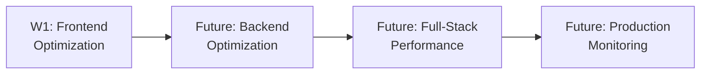

# Web Optimization Workshop Series

A comprehensive workshop series focused on modern web performance optimization techniques, from frontend optimization to backend strategies and full-stack monitoring.

## 🎯 Series Objectives

This series teaches participants how to:

- Measure and analyze web performance metrics
- Optimize frontend assets and reduce load times
- Implement effective caching and CDN strategies
- Apply framework-specific optimization techniques
- Monitor and maintain performance in production

## 📚 Workshop Overview

### Workshop 1: Frontend Optimization
**Duration**: 1.5 hours  
**Level**: Intermediate

Learn essential frontend optimization techniques including JavaScript bundling, lazy loading, image optimization, and caching strategies. Master Core Web Vitals and learn to use performance measurement tools.

**Topics Covered**:
- Core Web Vitals (LCP, INP, CLS)
- JavaScript bundle optimization
- Image optimization and lazy loading
- Caching strategies and CDN usage
- Framework-level optimizations

## 🔧 Prerequisites

### Required Knowledge
- HTML, CSS, and JavaScript fundamentals
- Basic understanding of web browsers
- Familiarity with developer tools
- Experience with at least one modern framework (Vue, React, etc.)

### Required Tools
- Modern web browser (Chrome/Firefox)
- Node.js and npm/yarn
- Text editor or IDE
- Terminal/command line access

## 🚀 Getting Started

1. **Choose a Workshop**: Start with Workshop 1 for frontend fundamentals
2. **Check Prerequisites**: Ensure you have required tools installed
3. **Clone the Repository**:
   ```bash
   git clone https://github.com/TFD/container-security-workshop-series.git
   cd container-security-workshop-series/series/web-optimization
   ```
4. **Follow Workshop Instructions**: Each workshop has a README with setup steps

## 📖 Learning Path



## 🎓 Target Audience

- Frontend developers wanting to improve performance
- Full-stack developers optimizing user experience
- DevOps engineers improving web delivery
- Technical leads responsible for site performance

## 📊 Performance Impact

Understanding web optimization is critical because:

- **1 second delay** → up to 7% conversion loss
- **53% of users** leave if page loads >3 seconds
- **Page speed** is a ranking factor for SEO
- **Optimized sites** reduce infrastructure costs

## 🤝 Contributing

We welcome contributions! See [CONTRIBUTING.md](../../CONTRIBUTING.md) for guidelines.

## 📝 License

This project is licensed under the MIT License - see [LICENSE](../../LICENSE) for details.

## 🔗 Resources

- [Web.dev Performance](https://web.dev/performance/)
- [MDN Web Performance](https://developer.mozilla.org/en-US/docs/Web/Performance)
- [Chrome DevTools Documentation](https://developer.chrome.com/docs/devtools/)

---

**Teaching for Development (TFD)** - Empowering developers through practical, hands-on workshops.
