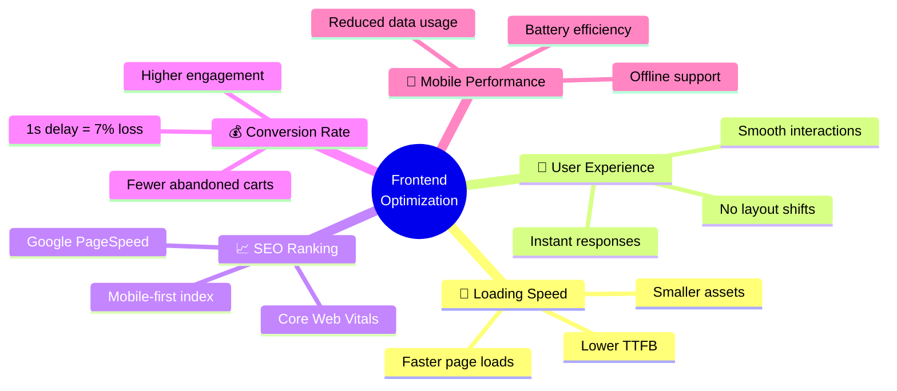
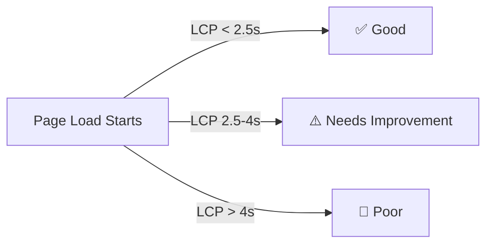
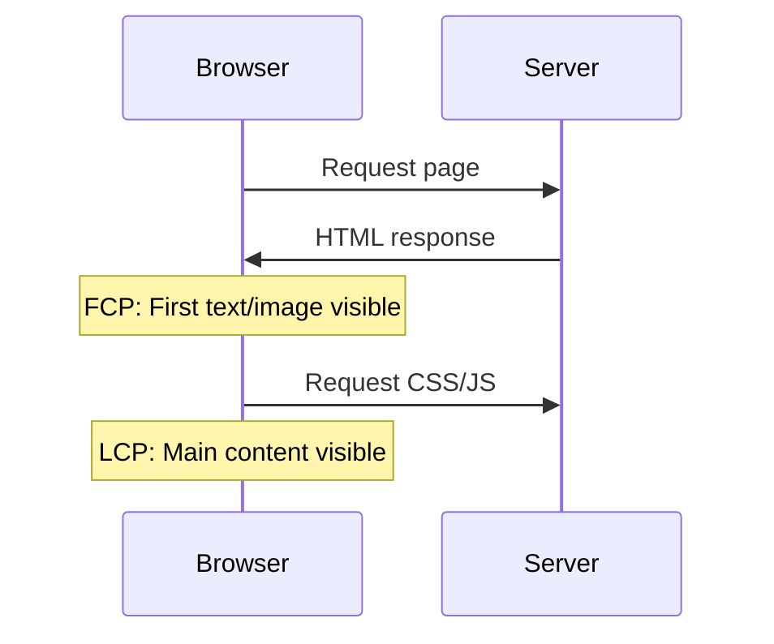
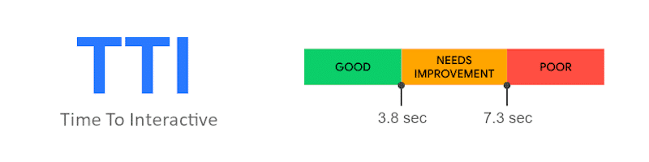
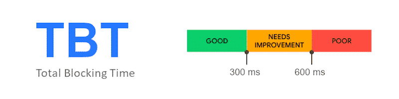
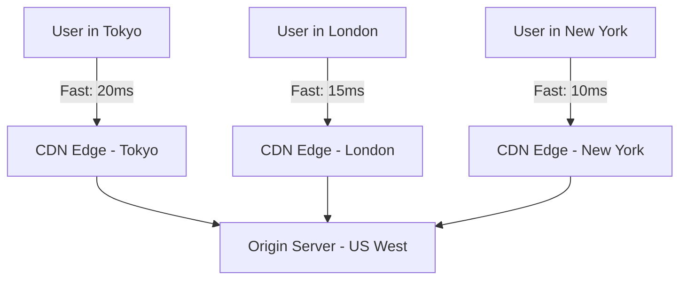
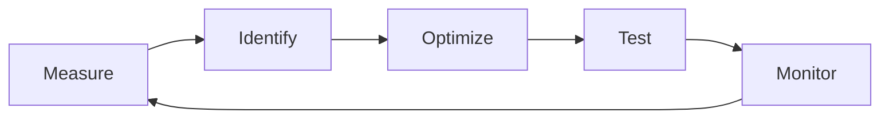

# Workshop 1: Frontend Optimization
**Duration**: 1.5 hours (90 minutes)  
**Level**: Intermediate  
**Last Updated**: March 2026

## Table of Contents

1. [Introduction](#1-introduction-10-minutes)
2. [Frontend Performance Metrics](#2-frontend-performance-metrics-20-minutes)
3. [Frontend Optimization Techniques](#3-frontend-optimization-techniques-40-minutes)
4. [Network Optimization](#4-network-optimization-10-minutes)
5. [Framework-Level Optimization](#5-framework-level-optimization-5-minutes)
6. [Practical Optimization Workflow](#6-practical-optimization-workflow-5-minutes)
7. [Conclusion](#7-conclusion-5-minutes)

---
View recorded workshop on YouTube: [https://youtu.be/9weMJYLVwmI](https://youtu.be/9weMJYLVwmI)
---

## 🎯 Learning Objectives

By the end of this workshop, you will be able to:

- Understand why frontend optimization is critical for business success
- Measure and interpret Core Web Vitals metrics
- Apply multiple optimization techniques to reduce page load time
- Implement effective caching and CDN strategies
- Monitor real user performance in production
- Follow a systematic optimization workflow

---

## 1. Introduction (10 minutes)

### Why Frontend Optimization Matters

Frontend optimization is not just about making websites faster—it directly impacts your bottom line and user satisfaction.

#### Key Benefits

Frontend optimization improves:

✅ **Website loading speed** - Faster pages keep users engaged  
✅ **User experience** - Smooth interactions increase satisfaction  
✅ **SEO ranking** - Google prioritizes fast sites  
✅ **Conversion rate** - Speed directly correlates to sales  
✅ **Mobile performance** - Critical for mobile-first users



#### Real-World Impact

The numbers speak for themselves:

📊 **1 second delay** → up to **7% conversion loss**  
📊 **53% of users** leave if page loads **>3 seconds**  
📊 **100ms improvement** → **1% revenue increase** (Amazon study)  
📊 **0.1s faster** → **8% more conversions** (Walmart study)

💡 **Example**: If your e-commerce site makes $100,000/day, a 1-second delay could cost you $7,000 daily—over $2.5 million annually.

### Common Problems

Before we dive into solutions, let's identify the usual culprits:

#### 1. Large JavaScript Bundles

**Problem**: Modern web apps often ship megabytes of JavaScript.

```javascript
// Common issue: importing entire libraries
import _ from 'lodash'; // Imports ALL of lodash (~70KB)

// Better approach: import only what you need
import debounce from 'lodash/debounce'; // Only ~2KB
```

**Impact**: 
- Longer download times
- Slower parsing and execution
- Delayed interactivity

#### 2. Too Many Network Requests

**Problem**: Each request adds latency, especially on mobile networks.

```
Typical unoptimized page:
- 50+ JavaScript files
- 30+ CSS files
- 100+ images
- Multiple font files
= 200+ requests 🔴
```

#### 3. Unoptimized Images

**Problem**: Images often account for 50-80% of page weight.

```
Common mistakes:
❌ 5MB raw camera photo for thumbnail
❌ PNG when JPEG would suffice
❌ No lazy loading for below-the-fold images
❌ Same image for mobile and desktop
```

#### 4. Blocking CSS/JS

**Problem**: Resources that block rendering delay content visibility.

```html
<!-- BAD: Blocks rendering -->
<head>
  <script src="large-analytics.js"></script>
  <link rel="stylesheet" href="entire-bootstrap.css">
</head>

<!-- GOOD: Non-blocking -->
<head>
  <script defer src="large-analytics.js"></script>
  <style>/* Critical CSS inline */</style>
  <link rel="preload" href="main.css" as="style">
</head>
```

#### 5. Poor Caching Strategy

**Problem**: Users re-download unchanged files on every visit.

```
Without caching:
Every visit = Full download

With caching:
First visit = Full download
Subsequent visits = Only changed files
```

---

## 2. Frontend Performance Metrics (20 minutes)

> 📝 **Key Principle**: "You can't optimize what you don't measure."

### Core Web Vitals

Google's Core Web Vitals are three critical metrics that measure real-world user experience.

#### Largest Contentful Paint (LCP)

**What it measures**: Loading performance—when the largest visible element appears.

**Good LCP**: < 2.5 seconds  
**Needs Improvement**: 2.5 - 4.0 seconds  
**Poor**: > 4.0 seconds




**What counts as "largest contentual element"?**
- Large images
- Video thumbnail
- Block-level text elements
- Background images loaded via CSS

**Common causes of slow LCP**:

1. **Slow server response times**
   ```
   TTFB (Time to First Byte) > 600ms
   Solution: Optimize backend, use CDN
   ```

2. **Render-blocking JavaScript and CSS**
   ```javascript
   // Bad: Blocks rendering
   <script src="huge-bundle.js"></script>
   
   // Good: Deferred loading
   <script defer src="huge-bundle.js"></script>
   ```

3. **Large image files**
   ```
   5MB image = ~8 seconds on 3G
   Solution: Compress, use WebP, lazy load
   ```

4. **Client-side rendering delays**
   ```
   Issue: Content generated by JavaScript after download
   Solution: Server-side rendering (SSR) or static generation
   ```

#### Interaction to Next Paint (INP)

**What it measures**: Responsiveness—how quickly page reacts to user interactions.

**Good INP**: < 200 milliseconds  
**Needs Improvement**: 200 - 500 ms  
**Poor**: > 500 ms


**Example scenarios**:
- User clicks a button → how long until visual feedback?
- User types in a search box → when does the interface update?
- User opens a dropdown menu → delay before it appears?

**Common problems**:

1. **Heavy JavaScript execution**
   ```javascript
   // Bad: Blocking main thread
   function processLargeData() {
     for (let i = 0; i < 1000000; i++) {
       // Expensive computation
     }
   }
   
   // Good: Break into chunks
   async function processLargeData() {
     for (let i = 0; i < 1000; i++) {
       await new Promise(resolve => setTimeout(resolve, 0));
       // Process 1000 items at a time
     }
   }
   ```

2. **Long event handlers**
   ```javascript
   // Bad: Synchronous expensive operations
   button.addEventListener('click', () => {
     const result = expensiveCalculation();
     updateUI(result);
   });
   
   // Good: Async operations
   button.addEventListener('click', async () => {
     const result = await expensiveCalculation();
     updateUI(result);
   });
   ```

3. **Large DOM size**
   ```
   DOM with 5000+ nodes = slow interactions
   Solution: Virtualization, pagination
   ```

#### Cumulative Layout Shift (CLS)

**What it measures**: Visual stability—unexpected layout shifts during page load.

**Good CLS**: < 0.1  
**Needs Improvement**: 0.1 - 0.25  
**Poor**: > 0.25


**Classic problem**:

```
User scenario:
1. User sees "Buy Now" button
2. User moves cursor to click
3. Ad loads above, pushes button down
4. User accidentally clicks ad 😤
```

**Common causes and solutions**:

1. **Images without dimensions**
   ```html
   <!-- BAD: Causes layout shift -->
   
   
   <!-- GOOD: Reserve space -->
   
   
   <!-- BETTER: Aspect ratio -->
   
   ```

2. **Dynamic content insertion**
   ```html
   <!-- BAD: Banner appears after content -->
   <div id="banner"></div>
   <main>Content here</main>
   
   <!-- GOOD: Reserve space -->
   <div id="banner" style="min-height: 100px"></div>
   <main>Content here</main>
   ```

3. **Web fonts causing text reflow**
   ```css
   /* BAD: Invisible text, then shift */
   @font-face {
     font-family: 'CustomFont';
     src: url('font.woff2');
   }
   
   /* GOOD: Show fallback, swap when ready */
   @font-face {
     font-family: 'CustomFont';
     src: url('font.woff2');
     font-display: swap;
   }
   ```

### Other Important Metrics

#### First Contentful Paint (FCP)

**What it measures**: When the first piece of DOM content renders.

**Good**: < 1.8 seconds



#### Time to Interactive (TTI)

**What it measures**: When the page becomes fully interactive and responsive.

**Good**: < 3.8 seconds



**Requirements for TTI**:
- Page displays useful content (FCP)
- Event handlers registered
- Page responds to interactions within 50ms

#### Total Blocking Time (TBT)

**What it measures**: Total time the main thread was blocked (preventing user input).

**Good**: < 200 milliseconds



```javascript
// Blocking task example
function blockingTask() {
  const start = Date.now();
  while (Date.now() - start < 1000) {
    // Blocks for 1 second! 🔴
  }
}
```

### Tools to Measure Performance

> 🎬 **Live Demo — run this before starting the tools walkthrough**
>
> Open [`scripts/demo/demo.html`](../scripts/demo/demo.html) in Chrome using a local server:
>
> ```bash
> # Option A — Node.js
> npx serve series/web-optimization/w1-frontend-optimization/scripts/demo -p 8080
>
> # Option B — Python
> python3 -m http.server 8080 --directory series/web-optimization/w1-frontend-optimization/scripts/demo
> ```
>
> Then navigate to `http://localhost:8080/demo.html` and run a Lighthouse audit.
> The page is intentionally built with the following issues:
>
> | Metric | Intentional Issue |
> |--------|-------------------|
> | **LCP** | Large unoptimised hero image loaded from an external URL |
> | **CLS** | `` has no explicit `width`/`height`; late-injected banner demo |
> | **INP / TBT** | Synchronous ~600 ms spin-loop on interaction; 300 ms blocking task on load |
> | **TTI** | Render-blocking script runs before content is interactive |
>
> Walk students through each failing metric in the Lighthouse report, then show them
> the corresponding section of the demo page that caused it.

#### 1. Lighthouse

**Access**: Chrome DevTools → Lighthouse tab

**Features**:
- Overall performance score (0-100)
- Core Web Vitals measurements
- Specific optimization suggestions
- Accessibility and SEO audits

**How to use**:
```bash
# Run Lighthouse from command line
npm install -g lighthouse
lighthouse https://example.com --view
```

**When to use**: 
- Initial performance audit
- Quick score check
- Development environment testing

#### 2. WebPageTest

**URL**: https://www.webpagetest.org/

**Features**:
- Real device testing
- Network waterfall visualization
- Multiple location testing
- Connection speed simulation
- Filmstrip view of loading

**Example test**:
```
Test Settings:
- Location: London, UK
- Browser: Chrome
- Connection: 3G
- Runs: 3 (for consistency)
```

**When to use**:
- Detailed network analysis
- Real-world device testing
- Comparison testing

#### 3. Chrome DevTools Performance Tab

**Access**: DevTools → Performance → Record

**Features**:
- JavaScript execution timeline
- Rendering bottleneck identification
- Frame rate analysis
- Memory usage tracking

**How to use**:
1. Open DevTools (F12)
2. Go to Performance tab
3. Click Record
4. Interact with page
5. Stop recording
6. Analyze flame chart

**When to use**:
- Debugging specific interactions
- Finding JavaScript bottlenecks
- Analyzing rendering performance

---

## 3. Frontend Optimization Techniques (40 minutes)

### 1. Reduce JavaScript Bundle Size

JavaScript is often the biggest performance bottleneck in modern web apps.

#### Why it matters

```
1MB JavaScript file:
- Download: 2-3 seconds (3G)
- Parse: 0.5-1 second
- Compile: 0.5-1 second
- Execute: 0.5-2 seconds
= 3.5-7 seconds before interactive! 🔴
```

#### Technique: Tree Shaking

**Definition**: Eliminates unused code during the build process.

**Example**:

```javascript
// utils.js - Library with many functions
export function add(a, b) { return a + b; }
export function subtract(a, b) { return a - b; }
export function multiply(a, b) { return a * b; }
export function divide(a, b) { return a / b; }

// app.js - Your code only uses one function
import { add } from './utils.js';
console.log(add(2, 3));

// With tree shaking: Only 'add' is bundled
// Without tree shaking: All functions bundled
```

**Configuration** (Webpack):

```javascript
// webpack.config.js
module.exports = {
  mode: 'production', // Enables tree shaking
  optimization: {
    usedExports: true,
    sideEffects: false
  }
};
```

**Configuration** (Vite):

Vite uses Rollup under the hood — tree shaking is **enabled by default** in production builds. No extra config is required for basic usage:

```javascript
// vite.config.js
import { defineConfig } from 'vite';

export default defineConfig({
  build: {
    // Tree shaking is on by default; these are optional fine-tuning options
    rollupOptions: {
      treeshake: {
        // Remove functions marked as side-effect-free
        preset: 'recommended',
        // Treat property reads on modules as side-effect-free
        propertyReadSideEffects: false,
      },
    },
  },
});
```

> 💡 **Tip**: Mark individual packages as side-effect-free in `package.json` so both Vite and Webpack skip unused exports:
>
> ```json
> { "sideEffects": false }
> ```
>
> Or allowlist files that _do_ have side effects (e.g., global CSS imports):
>
> ```json
> { "sideEffects": ["*.css", "./src/polyfills.js"] }
> ```

#### Technique: Code Splitting

**Definition**: Split your code into smaller chunks loaded on demand.

**Route-based splitting** (Vue Router):

```javascript
// Bad: Everything loaded upfront
import Dashboard from './Dashboard.vue';
import Profile from './Profile.vue';
import Settings from './Settings.vue';

const routes = [
  { path: '/dashboard', component: Dashboard },
  { path: '/profile', component: Profile },
  { path: '/settings', component: Settings }
];

// Good: Load routes on demand
const routes = [
  { 
    path: '/dashboard', 
    component: () => import('./Dashboard.vue') // Lazy loaded!
  },
  { 
    path: '/profile', 
    component: () => import('./Profile.vue')
  },
  { 
    path: '/settings', 
    component: () => import('./Settings.vue')
  }
];
```

**Component-based splitting** (React):

```javascript
import React, { lazy, Suspense } from 'react';

// Lazy load heavy components
const HeavyChart = lazy(() => import('./HeavyChart'));

function Dashboard() {
  return (
    <div>
      <h1>Dashboard</h1>
      <Suspense fallback={<div>Loading chart...</div>}>
        <HeavyChart />
      </Suspense>
    </div>
  );
}
```

**Results**:
```
Before code splitting:
- main.js: 800KB

After code splitting:
- main.js: 200KB ✅
- dashboard.chunk.js: 150KB (loaded on demand)
- profile.chunk.js: 100KB (loaded on demand)
- settings.chunk.js: 100KB (loaded on demand)
```

#### Technique: Remove Unused Dependencies

**Audit your dependencies**:

```bash
# Check bundle size
npm install -g webpack-bundle-analyzer
webpack-bundle-analyzer dist/stats.json

# Find unused dependencies
npm install -g depcheck
depcheck
```

**Common bloat examples**:

```javascript
// Bad: Importing entire library (70KB)
import _ from 'lodash';
const result = _.debounce(fn, 300);

// Good: Import specific function (2KB)
import debounce from 'lodash/debounce';
const result = debounce(fn, 300);

// Bad: Using moment.js (67KB gzipped)
import moment from 'moment';
moment().format('YYYY-MM-DD');

// Good: Using date-fns (2KB gzipped)
import { format } from 'date-fns';
format(new Date(), 'yyyy-MM-dd');
```

### 2. Lazy Loading

**Principle**: Load resources only when needed, not upfront.

#### Lazy Load Images

**Native lazy loading**:

```html
<!-- Browser handles lazy loading automatically -->


<!-- Eager loading (default) -->

```

**Browser support**: Chrome 77+, Firefox 75+, Edge 79+, Safari 15.4+

**Advanced lazy loading with Intersection Observer**:

```javascript
// For older browsers or more control
const images = document.querySelectorAll('img[data-src]');

const imageObserver = new IntersectionObserver((entries, observer) => {
  entries.forEach(entry => {
    if (entry.isIntersecting) {
      const img = entry.target;
      img.src = img.dataset.src; // Load image
      img.removeAttribute('data-src');
      observer.unobserve(img);
    }
  });
});

images.forEach(img => imageObserver.observe(img));
```

```html
<!-- HTML -->

```

#### Lazy Load Components

**Vue 3 example**:

```vue
<template>
  <div>
    <!-- Heavy component loaded on demand -->
    <Suspense>
      <template #default>
        <AsyncHeavyComponent />
      </template>
      <template #fallback>
        <LoadingSpinner />
      </template>
    </Suspense>
  </div>
</template>

<script setup>
import { defineAsyncComponent } from 'vue';

const AsyncHeavyComponent = defineAsyncComponent(() =>
  import('./HeavyComponent.vue')
);
</script>
```

#### Lazy Load Routes

**Next.js example**:

```javascript
// pages/dashboard.js
import dynamic from 'next/dynamic';

// Lazy load with custom loading component
const DashboardWidget = dynamic(
  () => import('../components/DashboardWidget'),
  {
    loading: () => <p>Loading dashboard...</p>,
    ssr: false // Skip server-side rendering
  }
);

export default function Dashboard() {
  return <DashboardWidget />;
}
```

### 3. Optimize Images

Images typically represent 50-80% of total page weight.

#### Use Modern Formats

**Format comparison**:

```
Same 1920x1080 image:
- JPEG: 250KB
- PNG: 850KB
- WebP: 150KB (40% smaller than JPEG!)
- AVIF: 100KB (60% smaller than JPEG!)
```

**HTML with fallbacks**:

```html
<picture>
  <!-- Modern browsers: Use AVIF -->
  <source srcset="image.avif" type="image/avif">
  
  <!-- Fallback: WebP -->
  <source srcset="image.webp" type="image/webp">
  
  <!-- Fallback: JPEG -->
  
</picture>
```

#### Compress Images

**Tools**:
- **Squoosh** (web): https://squoosh.app/
- **ImageOptim** (Mac): Free compression tool
- **TinyPNG** (web): PNG compression

**Command-line compression**:

```bash
# Install imagemagick
brew install imagemagick

# Compress JPEG (quality 85)
convert input.jpg -quality 85 output.jpg

# Convert to WebP
cwebp input.jpg -q 80 -o output.webp

# Batch processing
for img in *.jpg; do
  cwebp "$img" -q 80 -o "${img%.jpg}.webp"
done
```

#### Serve Responsive Images

**Problem**: Sending 4K images to mobile phones.

**Solution**: srcset and sizes attributes.

```html

```

**Breakdown**:
- `srcset`: Available image sizes
- `sizes`: When to use each size
- Browser automatically picks the best option

#### Use CDN Image Transformation

**Cloudinary example**:

```html
<!-- Original: 2000x1500 -->


<!-- Auto-optimized: width=800, auto format, auto quality -->

```

### 4. Minify and Compress Assets

#### Minification

**JavaScript minification** (Terser):

```javascript
// Before minification (readable)
function calculateTotalPrice(items) {
  let total = 0;
  for (let i = 0; i < items.length; i++) {
    total += items[i].price * items[i].quantity;
  }
  return total;
}

// After minification
function calculateTotalPrice(t){let e=0;for(let l=0;l<t.length;l++)e+=t[l].price*t[l].quantity;return e}
```

**CSS minification**:

```css
/* Before: 2.5KB */
.header {
  background-color: #ffffff;
  padding: 20px;
  margin-bottom: 30px;
}

/* After: 0.5KB */
.header{background-color:#fff;padding:20px;margin-bottom:30px}
```

#### Compression

**Gzip vs Brotli**:

```
1MB JavaScript file:
- Uncompressed: 1000KB
- Gzip: 250KB (75% reduction)
- Brotli: 200KB (80% reduction) ✅
```

**NGINX configuration**:

```nginx
# Enable Gzip
gzip on;
gzip_comp_level 6;
gzip_types
  text/plain
  text/css
  text/javascript
  application/javascript
  application/json
  image/svg+xml;

# Enable Brotli (better compression)
brotli on;
brotli_comp_level 6;
brotli_types
  text/plain
  text/css
  text/javascript
  application/javascript
  application/json
  image/svg+xml;
```

**Apache configuration**:

```apache
# .htaccess
<IfModule mod_deflate.c>
  AddOutputFilterByType DEFLATE text/html text/plain text/xml text/css
  AddOutputFilterByType DEFLATE application/javascript application/json
</IfModule>
```

### 5. Use a CDN

**CDN (Content Delivery Network)**: Distributes static assets across global servers.

#### How CDN Works



#### Benefits

✅ **Lower latency**: Content served from nearest server  
✅ **Faster global access**: Consistent performance worldwide  
✅ **Reduced origin load**: Less traffic to your server  
✅ **Better availability**: Multiple points of presence  
✅ **DDoS protection**: Many CDNs include security features

#### Popular CDN Providers

**Cloudflare** (Free tier available)
```bash
# Setup: Change DNS nameservers
# Auto-caching, auto-minification
```

**AWS CloudFront**
```bash
# Create distribution
aws cloudfront create-distribution \
  --origin-domain-name example.com \
  --default-root-object index.html
```

**Fastly** (Edge compute capabilities)
**Vercel** (Optimized for Next.js)
**Netlify** (Integrated with Git)

### 6. Caching Strategy

**Goal**: Avoid downloading unchanged files repeatedly.

#### Cache-Control Headers

```
Cache-Control: max-age=31536000, immutable
```

**Breakdown**:
- `max-age=31536000`: Cache for 1 year
- `immutable`: Never revalidate (perfect for versioned files)

#### Caching Strategies

**1. Versioned assets (Aggressive caching)**

```nginx
# Cache JS/CSS with hash in filename forever
location ~* \.(?:js|css)$ {
  add_header Cache-Control "public, max-age=31536000, immutable";
}

# Example files:
# app.abc123.js
# styles.def456.css
```

**2. HTML (Always fresh)**

```nginx
location ~* \.html$ {
  add_header Cache-Control "no-cache, no-store, must-revalidate";
  add_header Pragma "no-cache";
  add_header Expires "0";
}
```

**3. Images (Moderate caching)**

```nginx
location ~* \.(?:jpg|jpeg|gif|png|ico|svg|webp)$ {
  add_header Cache-Control "public, max-age=2592000"; # 30 days
}
```

#### Service Worker Caching

**Advanced caching with Service Workers**:

```javascript
// service-worker.js
const CACHE_NAME = 'v1';
const urlsToCache = [
  '/',
  '/styles/main.css',
  '/script/main.js'
];

// Install event: Cache assets
self.addEventListener('install', event => {
  event.waitUntil(
    caches.open(CACHE_NAME)
      .then(cache => cache.addAll(urlsToCache))
  );
});

// Fetch event: Serve from cache, fallback to network
self.addEventListener('fetch', event => {
  event.respondWith(
    caches.match(event.request)
      .then(response => response || fetch(event.request))
  );
});
```

### 7. Reduce Render Blocking Resources

**Problem**: CSS and JavaScript block page rendering.

#### Defer JavaScript

```html
<!-- BAD: Blocks parsing and rendering -->
<script src="app.js"></script>

<!-- GOOD: Parse HTML first, execute after -->
<script defer src="app.js"></script>

<!-- ALSO GOOD: Don't block parsing -->
<script async src="analytics.js"></script>
```

**Difference**:
- `defer`: Execute after HTML parsing, in order
- `async`: Execute as soon as downloaded, may be out of order

```mermaid
gantt
    title Script Loading Comparison
    dateFormat X
    axisFormat %s
    
    section Normal
    Download :0, 2
    Block Parse :0, 2
    Execute :2, 3
    
    section Defer
    Download :0, 2
    Parse HTML :0, 3
    Execute :3, 4
    
    section Async
    Download :0, 2
    Execute Immediately :2, 3
```



#### Inline Critical CSS

**Technique**: Inline CSS needed for above-the-fold content.

```html
<head>
  <!-- Critical CSS inline -->
  <style>
    /* Only styles for hero, header, above-fold */
    .header { background: #333; color: white; padding: 1rem; }
    .hero { height: 100vh; display: flex; align-items: center; }
  </style>
  
  <!-- Non-critical CSS loaded async -->
  <link rel="preload" href="styles.css" as="style" onload="this.onload=null;this.rel='stylesheet'">
  <noscript><link rel="stylesheet" href="styles.css"></noscript>
</head>
```

**Tools for extracting critical CSS**:
- [Critical](https://github.com/addyosmani/critical)
- [Critters](https://github.com/GoogleChromeLabs/critters)

```bash
# Using Critical
npm install -g critical
critical src/index.html --base dist --inline > dist/index.html
```

### 8. Optimize Fonts

Web fonts can delay text rendering significantly.

#### font-display Strategy

```css
@font-face {
  font-family: 'CustomFont';
  src: url('font.woff2') format('woff2');
  font-display: swap; /* Show fallback immediately, swap when ready */
}
```

**Options**:
- `block`: Invisible text up to 3s (avoid!)
- `swap`: Show fallback immediately, swap when ready ✅
- `fallback`: Show fallback after 100ms, swap for 3s window
- `optional`: Browser decides based on connection speed

#### Preload Important Fonts

```html
<head>
  <!-- Load critical font immediately -->
  <link rel="preload" 
        href="/fonts/main-font.woff2" 
        as="font" 
        type="font/woff2" 
        crossorigin>
</head>
```

#### Subset Fonts

**Problem**: Full font files include all characters (Latin, Cyrillic, Greek, etc.)

**Solution**: Include only needed characters.

```html
<!-- Full Google Fonts: ~50KB -->
<link href="https://fonts.googleapis.com/css2?family=Roboto" rel="stylesheet">

<!-- Subset (Latin only): ~12KB -->
<link href="https://fonts.googleapis.com/css2?family=Roboto&subset=latin" rel="stylesheet">

<!-- Further subset (specific characters): ~5KB -->
<link href="https://fonts.googleapis.com/css2?family=Roboto&text=ABCDEFGHIJKLMNOPQRSTUVWXYZabcdefghijklmnopqrstuvwxyz0123456789" rel="stylesheet">
```

**Self-hosting with subsetting**:

```bash
# Install glyphhanger
npm install -g glyphhanger

# Create subset
glyphhanger https://example.com --subset=font.ttf --formats=woff2
```

---

## 4. Network Optimization (10 minutes)

### Reduce HTTP Requests

**Every request has overhead**:

```
Single HTTP request:
- DNS lookup: 20-120ms
- TCP connection: 20-100ms
- TLS handshake: 50-200ms
- Actual transfer: Varies
= 90-420ms minimum!
```

#### Technique: Combine Files

**CSS bundling**:

```bash
# Before: 5 separate CSS files = 5 requests
header.css
menu.css
content.css
sidebar.css
footer.css

# After: 1 combined file = 1 request
styles.css (combined)
```

**Icon sprites** (traditional):

```css
/* Instead of 20 icon files */
.icon {
  background: url('sprite.png') no-repeat;
}

.icon-home { background-position: 0 0; }
.icon-user { background-position: -32px 0; }
.icon-settings { background-position: -64px 0; }
```

**Modern alternative: SVG sprites**

```html
<svg style="display: none;">
  <symbol id="icon-home" viewBox="0 0 24 24">
    <path d="M10 20v-6h4v6h5v-8h3L12 3 2 12h3v8z"/>
  </symbol>
  <symbol id="icon-user" viewBox="0 0 24 24">
    <path d="M12 12c2.21 0 4-1.79 4-4s-1.79-4-4-4-4 1.79-4 4 1.79 4 4 4zm0 2c-2.67 0-8 1.34-8 4v2h16v-2c0-2.66-5.33-4-8-4z"/>
  </symbol>
</svg>

<!-- Use icons -->
<svg><use xlink:href="#icon-home"></use></svg>
<svg><use xlink:href="#icon-user"></use></svg>
```

### HTTP/2 Advantages

**HTTP/1.1 limitations**:
```
Request 1 → Wait → Response 1
Request 2 → Wait → Response 2
Request 3 → Wait → Response 3
(Sequential, slow)
```

**HTTP/2 benefits**:
```
Request 1 ──┐
Request 2 ──┤→ Multiplexing → All responses in parallel
Request 3 ──┘
(Parallel, fast!)
```

**Additional HTTP/2 features**:
- **Header compression**: Reduces overhead
- **Server push**: Server sends resources before requested
- **Binary protocol**: More efficient than text

**Enable HTTP/2** (NGINX):

```nginx
server {
  listen 443 ssl http2;
  server_name example.com;
  
  ssl_certificate /path/to/cert.pem;
  ssl_certificate_key /path/to/key.pem;
}
```

### Prefetch & Preload

#### Preload

**Definition**: High-priority fetch for resources needed soon.

```html
<!-- Tell browser to fetch immediately -->
<link rel="preload" href="critical-font.woff2" as="font" crossorigin>
<link rel="preload" href="hero-image.jpg" as="image">
<link rel="preload" href="main.js" as="script">
```

**Use cases**:
- Critical fonts
- Hero images
- Key JavaScript/CSS

#### Prefetch

**Definition**: Low-priority fetch for resources needed later.

```html
<!-- Hint: User might navigate here next -->
<link rel="prefetch" href="/dashboard.js">
<link rel="prefetch" href="/next-page.html">
```

**Use cases**:
- Next page in flow
- Likely user navigation
- Background data loading

#### DNS-prefetch

**Definition**: Resolve DNS early.

```html
<!-- Prepare connections to external domains -->
<link rel="dns-prefetch" href="https://fonts.googleapis.com">
<link rel="dns-prefetch" href="https://analytics.example.com">
```

#### Preconnect

**Definition**: Establish early connection (DNS + TCP + TLS).

```html
<!-- Full connection to external domain -->
<link rel="preconnect" href="https://api.example.com">
<link rel="preconnect" href="https://cdn.example.com">
```

**Comparison**:

```
dns-prefetch:    [DNS]
preconnect:      [DNS][TCP][TLS]
prefetch:        [DNS][TCP][TLS][GET resource]
preload:         [DNS][TCP][TLS][GET resource] (high priority!)
```

---

## 5. Framework-Level Optimization (5 minutes)

Modern frameworks offer powerful optimization techniques.

### Server-Side Rendering (SSR)

**Traditional SPA problem**:

```html
<!-- Client receives empty shell -->
<div id="app"></div>
<script src="app.js"></script>

<!-- Steps:
1. Download HTML (empty)
2. Download JavaScript
3. Execute JavaScript
4. Render content
= Users see content after ALL steps
```

**SSR solution**:

```html
<!-- Client receives fully rendered HTML -->
<div id="app">
  <h1>Welcome</h1>
  <p>Content is already here!</p>
</div>
<script src="app.js"></script>

<!-- JavaScript hydrates existing content
= Users see content immediately
```

#### Nuxt.js (Vue) Example

```javascript
// nuxt.config.js
export default {
  ssr: true, // Enable SSR
  
  // Or choose per-page
  generate: {
    routes: ['/about', '/contact']
  }
}
```

#### Next.js (React) Example

```javascript
// pages/index.js
export default function Home({ data }) {
  return <div>{data}</div>;
}

// This runs on server
export async function getServerSideProps() {
  const data = await fetchData();
  return { props: { data } };
}
```

### Static Site Generation (SSG)

**Even better**: Pre-render at build time.

```javascript
// Next.js static generation
export async function getStaticProps() {
  const data = await fetchData();
  
  return {
    props: { data },
    revalidate: 3600 // Rebuild every hour
  };
}
```

**Benefits**:
- ⚡ Instant page loads
- 💰 Cheap hosting (static files)
- 🔒 More secure (no server)

**Best for**:
- Blogs
- Documentation
- Marketing sites
- E-commerce product listings

### Route-Based Code Splitting

**Automatic in modern frameworks**:

```javascript
// Vue Router
const routes = [
  {
    path: '/dashboard',
    component: () => import('./views/Dashboard.vue') // Auto code-split!
  }
];

// Next.js
// Each file in pages/ is automatically code-split
pages/
  index.js      → Route: /
  about.js      → Route: /about
  contact.js    → Route: /contact
```

**Result**:
```
Visit /           → Load: index.bundle.js
Visit /about      → Load: about.bundle.js
Visit /contact    → Load: contact.bundle.js

VS all at once in SPA
```

### Framework-Specific Tips

#### Vue 3

```vue
<template>
  <!-- Use v-once for static content -->
  <div v-once>
    <h1>{{ staticTitle }}</h1>
  </div>
  
  <!-- Use v-memo for expensive lists -->
  <div v-for="item in list" v-memo="[item.id]">
    {{ expensiveComputation(item) }}
  </div>
</template>
```

#### React

```javascript
// Memoize expensive computations
import { useMemo } from 'react';

function Component({ items }) {
  const expensiveResult = useMemo(
    () => computeExpensiveValue(items),
    [items]
  );
  
  return <div>{expensiveResult}</div>;
}

// Memoize components
import { memo } from 'react';

const MemoizedComponent = memo(function MyComponent({ data }) {
  return <div>{data}</div>;
});
```

---

## 6. Practical Optimization Workflow (5 minutes)

**Follow this systematic process**:

### Step 1: Measure Current Performance

```bash
# Run Lighthouse
lighthouse https://example.com --output html --output-path ./report.html

# Run WebPageTest
# Visit webpagetest.org and test from multiple locations
```

**Document baseline**:
```
Before optimization:
- LCP: 4.2s 🔴
- FID: 350ms 🔴
- CLS: 0.25 🔴
- Total page size: 3.5MB
- Requests: 87
- Load time: 6.8s
```

### Step 2: Identify Bottlenecks

**Analyze Lighthouse suggestions**:
```
Top opportunities:
1. Eliminate render-blocking resources (save 2.1s)
2. Properly size images (save 1.8s)
3. Reduce unused JavaScript (save 1.2s)
```

**Check network waterfall**:
- Identify slow resources
- Find sequential loading chains
- Spot oversized assets

### Step 3: Optimize Biggest Problems First

**Prioritize by impact**:

```
1. High impact, low effort:
   - Image compression (saves 1.8s)
   - Enable Gzip/Brotli (saves 1.2s)
   
2. High impact, medium effort:
   - Code splitting (saves 1.0s)
   - Lazy loading (saves 0.8s)
   
3. High impact, high effort:
   - Implement SSR (saves 1.5s)
   - Complete redesign (saves 2.0s)
```

**Start with quick wins!**

### Step 4: Test Again

```bash
# Run Lighthouse again
lighthouse https://example.com --output html
```

**Compare results**:
```
After optimization:
- LCP: 2.1s ✅ (50% improvement)
- FID: 150ms ✅ (57% improvement)
- CLS: 0.08 ✅ (68% improvement)
- Total page size: 850KB (76% reduction)
- Requests: 32 (63% reduction)
- Load time: 2.9s (57% improvement)
```

### Step 5: Monitor Production

```javascript
// Set up monitoring
setupRUM({
  service: 'my-app',
  trackWebVitals: true,
  alertThresholds: {
    LCP: 2500,
    FID: 100,
    CLS: 0.1
  }
});
```

**Create dashboards**:
- Real user Core Web Vitals
- Performance by country/device
- Error rates and slow transactions

### The Optimization Loop



**Remember**:
- 📊 Measure → Optimize → Measure again
- 🎯 Focus on biggest impact first
- 🔄 Performance is ongoing, not one-time
- 📈 Track real user metrics

---

## 7. Conclusion (5 minutes)

### Why Frontend Optimization Matters

Frontend optimization is not just about speed—it's about:

✅ **Better user experience** - Happy users stay longer  
✅ **Higher conversions** - Fast sites sell more  
✅ **Improved SEO** - Google rewards fast sites  
✅ **Lower infrastructure costs** - Efficient delivery  
✅ **Competitive advantage** - Stand out from competitors

### Key Takeaways

#### 1. Always Measure First
```
You can't optimize what you don't measure.
Use Lighthouse, WebPageTest, Chrome DevTools.
```

#### 2. Reduce JavaScript Size
```
- Tree shaking
- Code splitting
- Remove unused dependencies
Impact: Often 50-70% size reduction
```

#### 3. Optimize Images
```
- Use WebP/AVIF
- Compress aggressively
- Implement lazy loading
- Serve responsive sizes
Impact: Images are usually 50%+ of page weight
```

#### 4. Implement Caching & CDN
```
- Aggressive caching for static assets
- Use CDN for global delivery
- Service Workers for offline support
Impact: Repeat visits 80% faster
```

#### 5. Monitor Real Users
```
- Lab data ≠ Real users
- Track Core Web Vitals in production
- Set performance budgets
- Alert on regressions
Impact: Catch issues before users complain
```

### Quick Reference Card

```
┌─────────────────────────────────────────────────┐
│ Frontend Optimization Cheat Sheet              │
├─────────────────────────────────────────────────┤
│ 🎯 Core Web Vitals Goals:                      │
│   • LCP < 2.5s                                  │
│   • INP < 200ms                                 │
│   • CLS < 0.1                                   │
│                                                 │
│ ⚡ Quick Wins:                                  │
│   1. Enable Gzip/Brotli compression            │
│   2. Lazy load images (loading="lazy")         │
│   3. Defer non-critical JavaScript             │
│   4. Use CDN for static assets                 │
│   5. Compress images to WebP                   │
│                                                 │
│ 📊 Measurement Tools:                           │
│   • Lighthouse (DevTools)                      │
│   • WebPageTest                                │
│   • Chrome DevTools Performance Tab            │
│                                                 │
│ 🔄 Workflow:                                    │
│   Measure → Identify → Optimize → Test         │
│   → Monitor → Repeat                           │
└─────────────────────────────────────────────────┘
```

### Next Steps

1. **Audit your site** - Run Lighthouse right now
2. **Implementation** strategy - Focus on quick wins first
3. **Set up monitoring** - Track real user performance
4. **Continuous improvement** - Make optimization part of your workflow
5. **Share knowledge** - Teach your team these techniques

### Additional Learning Resources

**Tools**:
- [Lighthouse](https://developers.google.com/web/tools/lighthouse)
- [WebPageTest](https://www.webpagetest.org/)
- [web.dev](https://web.dev/metrics/)

**Documentation**:
- [MDN Web Performance](https://developer.mozilla.org/en-US/docs/Web/Performance)
- [Chrome DevTools Docs](https://developer.chrome.com/docs/devtools/)

**Books**:
- "High Performance Browser Networking" by Ilya Grigorik
- "Designing for Performance" by Lara Hogan

**Courses**:
- web.dev/learn → Performance section
- Frontend Masters - Performance courses

### Remember

> **"Fast is not a feature—it's a requirement."**

Performance optimization is an investment that pays dividends in:
- User satisfaction
- Conversion rates
- SEO rankings
- Infrastructure costs
- Competitive advantage

Start optimizing today! 🚀

---

## Q&A and Live Demonstration

Time for questions and optional live demos:

- Running Lighthouse audit
- Analyzing network waterfall
- Implementing lazy loading
- Image compression comparison
- Code splitting demonstration

---

**Thank you for attending! Let's make the web faster together! 🎉**
