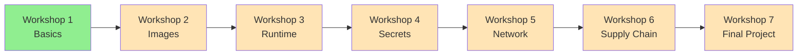

# Web Security Series - Container Security

[]()
[](https://www.docker.com/)
[]()

> A comprehensive hands-on workshop series covering practical container security from basics to advanced topics.

**Total Duration:** 6-8 hours | **Format:** Live online | **Level:** Beginner to Advanced

---

## 🎯 Series Overview

Container security is critical in modern DevOps, yet many developers lack proper knowledge of security best practices. This 7-part workshop series bridges that gap through hands-on learning, live demonstrations, and real-world scenarios.

### What You'll Master

- 🔐 **Container fundamentals** - Security architecture and isolation models
- 🖼️ **Image security** - Building and scanning secure container images  
- ⚙️ **Runtime protection** - Capabilities, privileges, and container escapes
- 🔑 **Secrets management** - Proper handling of sensitive data
- 🌐 **Network security** - Isolation patterns and access control
- 🔗 **Supply chain** - CI/CD security and dependency management
- 🛡️ **Defense in depth** - Applying all concepts in practice

---

## � Workshop Structure

```
web-security/
├── README.md (this file)
├── w1-container-security-basics/
│   ├── README.md
│   ├── materials/
│   ├── exercises/
│   └── scripts/
├── w2-image-security-attack-surface/ (Coming Soon)
├── w3-runtime-security-privileged-containers/ (Coming Soon)
├── w4-secrets-configuration-security/ (Coming Soon)
├── w5-network-access-control/ (Coming Soon)
├── w6-supply-chain-cicd-risks/ (Coming Soon)
└── w7-final-secure-broken-app/ (Coming Soon)
```

---

## 📋 Workshop Series

### [Workshop 1: Container Security Basics](w1-container-security-basics/) ✅
**Completed:** February 4, 2026 | **Duration:** 2.5 hours | **Participants:** 300+

Learn container security fundamentals, shared kernel risks, and common security myths.

**Topics:**
- Containers vs VMs (security perspective)
- Shared kernel risks and implications
- Container isolation boundaries
- Common security myths debunked

**[📖 View Workshop Details →](w1-container-security-basics/README.md)**

---

### Workshop 2: Image Security & Attack Surface 🚧
**Status:** Coming Soon | **Duration:** 1 hour | **Level:** Beginner

Reduce attack surface before containers even run.

**Topics:**
- How vulnerable images happen
- The `latest` tag problem
- Alpine vs Ubuntu vs Distroless
- CVE scanning and vulnerability detection

---

### Workshop 3: Runtime Security & Privileged Containers 🚧
**Status:** Coming Soon | **Duration:** 1-1.5 hours | **Level:** Intermediate

Understand and mitigate runtime security risks.

**Topics:**
- Linux capabilities explained
- Why `--privileged` is dangerous
- Container escape scenarios
- Running containers as non-root

---

### Workshop 4: Secrets & Configuration Security 🚧
**Status:** Coming Soon | **Duration:** 1 hour | **Level:** Intermediate

Never commit secrets - use proper secret management.

**Topics:**
- Why secrets in images are dangerous
- Environment variables vs mounted secrets
- Docker secrets & Kubernetes secrets
- Secret rotation strategies

---

### Workshop 5: Network & Access Control 🚧
**Status:** Coming Soon | **Duration:** 1 hour | **Level:** Intermediate

Limit blast radius through network isolation.

**Topics:**
- Container networking security
- Port exposure risks
- Network isolation patterns
- Service segmentation and zero-trust

---

### Workshop 6: Supply Chain & CI/CD Risks 🚧
**Status:** Coming Soon | **Duration:** 1 hour | **Level:** Advanced

Secure the entire container supply chain.

**Topics:**
- Image poisoning attacks
- Dependency vulnerabilities
- Tag immutability
- Container signing & verification
- CI/CD security best practices

---

### Workshop 7: Final Project - Secure the Broken App 🚧
**Status:** Coming Soon | **Duration:** 1-1.5 hours | **Level:** All Levels

Hands-on security challenge: Fix a deliberately insecure containerized application.

**Tasks:**
- Harden vulnerable Dockerfiles
- Remove excessive privileges
- Implement proper secret management
- Configure network isolation
- Apply defense-in-depth strategies

---

## 🚀 Getting Started

### Prerequisites

- Docker installed and running
- Basic Linux command line knowledge
- Terminal access
- Text editor (VS Code, Vim, etc.)
- Internet connection

### Quick Start

1. **Clone the repository:**
   ```bash
   git clone https://github.com/KimangKhenng/tfd-workshop.git
   cd container-security-workshop-series/series/web-security
   ```

2. **Start with Workshop 1:**
   ```bash
   cd w1-container-security-basics
   cat README.md
   ```

3. **Verify your Docker setup:**
   ```bash
   docker --version
   docker run --rm hello-world
   ```

---

## 🎓 Learning Path

We recommend completing workshops in order as each builds on previous concepts:



### Recommended Tracks

**Beginner Track:**
1. Workshop 1: Container Security Basics
2. Workshop 2: Image Security
3. Workshop 4: Secrets Management

**Intermediate Track:**
1. Workshop 3: Runtime Security
2. Workshop 5: Network Security

**Advanced Track:**
1. Workshop 6: Supply Chain Security
2. Workshop 7: Final Project

---

## 🎯 Learning Outcomes

After completing this series, you will be able to:

✅ Explain container security fundamentals and isolation models  
✅ Build and scan secure container images  
✅ Configure runtime security controls and capabilities  
✅ Implement proper secrets management  
✅ Design network isolation and access control  
✅ Secure CI/CD pipelines and supply chains  
✅ Apply defense-in-depth security strategies  

---

## 📚 Resources

### Official Documentation
- [Docker Security Best Practices](https://docs.docker.com/engine/security/)
- [CIS Docker Benchmark](https://www.cisecurity.org/benchmark/docker)
- [NIST Container Security Guide](https://nvlpubs.nist.gov/nistpubs/SpecialPublications/NIST.SP.800-190.pdf)
- [Kubernetes Security](https://kubernetes.io/docs/concepts/security/)

### Security Tools
- [Trivy](https://github.com/aquasecurity/trivy) - Vulnerability scanner
- [Docker Bench Security](https://github.com/docker/docker-bench-security) - Security audit
- [Falco](https://falco.org/) - Runtime security
- [Anchore](https://anchore.com/) - Container analysis

### Recommended Reading
- [Container Security by Liz Rice](https://www.oreilly.com/library/view/container-security/9781492056690/)
- [Docker Security Cheat Sheet](https://cheatsheetseries.owasp.org/cheatsheets/Docker_Security_Cheat_Sheet.html)
- [Kubernetes Security Best Practices](https://kubernetes-security.info/)

---

## 🤝 Contributing

Found an issue or have suggestions? We welcome contributions!

- 🐛 [Report bugs](https://github.com/KimangKhenng/tfd-workshop/issues)
- 💡 [Request features](https://github.com/KimangKhenng/tfd-workshop/issues)
- 📝 [Improve documentation](https://github.com/KimangKhenng/tfd-workshop/pulls)

---

## 📜 License

This workshop series is part of the TFD Workshop and is licensed under the MIT License.

---

<div align="center">

**[⬅ Back to Main README](../../README.md)** | **[Start Workshop 1 →](w1-container-security-basics/README.md)**

Part of the [TFD Workshop Series](https://github.com/KimangKhenng/tfd-workshop)

</div>
